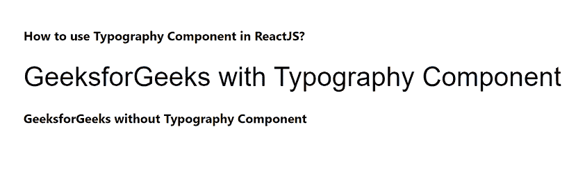

# 如何在 ReactJS 中使用排版组件？

> 原文：[https://www.geeksforgeeks.org/how-to-use-typography-component-in-reactjs/](https://www.geeksforgeeks.org/how-to-use-typography-component-in-reactjs/)

使用排版尽可能清晰高效地呈现你的设计和内容。React 的 Material UI 有这个组件可供我们使用，非常容易集成。我们可以使用下面的方法在 ReactJS 中使用排版组件。

## 创建 React 应用程序并安装模块

**步骤 1:** 使用以下命令创建一个 React 应用程序：

```jsx
npx create-react-app foldernam.
```

**步骤 2:** 在创建项目文件夹（即文件夹名 `foldername`）后，使用以下命令移动到该文件夹。

```jsx
cd foldername
```

**步骤 3:** 创建 ReactJS 应用程序后，使用以下命令安装 `material-ui` 模块。

```jsx
npm install @material-ui/core
```

## 项目结构

如下图。


## 示例代码

现在在 `App.js` 文件中写下以下代码。在这里，`App` 是我们编写代码的默认组件。

### App.js

```jsx
import React from "react";
import Typography from "@material-ui/core/Typography";

export default function App() {
  return (
    <div style={{ display: "block", padding: 30 }}>
      <h4>How to use Typography Component in ReactJS?</h4>
      <Typography variant="h4" gutterBottom>
        GeeksforGeeks with Typography Component
      </Typography>

      <h4>GeeksforGeeks without Typography Component</h4>
    </div>
  );
}
```

## 运行应用程序并查看输出

从项目的根目录使用以下命令运行应用程序。

```jsx
npm start
```

现在打开浏览器，转到 `http://localhost:3000/`，会看到如下输出。



## 参考

[https://material-ui.com/components/typography/](https://material-ui.com/components/typography/)