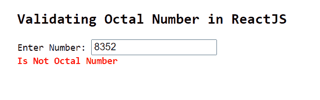
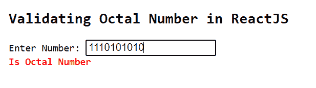

# 如何在 ReactJS 中验证八进制数？

> 原文: [https://www.geeksforgeeks.org/how-to-validate-octal-number-in-reactjs/](https://www.geeksforgeeks.org/how-to-validate-octal-number-in-reactjs/)

八进制数字系统是基数-8的数字系统，使用数字0到7。它也被简称为octal。以下示例显示了如何使用ReactJS应用程序中的npm模块验证用户输入的数据并检查其是否有效。

## 创建React应用程序并安装模块

### 步骤 1
使用以下命令创建一个React应用程序：
```jsx
npx create-react-app foldername
```

### 步骤 2
在创建项目文件夹（即`foldername`）后，使用以下命令移动到该文件夹：
```jsx
cd foldername
```

### 步骤 3
创建ReactJS应用程序后，使用以下命令安装`validator`模块：
```jsx
npm install validator
```

## 项目结构
如下图。


## App.js
现在在`App.js`文件中写下以下代码。在这里，`App`是我们编写代码的默认组件。

```jsx
import React, { useState } from "react";
import validator from 'validator'

const App = () => {

const [errorMessage, setErrorMessage] = useState('')

const validate = (value) => {

if (validator.isOctal(value)) {
      setErrorMessage('Is Octal Number')
    } else {
      setErrorMessage('Is Not Octal Number')
    }
  }

return (
    <div style={{
      marginLeft: '200px',
    }}>
      <pre>
        <h2>Validating Octal Number in ReactJS</h2>
        <span>Enter Number: </span><input type="text" 
        onChange={(e) => validate(e.target.value)}></input> <br />
        <span style={{
          fontWeight: 'bold',
          color: 'red',
        }}>{errorMessage}</span>
      </pre>
    </div>
  );
}

export default App
```

## 运行应用程序的步骤
从项目的根目录使用以下命令运行应用程序：
```jsx
npm start
```

## 输出

*   如果用户输入一个无效的八进制数，如下所示，输出如下：
    

*   如果用户输入有效的八进制数，输出如下：
    