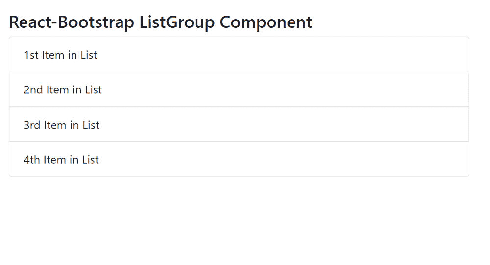

# React-Bootstrap ListGroup 组件

> Original: [https://www.geeksforgeeks.org/react-bootstrap-listgroup-component/](https://www.geeksforgeeks.org/react-bootstrap-listgroup-component/)

React-Bootstrap 是一个前端框架，其设计考虑到了 React。ListGroup 组件提供了一种显示一系列内容的方法。它是一个功能强大且灵活的组件。我们可以在 ReactJS 中使用以下方法来使用 React-Bootstrap ListGroup 组件。

## ListGroup 属性

*   `activeKey`：用于将 ListGroup 项标记为活动。
*   `As`：它可以用作此组件的自定义元素类型。
*   `defaultActiveKey`：表示默认的活动键。
*   `horizontal`：用于将列表组项目的流向从垂直对齐更改为水平。
*   `onSelect`：它是在选择 ListGroup 项目时触发的回调。
*   `variant`：用于设置列表组的变体。
*   `bsPrefix`：它是使用高度定制的 Bootstrap CSS 的安全通道。

## ListGroup.Item 属性

*   `action`：用于将 ListGroupItem 标记为可操作。
*   `active`：用于将列表组项目标记为活动。
*   `As`：它可以用作此组件的自定义元素类型。
*   `disabled`：用于使列表项状态为禁用。
*   `eventKey`：用于唯一标识该组件。
*   `href`：它用于传递此元素的 href 属性。
*   `onClick`：它是在单击 ListGroup 项时触发的回调。
*   `variant`：用于设置列表组项目的变体。
*   `bsPrefix`：它是使用高度定制的 Bootstrap CSS 的安全通道。

## 创建 React 应用程序并安装模块

*   **步骤 1：** 使用以下命令创建 React 应用程序：

```jsx
npx create-react-app foldername
```

*   **步骤 2：** 创建项目文件夹（即 `foldername`）后，使用以下命令移动到该文件夹：

```jsx
cd foldername
```

*   **步骤 3：** 创建 ReactJS 应用程序后，使用以下命令安装所需的模块：

```jsx
npm install react-bootstrap
npm install bootstrap
```

## 项目结构

项目结构如下所示。


## 示例

现在在 `App.js` 文件中写下以下代码。在这里，`App` 是我们编写代码的默认组件。

### App.js

```jsx
import React from 'react';
import 'bootstrap/dist/css/bootstrap.css';
import ListGroup from 'react-bootstrap/ListGroup';

export default function App() {
  return (
    <div style={{ display: 'block', width: 700, padding: 30 }}>
      <h4>React-Bootstrap ListGroup Component</h4>
      <ListGroup>
        <ListGroup.Item>1st Item in List</ListGroup.Item>
        <ListGroup.Item>2nd Item in List</ListGroup.Item>
        <ListGroup.Item>3rd Item in List</ListGroup.Item>
        <ListGroup.Item>4th Item in List</ListGroup.Item>
      </ListGroup>
    </div>
  );
}
```

## 运行应用程序的步骤

使用以下命令从项目根目录运行应用程序：

```jsx
npm start
```

## 输出

现在打开浏览器，转到 `http://localhost:3000/`，您将看到以下输出：



## 引用

[https://react-bootstrap.github.io/components/list-group/](https://react-bootstrap.github.io/components/list-group/)