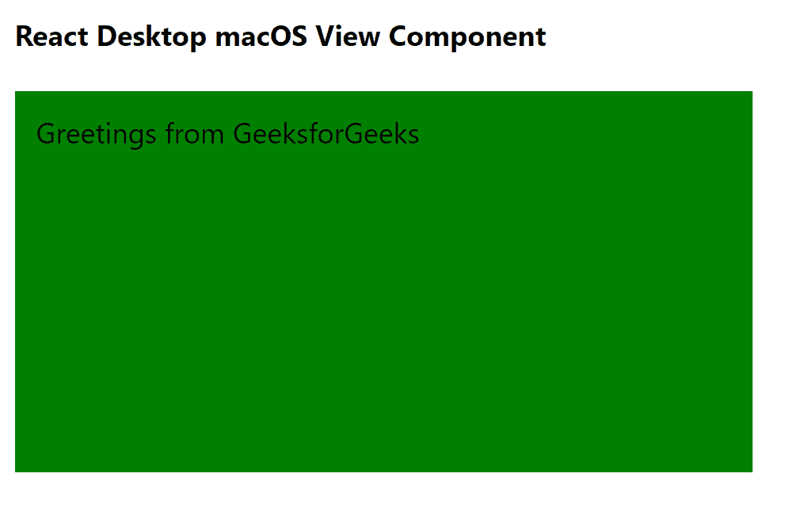

# React Desktop macOS View组件

> 原文：[https://www.geeksforgeeks.org/react-desktop-macos-view-component/](https://www.geeksforgeeks.org/react-desktop-macos-view-component/)

React Desktop是一个将原生桌面体验带到Web上的流行库。该库提供macOS和Windows OS组件。`View`组件用于允许用户创建视图。我们可以在ReactJS中使用以下方法来使用React Desktop macOS视图组件。

## 查看属性

*   `background`：用于设置组件背景颜色。
*   `height`：用于设置元件高度。
*   `hidden`：用于设置零部件可见性。
*   `horizontalAlign`：设置组件内容水平对齐。
*   `layout`：设置内容方向。
*   `margin`：设置组件的外边距。
*   `marginBottom`：设置组件的外底边距。
*   `marginLeft`：设置组件的左外边距。
*   `marginRight`：用于设置组件的右外边距。
*   `marginTop`：用于设置组件的外上边距。
*   `padding`：用于设置组件内部的填充。
*   `paddingBottom`：用于设置组件内部的底部填充。
*   `paddingLeft`：用于设置组件内部的左填充。
*   `paddingRight`：设置组件内部的右填充。
*   `paddingTop`：用于设置组件内部的顶部填充。
*   `verticalAlign`：设置组件内容垂直对齐。
*   `width`：设置组件宽度。

## 创建React应用程序并安装模块

*   **步骤 1：**使用以下命令创建React应用程序：
    ```jsx
    npx create-react-app foldername
    ```

*   **步骤 2：**创建项目文件夹（即`foldername`）后，使用以下命令移动到该文件夹：
    ```jsx
    cd foldername
    ```

*   **步骤 3：**创建ReactJS应用程序后，使用以下命令安装所需的模块：
    ```jsx
    npm install react-desktop
    ```

## 项目结构

如下所示。


## 示例

现在在`App.js`文件中写下以下代码。在这里，`App`是我们编写代码的默认组件。

### App.js

```jsx
import React from 'react'
import { View } from 'react-desktop/macOs';

export default function App() {
  return (
    <div style={{
      display: 'block', width: 700, paddingLeft: 30
    }}>
      <h4>React Desktop macOS View Component</h4>
      <View
        background="green"
        padding="12px"
        height="190px"
        width="390px"
      >
        Greetings from GeeksforGeeks
      </View>
    </div>
  );
}
```

## 运行应用程序的步骤

使用以下命令从项目根目录运行应用程序：
```jsx
npm start
```

## 输出

现在打开浏览器，转到`http://localhost:3000/`，您将看到以下输出：



## 引用

[React Desktop官方文档 - macOS View](https://reactdesktop.js.org/docs/mac-os/view)