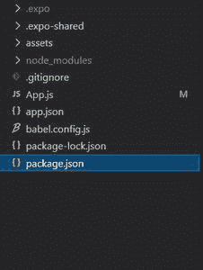
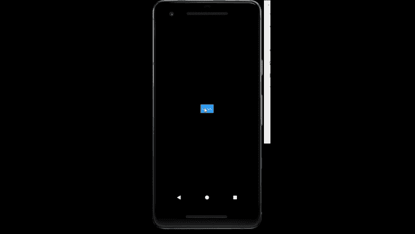

# React Native Modal组件

> 原文: [https://www.geeksforgeeks.org/react-native-modal-component/](https://www.geeksforgeeks.org/react-native-modal-component/)

下面的方法介绍了如何在 React Native 中创建 Modal。为此，我们将使用 Modal 组件。这是在封闭视图上呈现内容的基本方式。

**语法:**

```jsx
<Modal
  animationType=""
  transparent={}
  visible={}
  onRequestClose={}
>
```

**Modal中的属性:**

*   `animationType`: 这个属性控制 Modal 动画的方式。
*   `animated`: 这个属性不推荐使用，现在使用 `animationType` 代替。
*   `hardwareAccelerated`: 这个属性控制是否强制底层窗口的硬件加速。它只适用于安卓设备。
*   `onDismiss`: 这个属性允许传递一个函数，一旦 Modal 被消除，这个函数就会被调用。它只适用于 iOS 设备。
*   `onOrientationChange`: 当 Modal 显示时方向改变时调用。它只适用于 iOS 设备。
*   `onRequestClose`: 当用户轻按安卓上的硬件后退按钮时调用。
*   `onShow`: 这个属性允许传递一个函数，一旦显示了 Modal，这个函数就会被调用。
*   `presentationStyle`: 这个属性控制 Modal 如何出现。它只适用于 iOS 设备。
*   `statusBarTranslucent`: 这个属性决定了你的 Modal 是否应该在系统状态栏下。
*   `supportedOrientations`: 这个属性允许 Modal 旋转到任何指定的方向。它只适用于 iOS 设备。
*   `transparent`: 这个属性决定了你的 Modal 是否会填充整个视图。
*   `visible`: 这个属性决定了你的 Modal 是否可见。

**现在我们从实现开始:**

*   **步骤 1:** 打开终端，通过以下命令安装 `expo-cli`。

```bash
npm install -g expo-cli
```

*   **步骤 2:** 现在通过以下命令创建一个项目。

```bash
expo init myapp
```

*   **步骤 3:** 现在进入你的项目文件夹，即 `myapp`。

```bash
cd myapp
```

**项目结构:** 会是这样的。



**示例:** 现在让我们实现 Modal。在这里，我们创建了一个 Modal，当我们点击按钮时会出现。

**App.js**

```jsx
import React, { useState } from 'react';
import { StyleSheet, View, Text, Modal, Button } from 'react-native';

export default function App() {
  const [active, setactive] = useState(false);
  return (
    <View style={styles.container}>
      <Modal
        animationType="slide"
        transparent={true}
        visible={active}
        onRequestClose={() => {
          console.warn("closed");
        }}
      >
        <View style={styles.container}>
          <View style={styles.View}>
            <Text style={styles.text}>GeeksforGeeks</Text>
            <Button title="close" onPress={() => { setactive(!active) }} />
          </View>
        </View>
      </Modal>
      <Button
        title={"click"}
        onPress={() => { setactive(!active) }}
      />
    </View>
  );
}

const styles = StyleSheet.create({
  container: {
    flex: 1,
    backgroundColor: "black",
    alignItems: 'center',
    justifyContent: 'center',
  },
  View: {
    backgroundColor: "white",
    height: 140,
    width: 250,
    borderRadius: 15,
    alignItems: "center",
    justifyContent: "center",
    borderColor: "black",
    borderWidth: 2,
  },
  text: {
    fontSize: 20,
    color: "green",
    marginBottom: 20
  },
  button: {
    margin: 20,
    width: 200,
  }
});
```

使用以下命令启动服务器。

```bash
npm run android
```

**输出:** 如果你的模拟器没有自动打开，那么你需要手动打开。首先，去你的安卓工作室运行模拟器。现在再次启动服务器。



**参考:** [https://reactnative.dev/docs/modal](https://reactnative.dev/docs/modal)