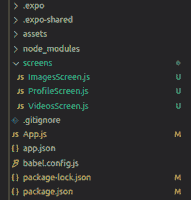
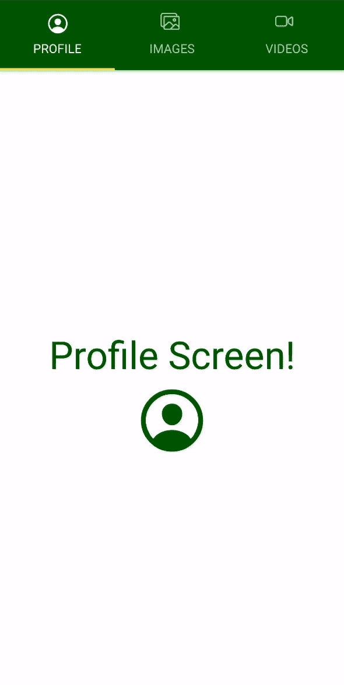

# 反应原生顶部标签导航器

> 原文: [https://www.geeksforgeeks.org/react-native-top-tab-navigator/](https://www.geeksforgeeks.org/react-native-top-tab-navigator/)

要创建顶部选项卡导航器，我们需要使用反应导航库中可用的 `createMaterialTopTabNavigator` 函数。它是用屏幕顶部的材质主题标签栏设计的。它允许通过轻按或水平滑动在各种选项卡之间切换。默认过渡动画可用。

## 道具

在 React Native 中，当组件被创建时，必须根据属性被称为道具的需要来定制它们。

*   **`initialRouteName`**: `initialRouteName` 是用于路由导航器初始加载时呈现的名称的道具。
*   **`screenOptions`**: `screenOptions` 是 React Native 中的道具，用作导航器内屏幕的默认选项。默认选项用于应用所有屏幕导航器。
*   **`tabBarPosition`**: 这种类型的道具用于设置标签栏在标签视图中的位置，默认值设置在“顶部”。
*   **`lazy`**: `lazy` 道具用于检查指示屏幕是否会被惰性渲染的布尔值。默认情况下，屏幕显示在视口体验中。
*   **`lazyPlaceholder`**: React Native 中的 `lazyPlaceholder` 道具是一个函数，它返回一个 React 元素，用于为那些尚未渲染的路线进行渲染。默认情况下，渲染值为空。
*   **`removeClippedSubviews`**: `removeClippedSubviews` 用于改进内存层次结构。它采用布尔值，该值指示是否从视图层次结构中移除不可见的视图。
*   **`keyboardDismissMode`**: 该属性用于获取字符串值，该值指示键盘是否作为对拖动手势的响应而关闭。`keyboardDismissMode` 中的其他值为 `auto`、`on-drag`、`none`。
*   **`timingConfig`**: `timingConfig` 道具是一个用于定时动画的配置对象，当按下标签时发生。`timingConfig` 的其他属性是 `duration` 和 `easing`。
*   **`position`**: 用于收听位置更新的动画值。当用户按下标签时，它会不时地改变。

## 选项

反应原生中的选项用于配置目的。在导航器中配置屏幕时执行配置。

*   **`title`**: 选项 `title` 通常用作 `headerTitle` 和 `tabBarLabel` 的后备。
*   **`tabBarIcon`**: `tabBarIcon` 选项返回一个 React 节点，用于在标签栏部分显示。`color` 是 React Native 小部件中的字符串。
*   **`tabBarLabel`**: 标签标题字符串中的标签，该标签显示在屏幕小部件的标签栏部分中。
*   **`tabBarAccessibilityLabel`**: 它是一个选项，可以是一个辅助功能标签，当用户按下选项卡时，屏幕阅读器会读取该标签。
*   **`tabBarButton`**: `tabBarButton` 选项可以是用于在测试中定位该标签按钮的标识。

## 事件

*   **`tabPress`**: 当用户按下标签栏部分中当前屏幕的标签按钮时，`tabPress` 事件触发。默认情况下，当我们将其滚动到顶部时使用。
*   **`tabLongPress`**: 当用户长时间按下标签栏中当前屏幕的标签按钮时触发的事件。

## 帮手

*   **`jumpTo`**: 帮手 `jumpTo` 用于执行一个函数来导航选项卡导航器中的现有屏幕，该功能接受 `name` 和 `params` 作为其参数，其中 `name` 是字符串，`params` 是对象。

## 现在让我们看看如何创建顶部选项卡导航器

*   **步骤 1:** 打开终端，通过以下命令安装 `expo-cli`。

```bash
npm install -g expo-cli
```

*   **步骤 2:** 现在通过以下命令创建一个项目。

```bash
expo init top-tab-navigator-demo
```

*   **步骤 3:** 现在进入你的项目文件夹，即 `top-tab-navigator-demo`。

```bash
cd top-tab-navigator-demo
```

*   **步骤 4:** 使用以下命令安装所需的软件包:

```bash
npm install --save react-navigation react-navigation-tabs react-native-paper react-native-vector-icons
```

## 项目结构

项目目录应该如下所示:



## 示例

现在，让我们在 `App.js` 文件中设置顶部选项卡导航器。在我们的演示应用程序中将有 3 个屏幕: 主屏幕、用户屏幕和设置屏幕。因此，我们将有 3 个选项卡在这 3 个屏幕之间导航。

首先，我们将添加我们的 `App.js` 文件，该文件将保存物料底部标签导航器逻辑。除了关于屏幕和标签的基本信息，我们还将在设置时添加图标和基本样式。

### App.js

```jsx
import React from "react";
import { Ionicons } from "@expo/vector-icons";
import { createAppContainer } from "react-navigation";
import { createMaterialTopTabNavigator } from "react-navigation-tabs";

import ProfileScreen from "./screens/ProfileScreen";
import ImagesScreen from "./screens/ImagesScreen";
import VideoScreen from "./screens/VideosScreen";

const TabNavigator = createMaterialTopTabNavigator(
  {
    Profile: {
      screen: ProfileScreen,
      navigationOptions: {
        tabBarLabel: "Profile",
        showLabel: ({ focused }) => {
          console.log(focused);
          return focused ? true : false;
        },
        tabBarIcon: (tabInfo) => (
          <Ionicons
            name="ios-person-circle-outline"
            size={tabInfo.focused ? 25 : 20}
            color={tabInfo.tintColor}
          />
        ),
      },
    },
    Images: {
      screen: ImagesScreen,
      navigationOptions: {
        tabBarLabel: "Images",
        tabBarIcon: (tabInfo) => (
          <Ionicons
            name="ios-images-outline"
            size={tabInfo.focused ? 24 : 20}
            color={tabInfo.tintColor}
          />
        ),
      },
    },
    Video: {
      screen: VideoScreen,
      navigationOptions: {
        tabBarLabel: "Videos",
        tabBarIcon: (tabInfo) => (
          <Ionicons
            name="ios-videocam-outline"
            size={tabInfo.focused ? 25 : 20}
            color={tabInfo.tintColor}
          />
        ),
      },
    },
  },
  {
    tabBarOptions: {
      showIcon: true,
      style: {
        backgroundColor: "#006600",
        marginTop: 28,
      },
    },
  }
);

const Navigator = createAppContainer(TabNavigator);

export default function App() {
  return (
    <Navigator>
      <ProfileScreen />
    </Navigator>
  );
}
```

### Profile.js

```jsx
import React from "react";
import { Text, View } from "react-native";
import { Ionicons } from "@expo/vector-icons";

const Profile = () => {
  return (
    <View style={{ flex: 1, alignItems: "center", justifyContent: "center" }}>
      <Text style={{ color: "#006600", fontSize: 40 }}>Profile Screen!</Text>
      <Ionicons name="ios-person-circle-outline" size={80} color="#006600" />
    </View>
  );
};

export default Profile;
```

### Images.js

```jsx
import React from "react";
import { Text, View } from "react-native";
import { Ionicons } from "@expo/vector-icons";

const Images = () => {
  return (
    <View style={{ flex: 1,
                   alignItems: "center",
                   justifyContent: "center" }}>
      <Text style={{ color: "#006600", fontSize: 40 }}>
        Images Screen!
      </Text>
      <Ionicons name="ios-images-outline"
                size={80} color="#006600" />
    </View>
  );
};

export default Images;
```

### Videos.js

```jsx
import React from "react";
import { Text, View } from "react-native";
import { Ionicons } from "@expo/vector-icons";

const Videos = () => {
  return (
    <View style={{ flex: 1,
                   alignItems: "center",
                   justifyContent: "center" }}>
      <Text style={{ color: "#006600", fontSize: 40 }}>
          Videos Screen!
      </Text>
      <Ionicons name="ios-videocam-outline"
                size={80} color="#006600" />
    </View>
  );
};

export default Videos;
```

使用以下命令启动服务器。

```bash
expo start
```

## 输出



**参考:** [https://reactnavigation.org/docs/material-top-tab-navigator/](https://reactnavigation.org/docs/material-top-tab-navigator/)