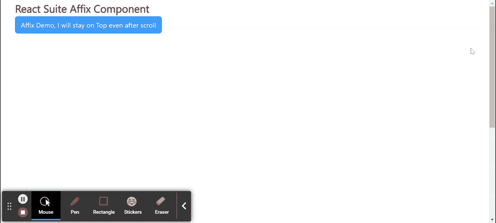

# 反应套件词缀成分

> 原文: [https://www.geeksforgeeks.org/react-suite-affix-component/](https://www.geeksforgeeks.org/react-suite-affix-component/)

React Suite 是一个流行的前端库，包含一组为中间平台和后端产品设计的 React 组件。`Affix` 组件允许用户将词缀缠绕在另一个组件上，以使其粘在视口上。我们可以在 ReactJS 中使用以下方法来使用 React Suite 词缀组件。

**属性:**

*   `children`: 用于表示该组件的 children 元素。
*   `classPrefix`: 用于表示组件 CSS 类的前缀。
*   `container`: 用于指定容器。
*   `onChange`: 是非固定和固定状态变化时触发的回调函数。
*   `top`: 用于设置定顶高度。

**创建反应应用程序并安装模块:**

*   **步骤 1:** 使用以下命令创建一个反应应用程序:

```jsx
npx create-react-app foldername
```

*   **步骤 2:** 在创建项目文件夹(即 `foldername`)后，使用以下命令将移动到该文件夹:

```jsx
cd foldername
```

*   **步骤 3:** 创建 ReactJS 应用程序后，使用以下命令安装所需的 `rsuite` 模块:

```jsx
npm install rsuite
```

**项目结构:** 如下图。


项目结构

**示例:** 现在在 `App.js` 文件中写下以下代码。在这里，`App` 是我们编写代码的默认组件。

## App.js

```jsx
import React from 'react'
import 'rsuite/dist/styles/rsuite-default.css';
import { Affix, Button } from 'rsuite';

export default function App() {

return (
    <div style={{
      display: 'block', width: 600, paddingLeft: 30, 
      height: 800, scrollBehavior: 'auto'
    }}>
      <h4>React Suite Affix Component</h4>
      <Affix>
        <Button appearance="primary">
          Affix Demo, I will stay on Top even after scroll
        </Button>
      </Affix>
    </div>
  );
}
```

**运行应用程序的步骤:** 从项目的根目录使用以下命令运行应用程序:

```jsx
npm start
```

**输出:** 现在打开浏览器，转到 `http://localhost:3000/`，会看到如下输出:



**参考:** [https://rsuitejs.com/components/affix/](https://rsuitejs.com/components/affix/)