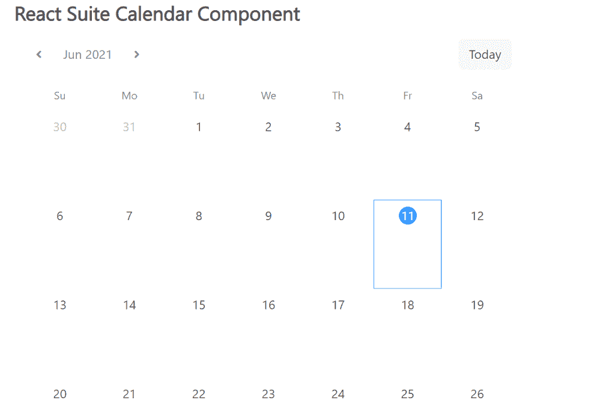

# React Suite 日历组件

> 原文：[https://www.geeksforgeeks.org/react-suite-calendar-component/](https://www.geeksforgeeks.org/react-suite-calendar-component/)

React Suite 是一个流行的前端库，包含一组为中间平台和后端产品设计的 React 组件。`Calendar` 组件允许用户通过日历显示数据。它被视为以日历的形式显示数据的容器。我们可以在 ReactJS 中使用以下方法来使用 React Suite 日历组件。

### 日历道具

*   `border`：用于显示边框。
*   `compact`：用于显示紧凑的日历。
*   `defaultValue`：用于表示默认值。
*   `isoWeek`：表示 ISO 8601 标准是否启用。
*   `onChange`：是值改变前触发的回调函数。
*   `onSelect`：是在选择的日期之前触发的回调函数。
*   `renderCell`：用于自定义渲染日历单元。
*   `value`：用于表示受控值。

### 创建 React 应用程序并安装模块

*   **步骤 1：** 使用以下命令创建一个 React 应用程序：

```jsx
npx create-react-app foldername
```

*   **步骤 2：** 在创建项目文件夹（即 `foldername`）后，使用以下命令移动到该文件夹：

```jsx
cd foldername
```

*   **步骤 3：** 创建 ReactJS 应用程序后，使用以下命令安装所需的 `rsuite` 模块：

```jsx
npm install rsuite
```

### 项目结构

如下图。


### 示例

现在在 `App.js` 文件中写下以下代码。在这里，`App` 是我们编写代码的默认组件。

## App.js

```jsx
import React from 'react'
import 'rsuite/dist/styles/rsuite-default.css';
import { Calendar } from 'rsuite';

export default function App() {
  return (
    <div style={{
      display: 'block', width: 600, paddingLeft: 30
    }}>
      <h4>React Suite Calendar Component</h4>
      <Calendar />
    </div>
  );
}
```

### 运行应用程序的步骤

从项目的根目录使用以下命令运行应用程序：

```jsx
npm start
```

### 输出

现在打开浏览器，转到 `http://localhost:3000/`，会看到如下输出：



### 参考

[https://rsuitejs.com/components/calendar/](https://rsuitejs.com/components/calendar/)