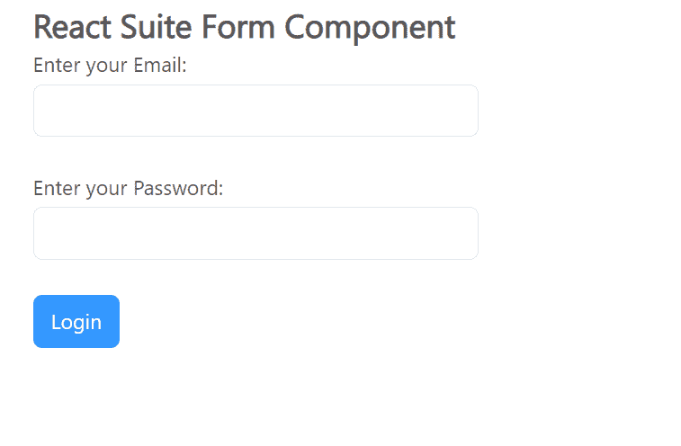

# React Suite 表单组件

> 原文: [https://www.geeksforgeeks.org/react-suite-form-component/](https://www.geeksforgeeks.org/react-suite-form-component/)

React Suite 是一个流行的前端库，包含一组为中间平台和后端产品设计的 React 组件。`Form` 组件提供了一种制作表单并接受用户输入，然后将其转发到服务器进行进一步数据处理的方法。我们可以在 `ReactJS` 中使用以下方法来使用 React Suite 表单组件。

## Form Props

*   `checkDelay`: 用于延迟处理数据检查。
*   `checkTrigger`: 用于指示表单验证触发类型。
*   `classPrefix`: 用于表示组件 CSS 类的前缀。
*   `errorFromContext`: 用于指示 `FormControl` 中的错误提醒默认来自 `Context`。
*   `fluid`: 允许表单输入 100% 填充容器。
*   `formDefaultValue`: 用于表示表单的默认值。
*   `formError`: 表单的错误信息。
*   `formValue`: 表示表单的值（受控）。
*   `layout`: 用于设置表单中元素布局的左右列。
*   `model`: 用于表示 `SchemaModel` 对象。
*   `onChange`: 数据变化时触发的回调函数。
*   `onCheck`: 数据检查期间触发的回调函数。
*   `onError`: 错误检查期间触发的回调函数。

## Form Methods

*   `check()`: 此方法用于验证表单数据。
*   `checkAsync()`: 是检查表单数据的异步函数。
*   `checkForField()`: 此方法用于核对单个字段值。
*   `checkForFieldAsync()`: 是检查表单单字段值的异步函数。
*   `cleanError()`: 此方法用于清除错误信息。
*   `cleanErrorForField()`: 此方法用于清除单个字段错误消息。

## FormControl Props

*   `accepter`: 表示被代理的组件。
*   `checkTrigger`: 用于表示数据验证触发类型。
*   `classPrefix`: 用于表示组件 CSS 类的前缀。
*   `errorMessage`: 用于显示错误信息。
*   `errorPlacement`: 用于放置错误信息。
*   `name`: 用于表示表单控件的名称。
*   `readOnly`: 用于使控件只读。
*   `plaintext`: 用于制作控件明文。

## FormGroup Props

*   `classPrefix`: 用于表示组件 CSS 类的前缀。
*   `controlId`: 用于设置受控部件的 `id`。

## ControlLabel Props

*   `classPrefix`: 用于表示组件 CSS 类的前缀。
*   `htmlFor`: 用于表示 HTML `<label>` 标签的属性。
*   `srOnly`: 仅用于屏幕阅读器。

## ErrorMessage Props

*   `classPrefix`: 用于表示组件 CSS 类的前缀。
*   `htmlFor`: 用于表示 HTML `<label>` 标签的属性。
*   `tooltip`: 用于指示是否通过 `Tooltip` 组件显示。

## 创建 React 应用程序并安装模块

*   **步骤 1:** 使用以下命令创建一个 React 应用程序:

```jsx
npx create-react-app foldername
```

*   **步骤 2:** 创建项目文件夹（即 `foldername`）后，使用以下命令移动到该文件夹中:

```jsx
cd foldername
```

*   **步骤 3:** 创建 `ReactJS` 应用程序后，使用以下命令安装所需的模块:

```jsx
npm install rsuite
```

## 项目结构

如下图所示。


## 示例

现在在 `App.js` 文件中写下以下代码。在这里，`App` 是我们编写代码的默认组件。

### App.js

```jsx
import React from 'react'
import 'rsuite/dist/styles/rsuite-default.css';
import {
  Form, FormGroup, FormControl, Button,
  ControlLabel,
} from 'rsuite';

export default function App() {
  return (
    <div style={{
      display: 'block', width: 700, paddingLeft: 30
    }}>
      <h4>React Suite Form Component</h4>
      <Form>
        <FormGroup>
          <ControlLabel>Enter your Email:</ControlLabel>
          <FormControl name="email" type="email" />
        </FormGroup>
        <FormGroup>
          <ControlLabel>Enter your Password:</ControlLabel>
          <FormControl name="password" type="password" />
        </FormGroup>
        <FormGroup>
          <Button appearance="primary">Login</Button>
        </FormGroup>
      </Form>
    </div>
  );
}
```

## 运行应用程序的步骤

从项目的根目录使用以下命令运行应用程序:

```jsx
npm start
```

## 输出

现在打开浏览器，转到 `http://localhost:3000/`，会看到如下输出:



## 参考

[https://rsuitejs.com/components/form/](https://rsuitejs.com/components/form/)