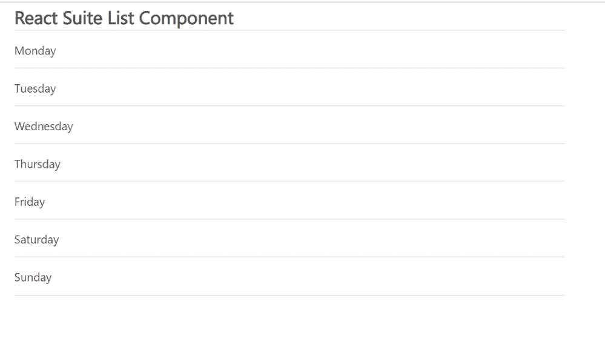

# React Suite 列表组件

> 原文: [https://www.geeksforgeeks.org/react-suite-list-component/](https://www.geeksforgeeks.org/react-suite-list-component/)

React Suite 是一个流行的前端库，包含一组为中间平台和后端产品设计的 React 组件。`List` 组件允许用户显示列表。我们可以在 ReactJS 中使用以下方法来使用 React Suite 列表组件。

## 列表属性

*   `bordered`: 用于加边样式。
*   `hover`: 用于悬停动画。
*   `sortable`: 用于更改列表项订单。
*   `size`: 用于表示列表项的大小。
*   `autoScroll`: 用于溢出时允许自动滚动。
*   `pressDelay`: 表示触发排序前的延时。
*   `transitionDuration`: 用于表示排序动画的持续时间。
*   `onSortStart`: 是开始排序时触发的回调函数。
*   `onSortMove`: 是在列表项上移动时触发的回调函数。
*   `onSortEnd`: 是排序结束时触发的回调函数。
*   `onScroll`: 是排序结束时触发的回调函数。

## 列表项属性

*   `index`: 用来表示一个项目的索引。
*   `collection`: 表示列表项的集合。
*   `disabled`: 保证物品不允许移动。

## 创建 React 应用程序并安装模块

*   **步骤 1:** 使用以下命令创建一个 React 应用程序:

```jsx
npx create-react-app foldername
```

*   **步骤 2:** 创建项目文件夹（即 `foldername`）后，使用以下命令移动到该文件夹中:

```jsx
cd foldername
```

*   **步骤 3:** 创建 ReactJS 应用程序后，使用以下命令安装所需的模块:

```jsx
npm install rsuite
```

## 项目结构

如下图。


项目结构

## 示例

现在在 `App.js` 文件中写下以下代码。在这里，`App` 是我们编写代码的默认组件。

### App.js

```jsx
import React from 'react'
import 'rsuite/dist/styles/rsuite-default.css';
import { List } from 'rsuite';

export default function App() {

const sampleData = ['Monday', 'Tuesday',
                  'Wednesday', 'Thursday', 
                  'Friday', 'Saturday', 'Sunday'];

return (
    <div style={{
      display: 'block', width: 700, paddingLeft: 30
    }}>
      <h4>React Suite List Component</h4>
      <List>
        {sampleData.map((item, index) => (
          <List.Item index={index} key={index} >
            {item}
          </List.Item>
        ))}
      </List>
    </div>
  );
}
```

## 运行应用程序的步骤

从项目的根目录使用以下命令运行应用程序:

```jsx
npm start
```

## 输出

现在打开浏览器，转到 `http://localhost:3000/`，会看到如下输出:



## 参考

[https://rsuitejs.com/components/list/](https://rsuitejs.com/components/list/)