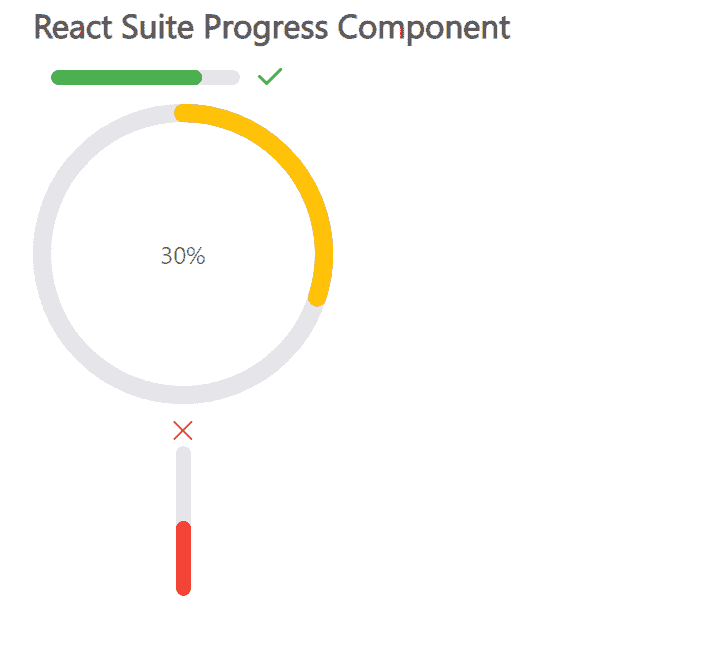

# React Suite 进度组件

> 原文: [https://www.geeksforgeeks.org/react-suite-progress-component/](https://www.geeksforgeeks.org/react-suite-progress-component/)

React Suite 是一个流行的前端库，包含一组为中间平台和后端产品设计的 React 组件。进度组件允许用户显示操作流程的当前进度。我们可以在 ReactJS 中使用以下方法来使用 React Suite 进度组件。

## Progress.Line Props

*   `classPrefix`: 用于表示组件 CSS 类的前缀。
*   `percent`: 用于设置完成百分比。
*   `showInfo`: 表示是否显示文字。
*   `status`: 用于设置进度的状态。
*   `strokeColor`: 用于表示线条颜色。
*   `strokeWidth`: 用于设置线宽。
*   `vertical`: 进度条垂直显示。

## Progress.Circle Props

*   `classPrefix`: 用于表示组件 CSS 类的前缀。
*   `gapDegree`: 用于表示半圆的间隙度。
*   `gapPosition`: 用于表示间隙位置。
*   `percent`: 用于设置完成百分比。
*   `showInfo`: 表示是否显示文字。
*   `status`: 用于设置进度的状态。
*   `strokeColor`: 用于表示线条颜色。
*   `strokeLinecap`: 用于表示不同类型开放路径的终点。
*   `strokeWidth`: 用于设置线宽。
*   `trailColor`: 用于设置未填充部分的颜色。
*   `trailWidth`: 用于设置未填充部分的宽度。

## 创建 React 应用程序并安装模块

*   **步骤 1:** 使用以下命令创建一个 React 应用程序:
    ```
    npx create-react-app foldername
    ```

*   **步骤 2:** 在创建项目文件夹（即 `foldername`）后，使用以下命令移动到该文件夹:
    ```
    cd foldername
    ```

*   **步骤 3:** 创建 ReactJS 应用程序后，使用以下命令安装所需的 `rsuite` 模块:
    ```
    npm install rsuite
    ```

**项目结构:** 如下图。


## 示例

现在在 `App.js` 文件中写下以下代码。在这里，`App` 是我们编写代码的默认组件。

### App.js

```jsx
import React from 'react'
import 'rsuite/dist/styles/rsuite-default.css';
import { Progress } from 'rsuite'

const { Line, Circle } = Progress

export default function App() {

return (
    <div style={{
      display: 'block', width: 700, paddingLeft: 30
    }}>
      <h4>React Suite Progress Component</h4>
      <div style={{ width: 200 }}>
        <Line percent={80} status='success' />
        <Circle percent={30} strokeColor="#ffc107" />
        <Line vertical percent={50} status="fail" />
      </div>
    </div>
  );
}
```

**运行应用程序的步骤:** 从项目的根目录使用以下命令运行应用程序:
```
npm start
```

**输出:** 现在打开浏览器，转到 `http://localhost:3000/`，会看到如下输出:



**参考:** [https://rsuitejs.com/components/progress/](https://rsuitejs.com/components/progress/)