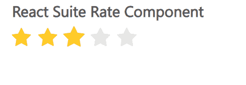

# 反应套件速率组件

> 原文：[https://www.geeksforgeeks.org/react-suite-rate-component/](https://www.geeksforgeeks.org/react-suite-rate-component/)

React Suite 是一个流行的前端库，包含一组为中间平台和后端产品设计的 React 组件。分级组件允许用户以分级的形式表示他对内容的兴趣。我们可以在 ReactJS 中使用以下方法来使用 React 套件费率组件。

## 等级道具

*   `allowHalf`：表示是否支持半选。
*   `character`：用于自定义字符。
*   `cleanable`：表示是否支持清除。
*   `defaultValue`：用于表示默认值。
*   `disabled`：用于禁用组件。
*   `max`：用于表示最高分。
*   `renderCharacter`：用于自定义渲染角色功能。
*   `readOnly`：用于表示是否只读。
*   `size`：用于设置组件尺寸。
*   `color`：用于表示按钮颜色。
*   `value`：用于表示值（受控）。
*   `vertical`：半选时用于方向。
*   `onChange`：是值发生变化时触发的回调函数。
*   `onChangeActive`：是悬停状态改变时触发的回调函数。

## 创建反应应用程序并安装模块

*   **步骤 1：** 使用以下命令创建一个反应应用程序：

    ```jsx
    npx create-react-app foldername
    ```

*   **步骤 2：** 在创建项目文件夹（即 `foldername`）后，使用以下命令移动到该文件夹：

    ```jsx
    cd foldername
    ```

*   **步骤 3：** 创建 ReactJS 应用程序后，使用以下命令安装所需的模块：

    ```jsx
    npm install rsuite
    ```

## 项目结构

如下图。


## 示例

现在在 `App.js` 文件中写下以下代码。在这里，`App` 是我们编写代码的默认组件。

### App.js

```jsx
import React from 'react'
import 'rsuite/dist/styles/rsuite-default.css';
import { Rate } from 'rsuite';

export default function App() {

return (
    <div style={{
      display: 'block', width: 600, paddingLeft: 30
    }}>
      <h4>React Suite Rate Component</h4>
      <Rate
        style={{ width: 300 }}
        defaultValue={1}
      />
    </div>
  );
}
```

## 运行应用程序的步骤

从项目的根目录使用以下命令运行应用程序：

```jsx
npm start
```

## 输出

现在打开浏览器，转到 `http://localhost:3000/`，会看到如下输出：



## 参考

[https://rsuitejs.com/components/rate/](https://rsuitejs.com/components/rate/)