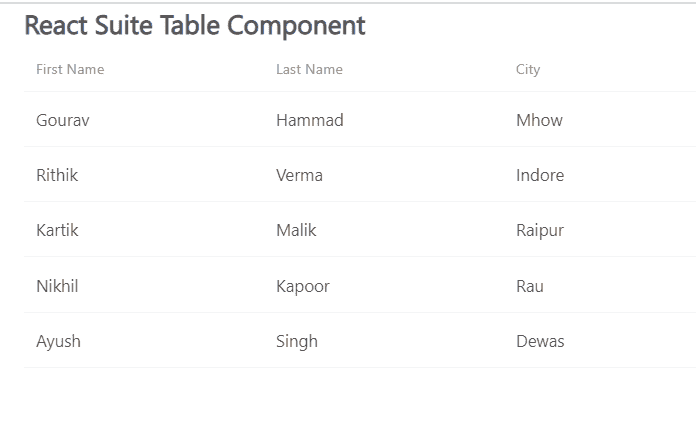

# 反应套件表组件

> 原文: [https://www.geeksforgeeks.org/react-suite-table-component/](https://www.geeksforgeeks.org/react-suite-table-component/)

React Suite 是一个流行的前端库，包含一组为中间平台和后端产品设计的 React 组件。`Table` 组件允许用户显示行数据。我们可以使用这个组件创建表。我们可以在 ReactJS 中使用以下方法来使用 React Suite 表组件。

## 桌面道具

*   `stickyHeader`: 用于将表头粘贴到页面指定位置。
*   `stickyScrollbar`: 用于将表格水平滚动条粘贴到页面的指定位置。
*   `autoHeight`: 用于自动高度。
*   `bodyRef`: 用于表示附加到表体元素的 Ref。
*   `bordered`: 用于显示边框。
*   `cellBordered`: 用于显示单元格边框。
*   `data`: 用于表示表格数据。
*   `defaultExpandAllRows`: 默认用于展开所有节点。
*   `defaultExpandRowKeys`: 用于通过 `rowKey` 指定默认的展开行。
*   `defaultSortType`: 用于表示排序类型。
*   `expandedRowKeys`: 用于通过行键指定默认的扩展行。
*   `headerHeight`: 用于表示表头高度。
*   `height`: 用于表示工作台高度。
*   `hover`: 用于表示表格的行有鼠标悬停效果。
*   `isTree`: 用于显示为树形表。
*   `loading`: 用于显示装载。
*   `minHeight`: 用于表示最小高度。
*   `onDataUpdated`: 是表数据更新后触发的回调函数。
*   `onExpandChange`: 是扩展时在扩展节点触发的回调函数。
*   `onRowClick`: 是行后触发的回调函数，返回 `rowDate`。
*   `onScroll`: 是滚动条滚动触发的回调函数。
*   `onSortColumn`: 排序序列的回调函数返回 `SortColumn`，`sortType` 的值。
*   `renderEmpty`: 用于自定义空显示内容中的数据。
*   `renderLoading`: 用于自定义数据加载中的显示内容。
*   `renderRowExpanded`: 用于自定义扩展区域的方式。
*   `renderTreeToggle`: 是切换时在扩展节点触发的回调函数。
*   `rowClassName`: 用于向行中添加可选的额外类名。
*   `rowExpandedHeight`: 用于设置可扩展区域的高度。
*   `rowHeight`: 用来表示行高。
*   `rowKey`: 用来表示行键。
*   `shouldUpdateScroll`: 表示数据更新后是否更新滚动条。
*   `showHeader`: 用于显示表头。
*   `sortColumn`: 用于排序列名。
*   `sortType`: 用于表示排序类型(受控)。
*   `virtualized`: 用于有效渲染大型表格数据。
*   `width`: 用于表示表格宽度。
*   `wordWrap`: 用于使单元格自动换行。

## Table.Column Props

*   `align`: 用于对齐。
*   `colSpan`: 当合并列的数据键值为空或未定义时，要合并的列单元格。
*   `fixed`: 用于固定柱。
*   `flexGrow`: 设置列宽在设置 `flexGrow` 无法设置大小和 `width` 属性时自动调整。
*   `minWidth`: 用于使用 `flexGrow` 时，通过最小宽度设置最小宽度。
*   `onResize`: 是列宽变化后触发的回调函数。
*   `resizable`: 用于可自定义的调整列宽。
*   `sortable`: 表示是否可排序。
*   `treeCol`: 用来表示树的一列。
*   `verticalAlign`: 用于垂直对齐。
*   `width`: 用于表示列宽。

## Table.ColumnGroup Props

*   `align`: 用于对齐。
*   `fixed`: 用于固定柱组。
*   `verticalAlign`: 用于垂直对齐。
*   `header`: 用于集团表头。

## Table.Cell Props

*   `dataKey`: 用于表示数据绑定键。
*   `rowData`: 用于表示行数据。
*   `rowIndex`: 用于表示行号。

## Table.Pagination Props

*   `activePage`: 用于配置当前页码。
*   `disabled`: 用于禁用组件。
*   `displayLength`: 配置每页显示多少行条目，对应长度菜单。
*   `first`: 用于显示首页按钮。
*   `last`: 用于显示最后一页按钮。
*   `lengthMenu`: 用于表示分页显示行号配置。
*   `maxButtons`: 用于配置显示按钮的最大数量。
*   `next`: 用于显示下一页按钮。
*   `onChangeLength`: 是一个回调函数，当 `lengthMenu` 值改变时触发。
*   `onChangePage`: 是页面发生变化时触发的回调函数。
*   `prev`: 用于显示上一页按钮。
*   `renderLengthMenu`: 用于自定义菜单。
*   `renderTotal`: 用于自定义总计。
*   `reverse`: 用于反转起始位置和结束位置。
*   `showInfo`: 用于显示寻呼信息。
*   `showLengthMenu`: 用于显示下拉菜单。
*   `total`: 用于表示数据条目的总数。

## 创建反应应用程序并安装模块

*   **步骤 1:** 使用以下命令创建一个反应应用程序:
    ```bash
    npx create-react-app foldername
    ```
*   **步骤 2:** 在创建项目文件夹(即文件夹名)后，使用以下命令将移动到该文件夹:
    ```bash
    cd foldername
    ```
*   **步骤 3:** 创建 ReactJS 应用程序后，使用以下命令安装所需的模块:
    ```bash
    npm install rsuite
    ```

## 项目结构

如下图。


## 示例

现在在 `App.js` 文件中写下以下代码。在这里，`App` 是我们编写代码的默认组件。

### App.js

```jsx
import React from 'react'
import 'rsuite/dist/styles/rsuite-default.css';
import { Table } from 'rsuite';
const { Column, HeaderCell, Cell } = Table;

export default function App() {

// Sample table data
    const sampleData = [
        { firstName: 'Gourav', lastName: 'Hammad', city: 'Mhow' },
        { firstName: 'Rithik', lastName: 'Verma', city: 'Indore' },
        { firstName: 'Kartik', lastName: 'Malik', city: 'Raipur' },
        { firstName: 'Nikhil', lastName: 'Kapoor', city: 'Rau' },
        { firstName: 'Ayush', lastName: 'Singh', city: 'Dewas' }
    ]

return (
        <div style={{
            display: 'block', width: 700, paddingLeft: 30
        }}>
            <h4>React Suite Table Component</h4>
            <Table
                height={500}
                data={sampleData}
            >
                <Column width={200}>
                    <HeaderCell>First Name</HeaderCell>
                    <Cell dataKey="firstName" />
                </Column>
                <Column width={200}>
                    <HeaderCell>Last Name</HeaderCell>
                    <Cell dataKey="lastName" />
                </Column>
                <Column width={200}>
                    <HeaderCell>City</HeaderCell>
                    <Cell dataKey="city" />
                </Column>
            </Table>
        </div>
    );
}
```

## 运行应用程序的步骤

从项目的根目录使用以下命令运行应用程序:
```bash
npm start
```

## 输出

现在打开浏览器，转到 `http://localhost:3000/`，会看到如下输出:



## 参考

[https://rsuitejs.com/components/table/](https://rsuitejs.com/components/table/)