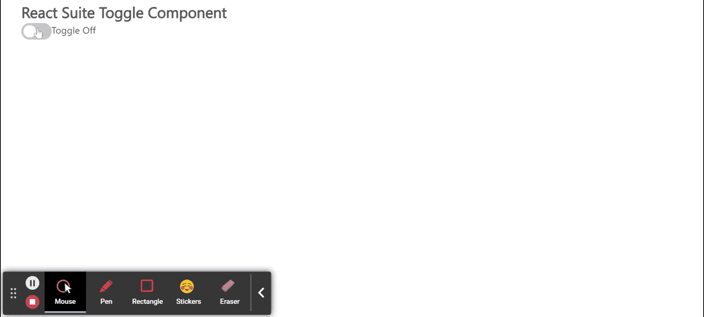

# 反应套件切换组件

> 原文：[https://www.geeksforgeeks.org/react-suite-toggle-component/](https://www.geeksforgeeks.org/react-suite-toggle-component/)

React Suite 是一个流行的前端库，包含一组为中间平台和后端产品设计的 React 组件。切换组件允许用户在两个值之间选择。我们可以在 ReactJS 中使用以下方法来使用 React Suite 切换组件。

### 切换道具

| 属性 | 描述 |
| :--- | :--- |
| `Check` | 用于检查状态（受控）。 |
| `被检查儿童` | 用于检查显示的内容。 |
| `Class prefix` | 用于表示组件 CSS 类的前缀。 |
| `is checked by default` | 用于指示默认检查。 |
| `Disabled` | 用于禁用组件。 |
| `onChange` | 状态更改时触发的回调函数。 |
| `dimension` | 用于指示肘关节的大小。 |
| `Uncheck` | 用于取消选中显示的内容。 |

### 创建反应应用程序并安装模块

*   **步骤 1：** 使用以下命令创建一个反应应用程序：

```bash
npx create-react-app foldername
```

*   **步骤 2：** 创建项目文件夹后，即文件夹名称，使用以下命令移动到项目文件夹：

```bash
cd foldername
```

*   **步骤 3：** 创建 ReactJS 应用程序后，使用以下命令安装所需的模块：

```bash
npm install rsuite
```

### 项目结构

如下图。


### 示例

现在在 `App.js` 文件中写下以下代码。在这里，`App` 是我们编写代码的默认组件。

## App.js

```jsx
// Importing required libraries
import React from 'react'
import 'rsuite/dist/styles/rsuite-default.css';
import { Toggle } from 'rsuite';

export default function App() {
  // State for the current toggle value
  const [currentValue, setCurrentValue] = React.useState(0)

  return (
    <div style={{
      display: 'block', width: 400, paddingLeft: 30
    }}>
      <h4>React Suite Toggle Component</h4>
      <Toggle
        onChange={(value) => { setCurrentValue(value) }}
      />
      {currentValue === true ? "Toggle On" : "Toggle Off"}
    </div>
  );
}
```

### 运行应用程序的步骤

从项目的根目录使用以下命令运行应用程序：

```bash
npm start
```

### 输出

现在打开浏览器，转到 `http://localhost:3000/`，会看到如下输出：



### 参考

[T2] https://rsuitejs.com/components/toggle/