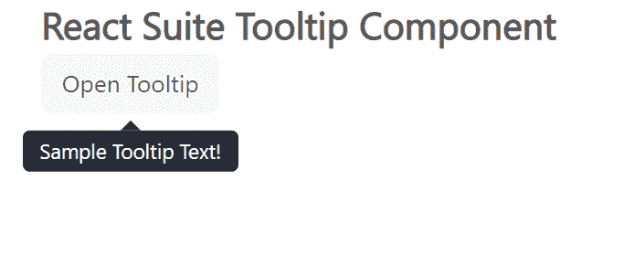

# 反应套件工具提示组件

> 原文：[https://www.geeksforgeeks.org/react-suite-tooltip-component/](https://www.geeksforgeeks.org/react-suite-tooltip-component/)

React Suite 是一个流行的前端库，包含一组为中间平台和后端产品设计的 React 组件。工具提示组件允许用户在悬停、聚焦或点击元素时显示信息性文本。我们可以在 ReactJS 中使用以下方法来使用 React 套件工具提示组件。

## 工具提示道具

*   `children`：表示主要内容。
*   `classPrefix`：用于表示组件 CSS 类的前缀。
*   `visible`：用于表示组件是否可见。

## 耳语道具

*   `container`：用于设置渲染容器。
*   `delay`：用于表示延迟时间。
*   `delayHide`：用于表示隐藏的延迟时间。
*   `delayShow`：用于显示延时时间。
*   `onBlur`：是失焦时触发的功能。
*   `onClick`：是点击事件触发的功能。
*   `onEnter`：是在叠加转换之前触发的功能。
*   `onEntered`：是叠加完成转换后触发的功能。
*   `onEntering`：这是一个在叠加开始过渡时触发的功能。
*   `onExit`：这是一个在叠加转换之前触发的功能。
*   `onExited`：是叠加完成过渡后触发的功能。
*   `onExiting`：是叠加开始向外过渡时触发的功能。
*   `onFocus`：是触发获得焦点的功能。
*   `onMouseOut`：是鼠标离开事件触发的功能。
*   `placement`：用于组件的放置。
*   `preventOverflow`：用于防止浮动元素溢出。
*   `speaker`：用于显示的组件。
*   `trigger`：用于触发事件。

## 耳语方法

*   `open()`：此方法用于显示工具提示。
*   `close()`：此方法用于关闭工具提示。

## 创建反应应用程序并安装模块

### 步骤 1
使用以下命令创建一个反应应用程序：
```jsx
npx create-react-app foldername
```

### 步骤 2
创建项目文件夹（即 `foldername`）后，使用以下命令移动到该文件夹中：
```jsx
cd foldername
```

### 步骤 3
创建 ReactJS 应用程序后，使用以下命令安装所需的模块：
```jsx
npm install rsuite
```

## 项目结构
如下图。


## 示例
现在在 `App.js` 文件中写下以下代码。在这里，`App` 是我们编写代码的默认组件。

### App.js
```jsx
import React from 'react'
import 'rsuite/dist/styles/rsuite-default.css';
import { Button, Tooltip, Whisper } from 'rsuite'

export default function App() {
  return (
    <div style={{
      display: 'block', width: 700, paddingLeft: 30
    }}>
      <h4>React Suite Tooltip Component</h4>
      <Whisper
        trigger="click"
        placement="bottom"
        speaker={<Tooltip>Sample Tooltip Text!</Tooltip>}
      >
        <Button appearance="subtle">Open Tooltip</Button>
      </Whisper>
    </div>
  );
}
```

## 运行应用程序的步骤
从项目的根目录使用以下命令运行应用程序：
```jsx
npm start
```

## 输出
现在打开浏览器，转到 `http://localhost:3000/`，会看到如下输出：



## 参考
[https://rsuitejs.com/components/tooltip/](https://rsuitejs.com/components/tooltip/)