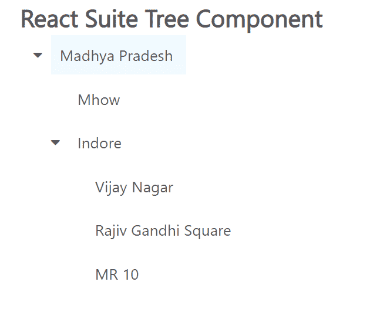

# 反应套件树组件

> 原文：[https://www.geeksforgeeks.org/react-suite-tree-component/](https://www.geeksforgeeks.org/react-suite-tree-component/)

React Suite 是一个流行的前端库，包含一组为中间平台和后端产品设计的 React 组件。树组件允许用户显示树结构的数据。我们可以在 ReactJS 中使用以下方法来使用 React Suite 树组件。

## 树组件属性

*   `childrenKey`：用于表示 Tree 数据结构 Children 属性名称。
*   `classPrefix`：用于表示组件 CSS 类的前缀。
*   `data`：用于表示可选数据。
*   `defaultExpandAll`：默认用于扩展所有节点。
*   `defaultExpandItemValues`：用于设置默认扩展节点的值。
*   `defaultValue`：用于表示默认值。
*   `disableItemValues`：用于禁用可选。
*   `draggable`：用于设置拖动节点。
*   `expandItemValues`：用于设置扩展节点(受控)的值。
*   `height`：用于表示菜单高度。
*   `labelKey`：用于设置显示“数据”中“键”的选项。
*   `onChange`：是一个回调函数，当值发生变化时触发。
*   `onDragStart`：是节点拖动开始时触发的回调函数。
*   `onDragEnter`：是节点拖拽进入时触发的回调函数。
*   `onDragOver`：是节点拖动过来时触发的回调函数。
*   `onDragLeave`：是节点拖拽离开时触发的回调函数。
*   `onDragEnd`：是节点拖动结束时触发的回调函数。
*   `onDrop`：是节点掉落时触发的回调函数。
*   `onExpand`：是显示树节点时触发的回调函数。
*   `onSelect`：是一个回调函数，在选择一个选项时触发。
*   `renderDragNode`：当 `draggable` 为真时，用于自定义渲染拖动节点。
*   `renderTreeIcon`：用于表示自定义渲染图标。
*   `renderTreeNode`：用于表示自定义渲染树节点。
*   `searchKeyword`：用于表示搜索关键字(受控)。
*   `value`：用于表示值(受控)。
*   `valueKey`：用于设置“数据”中的选项值‘key’。
*   `virtualized`：表示是否使用虚拟化列表。

## 创建 React 应用程序并安装模块

*   **步骤 1：** 使用以下命令创建一个 React 应用程序：

```jsx
npx create-react-app foldername
```

*   **步骤 2：** 创建项目文件夹（即 `foldername`）后，使用以下命令移动到该文件夹中：

```jsx
cd foldername
```

*   **步骤 3：** 创建 ReactJS 应用程序后，使用以下命令安装所需的模块：

```jsx
npm install rsuite
```

## 项目结构

项目结构如下图所示。


## 示例

现在在 `App.js` 文件中写下以下代码。在这里，`App` 是我们编写代码的默认组件。

### App.js

```jsx
import React from 'react'
import 'rsuite/dist/styles/rsuite-default.css';
import { Tree } from 'rsuite';

export default function App() {

  // Sample Options
  const options = [
    {
      "label": "Madhya Pradesh",
      "value": 1,
      "children": [
        {
          "label": "Mhow",
          "value": 2
        },
        {
          "label": "Indore",
          "value": 3,
          "children": [
            {
              "label": "Vijay Nagar",
              "value": 4
            },
            {
              "label": "Rajiv Gandhi Square",
              "value": 5
            },
            {
              "label": "MR 10",
              "value": 6
            },
          ]
        },
      ]
    }
  ]

  return (
    <div style={{
      display: 'block', width: 600, paddingLeft: 30
    }}>
      <h4>React Suite Tree Component</h4>
      <Tree
        style={{ width: 300 }}
        defaultExpandAll
        data={options}
      />
    </div>
  );
}
```

## 运行应用程序的步骤

从项目的根目录使用以下命令运行应用程序：

```jsx
npm start
```

## 输出

现在打开浏览器，转到 `http://localhost:3000/`，会看到如下输出：



## 参考

[https://rsuitejs.com/components/tree/](https://rsuitejs.com/components/tree/)