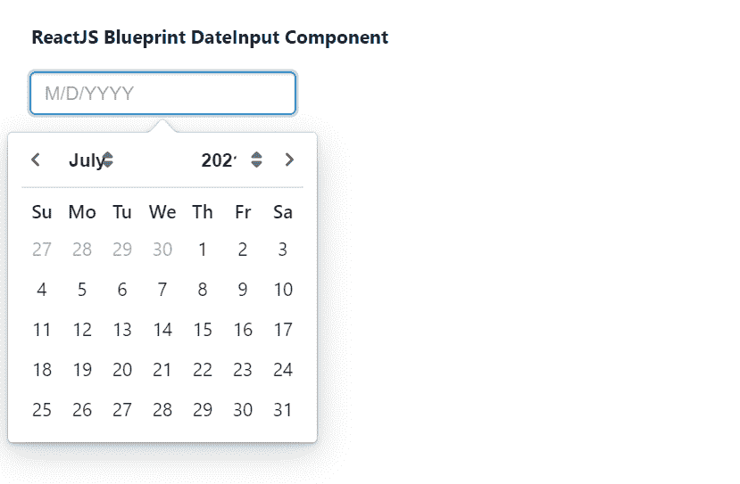

# 重新获取蓝图日期输入组件

> 原文：[https://www.geeksforgeeks.org/reactjs-blueprint-dateinput-component/](https://www.geeksforgeeks.org/reactjs-blueprint-dateinput-component/)

Blueprint 是一个基于 React 的 Web 用户界面工具包。该库非常适合构建桌面应用程序的复杂数据密集型界面，并且非常受欢迎。日期输入组件帮助用户输入日期作为输入。我们可以在 ReactJS 中使用以下方法来使用 ReactJS Blueprint DateInput 组件。

## 档案输入命题

*   `canClearSelection`：允许用户通过点击当前选择的日期来清除选择。
*   `className`：用于表示传递给子元素的以空格分隔的类名列表。
*   `clearButtonText`：用于表示日期选择器动作栏中重置按钮的文本。
*   `closeOnSelection`：用于指示选择日期时日历弹出窗口是否应关闭。
*   `dayPickerProps`：用于表示传递给 `ReactDayPicker` 的道具。
*   `defaultValue`：用于表示不受控制时组件中使用的默认日期。
*   `disabled`：表示日期输入是否非交互。
*   `fill`：用于表示组件是否应占据其容器的整个宽度。
*   `formatDate`：是一个将 JavaScript 日期渲染成字符串的函数。
*   `highlightCurrentDay`：表示日历中是否要突出显示当天。
*   `initialMonth`：用于表示日历显示的初始月份。
*   `inputProps`：用于表示传递给输入组的道具。
*   `invalidDateMessage`：用于表示所选日期无效时显示的错误信息。
*   `locale`：用于表示地区名称。
*   `localeUtils`：用来表示提供国际化支持的函数集合。
*   `maxDate`：表示用户可以选择的最晚日期。
*   `minDate`：用于表示用户可以选择的最早日期。
*   `modifiers`：它用于表示函数的集合，这些函数决定了哪些修饰符类应用于哪些天。
*   `onChange`：这是一个回调函数，当用户通过日期选择器或通过输入选择新的有效日期时会触发该函数。
*   `onError`：是一个回调函数，当用户输入完新的日期，日期导致错误状态时触发。
*   `outOfRangeMessage`：用于表示所选日期超出范围时显示的错误信息。
*   `parseDate`：是将用户输入文本反序列化为 JavaScript `Date` 对象的回调函数。
*   `placeholder`：用于表示要在空输入字段中显示的占位符文本。
*   `popoverProps`：用来表示要传给 `Popover` 的道具。
*   `reverseMonthAndYearMenus`：如果设置为 `true`，月份菜单将出现在年份菜单的左侧。
*   `rightElement`：用于表示要在输入右侧呈现的元素。
*   `shortcuts`：表示是否显示快速选择日期的快捷方式。
*   `showActionsBar`：用于指示显示*今日*和*清除*按钮的底部条是否应显示在日历下方。
*   `timePicker`：用于进一步配置出现在日历下方的*时间选择器*。
*   `timePrecision`：用于表示日历中时间选择的精度。
*   `todayButtonText`：用于表示日期选择器操作栏中今日按钮的文本。
*   `value`：表示当前选择的日期。

## 创建反应应用程序并安装模块

*   **步骤 1：** 使用以下命令创建一个反应应用程序：

    ```jsx
    npx create-react-app foldername
    ```

*   **步骤 2：** 创建项目文件夹（即 `foldername`）后，使用以下命令移动到该文件夹中：

    ```jsx
    cd foldername
    ```

*   **步骤 3：** 创建 ReactJS 应用程序后，使用以下命令安装所需的模块：

    ```bash
    npm install @blueprintjs/core
    npm install @blueprintjs/datetime
    ```

## 项目结构

如下图。


## 示例

现在在 `App.js` 文件中写下以下代码。在这里，`App` 是我们编写代码的默认组件。

## App.js

```jsx
import React from 'react'
import '@blueprintjs/datetime/lib/css/blueprint-datetime.css';
import '@blueprintjs/core/lib/css/blueprint.css';
import { DateInput } from "@blueprintjs/datetime";

function App() {
    return (
        <div style={{
            display: 'block', width: 400, padding: 30
        }}>
            <h4>ReactJS Blueprint DateInput Component</h4>
            <DateInput
                formatDate={date => date.toLocaleString()}
                parseDate={str => new Date(str)}
                placeholder={"M/D/YYYY"}
            />
        </div >
    );
}

export default App;
```

## 运行应用程序的步骤

从项目的根目录使用以下命令运行应用程序：

```bash
npm start
```

## 输出

现在打开浏览器，转到 `http://localhost:3000/`，会看到如下输出：



## 参考

[https://blueprintjs.com/docs/#datetime/dateinput](https://blueprintjs.com/docs/#datetime/dateinput)