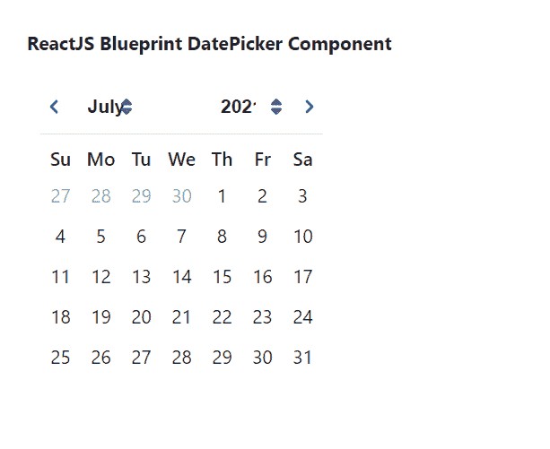

# 重新获取蓝图日期选择器组件

> 原文: [https://www.geeksforgeeks.org/reactjs-blueprint-datepicker-component/](https://www.geeksforgeeks.org/reactjs-blueprint-datepicker-component/)

Blueprint 是一个基于 React 的 Web 用户界面工具包。该库非常适合构建桌面应用程序的复杂数据密集型界面，并且非常受欢迎。日期选择器组件帮助用户选择单一日期。我们可以在 ReactJS 中使用以下方法来使用 ReactJS Blueprint 日期选择器组件。

## `DatePicker` Props

*   `canClearSelection`: 允许用户通过点击当前选择的日期来清除选择。
*   `className`: 用于表示传递给子元素的以空格分隔的类名列表。
*   `clearButtonText`: 用于表示动作栏中复位按钮的文本。
*   `dayPickerProps`: 用于表示传递给 `ReactDayPicker` 的道具。
*   `defaultValue`: 用于表示日历的第一天将显示为选中状态。
*   `highlightCurrentDay`: 表示日历中是否要突出显示当天。
*   `initialMonth`: 用于表示日历显示的初始月份。
*   `locale`: 用于表示地区名称。
*   `localeUtils`: 用来表示提供国际化支持的函数集合。
*   `maxDate`: 表示用户可以选择的最晚日期。
*   `minDate`: 用于表示用户可以选择的最早日期。
*   `modifiers`: 它用于表示函数的集合，这些函数决定了哪些修饰符类应用于哪些天。
*   `onChange`: 是用户选择一天时触发的回调函数。
*   `onShortcutChange`: 是启用快捷键道具，用户更改快捷键时触发的回调函数。
*   `reverseMonthAndYearMenus`: 如果设置为 true，月份菜单将出现在年份菜单的左侧。
*   `selectedShortcutIndex`: 用于表示当前选中的快捷方式。
*   `shortcuts`: 表示是否显示快速选择日期的快捷方式。
*   `showActionsBar`: 用于指示底部显示*今日*和*清除*按钮是否显示。
*   `timePicker`: 用于进一步配置出现在日历下方的*时间选择器*。
*   `timePrecision`: 用于表示日历中时间选择的精度。
*   `todayButtonText`: 用于表示动作栏中“today”按钮的文本。
*   `value`: 表示当前选择的日期。

## `DatePickerShortcut` Props

*   `date`: 用于表示此快捷方式所代表的日期。
*   `includeTime`: 用于当此道具设置为 true 时，允许此快捷方式更改选定的时间和日期。
*   `label`: 用于表示列表中出现的快捷标签。

## 创建 React 应用程序并安装模块

**步骤 1:** 使用以下命令创建一个 React 应用程序:

```jsx
npx create-react-app foldername
```

**步骤 2:** 创建项目文件夹（即 `foldername`）后，使用以下命令移动到该文件夹中:

```jsx
cd foldername
```

**步骤 3:** 创建 ReactJS 应用程序后，使用以下命令安装所需的模块:

```jsx
npm install @blueprintjs/core
npm install @blueprintjs/datetime
```

**项目结构:** 如下图。


## 示例

现在在 `App.js` 文件中写下以下代码。在这里，`App` 是我们编写代码的默认组件。

### `App.js`

```jsx
import React from 'react'
import '@blueprintjs/datetime/lib/css/blueprint-datetime.css';
import '@blueprintjs/core/lib/css/blueprint.css';
import { DatePicker } from "@blueprintjs/datetime";

function App() {
    return (
        <div style={{
            display: 'block', width: 400, padding: 30
        }}>
            <h4>ReactJS Blueprint DatePicker Component</h4>
            <DatePicker />
        </div >
    );
}

export default App;
```

**运行应用程序的步骤:** 从项目的根目录使用以下命令运行应用程序:

```jsx
npm start
```

**输出:** 现在打开浏览器，转到 `http://localhost:3000/`，会看到如下输出:



**参考:** [https://blueprintjs.com/docs/#datetime/datepicker](https://blueprintjs.com/docs/#datetime/datepicker)