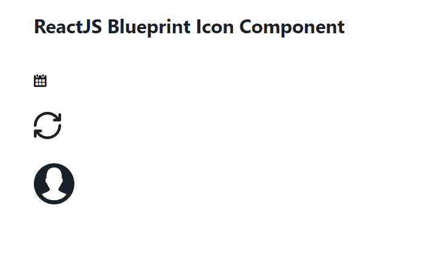

# 重新获取蓝图图标组件

> 原文: [https://www.geeksforgeeks.org/reactjs-blueprint-icon-component/](https://www.geeksforgeeks.org/reactjs-blueprint-icon-component/)

Blueprint 是一个基于 React 的网络用户界面工具包。该库非常适合构建桌面应用程序的复杂数据密集型界面，并且非常受欢迎。`Icon` 组件为用户提供了一种在应用程序中轻松渲染 SVG 图标的方式。它用于在我们的应用程序中显示图标。我们可以在 ReactJS 中使用以下方法来使用 ReactJS Blueprint `Icon` 组件。

## 图标道具 (Props)

*   `children`: 用于将 children 组件传递给底层元素。
*   `className`: 用于表示传递给子元素的以空格分隔的类名列表。
*   `color`: 用于表示图标的颜色。
*   `htmlTitle`: 用于表示渲染元素上 `title` 属性的字符串。
*   `icon`: 用于表示要渲染的 Blueprint UI 图标或图标元素的名称。
*   `iconSize`: 用于表示图标的大小，以像素为单位。
*   `intent`: 用于将视觉意图颜色应用于元素。
*   `style`: 用于传递 CSS 样式属性。
*   `tagName`: 用于表示渲染元素使用的 HTML 标记。
*   `title`: 用于表示描述字符串。

## 创建 React 应用程序并安装模块

*   **步骤 1:** 使用以下命令创建一个 React 应用程序:
    ```
    npx create-react-app foldername
    ```

*   **步骤 2:** 创建项目文件夹 (即 `foldername`) 后，使用以下命令移动到该文件夹中:
    ```
    cd foldername
    ```

*   **步骤 3:** 创建 ReactJS 应用程序后，使用以下命令安装所需的模块:
    ```
    npm install @blueprintjs/core
    ```

## 项目结构

如下图所示。


项目结构

## 示例

现在在 `App.js` 文件中写下以下代码。在这里，`App` 是我们编写代码的默认组件。

### App.js

```jsx
import React from 'react'
import '@blueprintjs/core/lib/css/blueprint.css';
import { Icon } from "@blueprintjs/core";

function App() {
    return (
        <div style={{
            display: 'block', width: 500, padding: 30
        }}>
            <h4>ReactJS Blueprint Icon Component</h4>
            <Icon iconSize={10} icon="calendar"/> <br></br><br></br>
            <Icon iconSize={20} icon="refresh"/> <br></br><br></br>
            <Icon iconSize={30} icon="user"/>
        </div>
    );
}

export default App;
```

## 运行应用程序的步骤

从项目的根目录使用以下命令运行应用程序:
```
npm start
```

## 输出

现在打开浏览器，转到 `http://localhost:3000/`，会看到如下输出:



## 参考

[https://blueprintjs.com/docs/#core/components/icon](https://blueprintjs.com/docs/#core/components/icon)