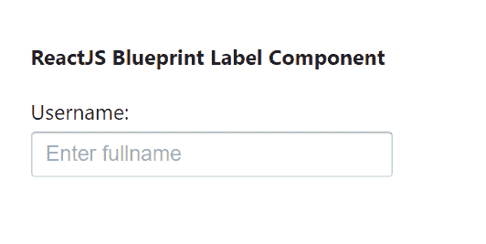
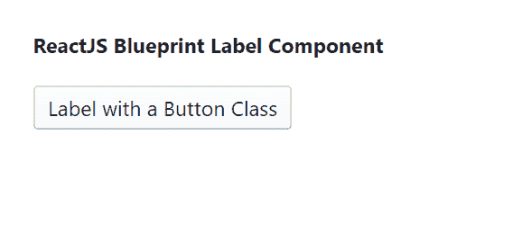

# 反应堆蓝图标签组件

> 原文: [https://www.geeksforgeeks.org/reactjs-blueprint-label-component/](https://www.geeksforgeeks.org/reactjs-blueprint-label-component/)

Blueprint 是一个基于 React 的网络用户界面工具包。该库非常适合构建桌面应用程序的复杂数据密集型界面，并且非常受欢迎。`Label` 组件为用户提供了一种增强表单可用性的方法。我们可以在 ReactJS 中使用以下方法来使用 ReactJS Blueprint `Label` 组件。

**`Label` 属性:**

*   `htmlFor`: 用于表示目标元素 `ref` 值。
*   `id`: 用于表示唯一标识符值。
*   `class`: 用于表示样式的类名。

## 创建 React 应用程序并安装模块

**步骤 1:** 使用以下命令创建一个 React 应用程序:

```jsx
npx create-react-app foldername
```

**步骤 2:** 创建项目文件夹（即 `foldername`）后，使用以下命令移动到该文件夹中:

```jsx
cd foldername
```

**步骤 3:** 创建 ReactJS 应用程序后，使用以下命令安装所需的模块:

```jsx
npm install @blueprintjs/core
```

**项目结构:** 如下图。


项目结构

## 示例 1

演示 `Label` 组件，不应用任何属性。在 `App.js` 文件中写下以下代码。

```jsx
import React from 'react'
import '@blueprintjs/core/lib/css/blueprint.css';
import { Label, InputGroup } from "@blueprintjs/core";

function App() {
    return (
        <div style={{
            display: 'block', width: 300, padding: 30
        }}>
            <h4>ReactJS Blueprint Label Component</h4>
            <Label>Username: 
            <InputGroup placeholder="Enter fullname"></InputGroup>
            </Label>
        </div>
    );
}

export default App;
```

**运行应用程序的步骤:** 从项目的根目录使用以下命令运行应用程序:

```jsx
npm start
```

**输出:** 现在打开浏览器，转到 `http://localhost:3000/`，会看到如下输出:



## 示例 2

演示应用了 `class` 属性的 `Label` 组件。在 `App.js` 文件中写下以下代码。

```jsx
import React from 'react'
import '@blueprintjs/core/lib/css/blueprint.css';
import { Label } from "@blueprintjs/core";

function App() {
    return (
        <div style={{
            display: 'block', width: 500, padding: 30
        }}>
            <h4>ReactJS Blueprint Label Component</h4>
            <Label class="bp3-button">Label with a Button Class</Label>
        </div>
    );
}

export default App;
```

**运行应用程序的步骤:** 从项目的根目录使用以下命令运行应用程序:

```jsx
npm start
```

**输出:** 现在打开浏览器，转到 `http://localhost:3000/`，会看到如下输出:



**参考:** [https://blueprintjs.com/docs/#core/components/label](https://blueprintjs.com/docs/#core/components/label)