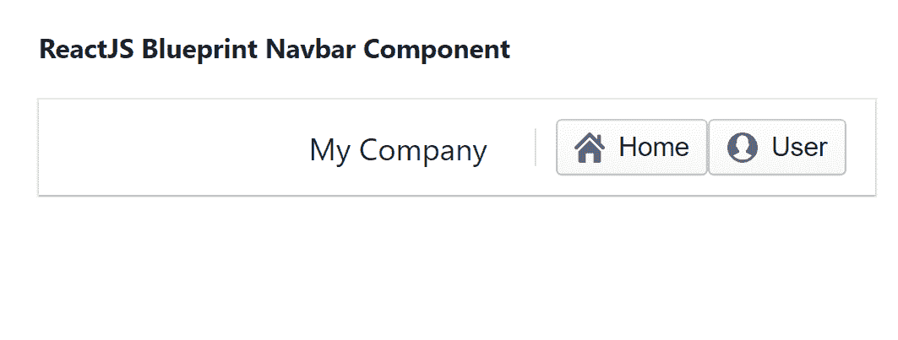

# 反应堆蓝图导航条组件

> 原文: [https://www.geeksforgeeks.org/reactjs-blueprint-navbar-component/](https://www.geeksforgeeks.org/reactjs-blueprint-navbar-component/)

Blueprint 是一个基于 React 的网络用户界面工具包。该库非常适合构建桌面应用程序的复杂数据密集型界面，并且非常受欢迎。导航栏组件为用户提供了一种在应用程序顶部为他们提供导航控件的方式。我们可以在 ReactJS 中使用以下方法来使用 ReactJS Blueprint 导航栏组件。

## Navbar Props

*   `className`: 用于表示传递给子元素的以空格分隔的类名列表。
*   `fixedTop`: 用于表示这个导航条是否应该固定在视口顶部。

## NavbarGroup Props

*   `align`: 用于表示组应该出现在导航栏的哪一侧。
*   `className`: 用于表示传递给子元素的以空格分隔的类名列表。

## NavbarHeading Props

*   `className`: 用于表示传递给子元素的以空格分隔的类名列表。

## NavbarDivider Props

*   `className`: 用于表示传递给子元素的以空格分隔的类名列表。

## 创建 React 应用程序并安装模块

*   **步骤 1:** 使用以下命令创建一个 React 应用程序:
    ```
    npx create-react-app foldername
    ```

*   **步骤 2:** 在创建项目文件夹（即 `foldername`）后，使用以下命令移动到该文件夹:
    ```
    cd foldername
    ```

*   **步骤 3:** 创建 ReactJS 应用程序后，使用以下命令安装所需的模块:
    ```
    npm install @blueprintjs/core
    ```

## 项目结构

如下图。


## 示例

现在在 `App.js` 文件中写下以下代码。在这里，`App` 是我们编写代码的默认组件。

### App.js

```jsx
import React from 'react'
import '@blueprintjs/core/lib/css/blueprint.css';
import {
    Navbar, NavbarHeading, NavbarGroup,
    NavbarDivider, Button
} from "@blueprintjs/core";

function App() {
    return (
        <div style={{
            display: 'block', width: 500, padding: 30
        }}>
            <h4>ReactJS Blueprint Navbar Component</h4>
            <Navbar>
                <NavbarGroup align={'right'}>
                    <NavbarHeading>My Company</NavbarHeading>
                    <NavbarDivider />
                    <Button icon="home" text="Home" />
                    <Button icon="user" text="User" />
                </NavbarGroup>
            </Navbar>
        </div>
    );
}

export default App;
```

## 运行应用程序的步骤

从项目的根目录使用以下命令运行应用程序:
```
npm start
```

## 输出

现在打开浏览器，转到 `http://localhost:3000/`，会看到如下输出:



## 参考

[https://blueprintjs.com/docs/#core/components/navbar](https://blueprintjs.com/docs/#core/components/navbar)