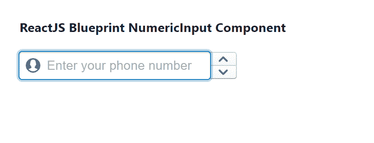

# 重新获取蓝图编号输入组件

> 原文: [https://www.geeksforgeeks.org/reactjs-blueprint-numberinput-component/](https://www.geeksforgeeks.org/reactjs-blueprint-numberinput-component/)

Blueprint 是一个基于 React 的 Web 用户界面工具包。该库非常适合构建桌面应用程序的复杂数据密集型界面，并且非常受欢迎。

## NumberInput 组件介绍

`NumberInput` 组件为用户提供了一种输入数字的方式。它是从用户那里收集数字数据的基本组件。我们可以在 ReactJS 中使用以下方法来使用 Blueprint 的 `NumberInput` 组件。

### NumberInput Props

*   `allowNumericCharactersOnly`: 字段中是否只允许浮点数字符。
*   `asyncControl`: 当设置为真时，我们可以通过异步更新来控制该输入的值。
*   `buttonPosition`: 用于表示按钮相对于输入字段的位置。
*   `clampValueOnBlur`: 用于指示模糊时是否应将值箝位到 `[min, max]`。
*   `className`: 用于表示传递给子元素的以空格分隔的类名列表。
*   `defaultValue`: 用于表示输入的初始值，用于不受控制的使用。
*   `disabled`: 用于指示输入是否非交互。
*   `fill`: 用于指示部件是否应占据其容器的整个宽度。
*   `inputRef`: 用于表示接收支持该组件的 HTML `<input>` 元素的引用处理程序或引用对象。
*   `intent`: 用于表示应用于元素的视觉意图颜色。
*   `large`: 用于表示该输入是否应该使用大样式。
*   `leftIcon`: 用于表示要在输入左侧呈现的图标或图标元素的名称。
*   `locale`: 用于表示区域设置名称，该名称被传递给组件以格式化数字，并允许在特定的区域设置中键入数字。
*   `majorStepSize`: 用于表示换档时连续值之间的增量。
*   `max`: 用于表示输入的最大值。
*   `min`: 用于表示输入的最小值。
*   `minorStepSize`: 用于表示按住 `alt` 时连续值之间的增量。
*   `onButtonClick`: 是一个回调函数，当值因按钮点击而改变时触发。
*   `onValueChange`: 它是一个回调函数，当值因键入、箭头键或按钮点击而改变时触发。
*   `placeholder`: 用于表示没有任何值时的占位符文本。
*   `rightElement`: 用于表示要在输入右侧呈现的元素。
*   `selectAllOnFocus`: 用于表示是否要选择整个文本字段进行聚焦。
*   `selectAllOnIncrement`: 用于指示是否递增选择整个文本字段。
*   `stepSize`: 用于表示无修饰键时连续值之间的增量。
*   `value`: 用于表示要在输入字段中显示的值。

## 创建 React 应用程序并安装模块

*   **步骤 1:** 使用以下命令创建一个 React 应用程序:
    ```jsx
    npx create-react-app foldername
    ```

*   **步骤 2:** 在创建项目文件夹 (即 `foldername`) 后，使用以下命令移动到该文件夹:
    ```jsx
    cd foldername
    ```

*   **步骤 3:** 创建 ReactJS 应用程序后，使用以下命令安装所需的 `@blueprintjs/core` 模块:
    ```jsx
    npm install @blueprintjs/core
    ```

## 项目结构

如下图所示。


## 示例

现在在 `App.js` 文件中写下以下代码。在这里，`App` 是我们编写代码的默认组件。

### App.js

```jsx
import React from 'react'
import '@blueprintjs/core/lib/css/blueprint.css';
import { NumericInput } from "@blueprintjs/core";

function App() {
    return (
        <div style={{
            display: 'block', width: 400, padding: 30
        }}>
            <h4>ReactJS Blueprint NumericInput Component</h4>
            <NumericInput
                disabled={false}
                leftIcon="user"
                onChange={() => { console.log("Called on change of value") }}
                placeholder="Enter your phone number"
            />
        </div >
    );
}

export default App;
```

## 运行应用程序的步骤

从项目的根目录使用以下命令运行应用程序:
```jsx
npm start
```

## 输出

现在打开浏览器，转到 `http://localhost:3000/`，会看到如下输出:



## 参考

[https://blueprintjs.com/docs/#core/components/numeric-input](https://blueprintjs.com/docs/#core/components/numeric-input)