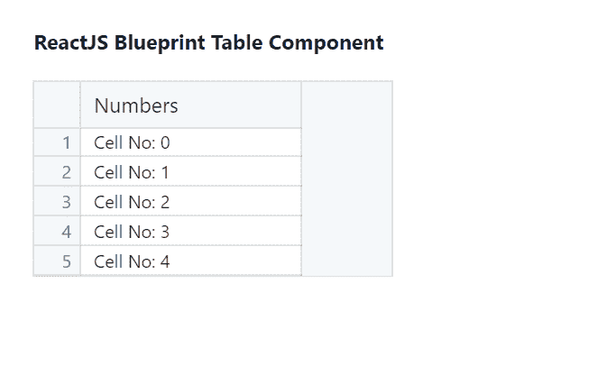
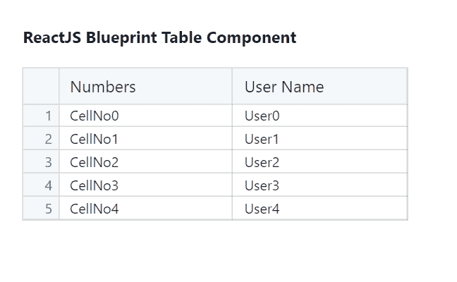

# ReactJS Blueprint Table 组件

> 原文: [https://www.geeksforgeeks.org/reactjs-blueprint-table-component/](https://www.geeksforgeeks.org/reactjs-blueprint-table-component/)

Blueprint 是一个基于 React 的 Web 用户界面工具包。该库非常适合构建桌面应用程序的复杂数据密集型界面，并且非常受欢迎。Table 组件允许用户显示数据行。我们可以在 ReactJS 中使用以下方法来使用 ReactJS Blueprint Table 组件。

### 组件属性

*   `numRows`: 用于设置行数。
*   `cellRenderer`: 用于定义数据如何显示，我们可以在每个 Column 组件上设置。

### 创建 React 应用程序并安装模块

*   **步骤 1:** 使用以下命令创建一个 React 应用程序:

```jsx
npx create-react-app foldername
```

*   **步骤 2:** 创建项目文件夹（即 `foldername`）后，使用以下命令移动到该文件夹中:

```jsx
cd foldername
```

*   **步骤 3:** 创建 ReactJS 应用程序后，使用以下命令安装所需的模块:

```jsx
npm install @blueprintjs/core
npm install --save @blueprintjs/table
```

### 项目结构

项目结构如下图所示。


### 示例 1

现在在 `App.js` 文件中写下以下代码。这里，我们显示了表组件中的一列。

## App.js

```jsx
import React from 'react'
import '@blueprintjs/core/lib/css/blueprint.css';
import '@blueprintjs/table/lib/css/table.css';
import { Column, Cell, Table } from "@blueprintjs/table";

function App() {

// Sample Column data
    const sampleColumn = (index) => {
        return <Cell> CellNo{index}</Cell>
    };

return (
        <div style={{ display: 'block', 
                      width: 300, 
                      padding: 30 }}>
            <h4>ReactJS Blueprint Table Component</h4>
            <Table numRows={5}>
                <Column name="Numbers" 
                        cellRenderer={sampleColumn} />
            </Table>
        </div>
    );
}

export default App;
```

**说明:** 我们使用了 Table 组件以表格的形式显示数据，这里我们显示了一个标题为 `Numbers` 的 Column，我们传递了自定义的 `sampleColumn` 函数，该函数返回一个 Cell 来显示示例文本 `CellNo` 和索引号。这个函数被调用了五次，正如我们指定的 `numRows={5}`。

### 运行应用程序的步骤

从项目的根目录使用以下命令运行应用程序:

```jsx
npm start
```

**输出:** 现在打开浏览器，转到 `http://localhost:3000/`，会看到如下输出:



### 示例 2

现在在 `App.js` 文件中写下以下代码。这里，我们显示了一个表组件中的多个列。

## App.js

```jsx
import React from 'react'
import '@blueprintjs/core/lib/css/blueprint.css';
import '@blueprintjs/table/lib/css/table.css';
import { Column, Cell, Table } from "@blueprintjs/table";

function App() {

// Sample Column One data
    const sampleColumnOne = (index) => {
        return <Cell> CellNo{index}</Cell>
    };

// Sample Column two data
    const sampleColumnTwo = (index) => {
        return <Cell> User{index}</Cell>
    };

return (
        <div style={{ display: 'block',
                      width: 390,
                      padding: 30 }}>
            <h4>ReactJS Blueprint Table Component</h4>
            <Table numRows={5}>
                <Column name="Numbers" 
                        cellRenderer={sampleColumnOne} />
                <Column name="User Name" 
                        cellRenderer={sampleColumnTwo} />
            </Table>
        </div>
    );
}

export default App;
```

**说明:** 我们使用了 Table 组件以表的形式显示数据，这里我们显示了两列，它们的标题分别为 `Numbers` 和 `User Name`。我们已经传递了自定义的 `sampleColumnOne` 和 `sampleColumnTwo` 函数，该函数返回一个 Cell 来分别显示示例文本 `CellNo` 和 `User` 加索引号。这些函数被调用了五次，因为我们已经指定了 `numRows={5}`。

### 运行应用程序的步骤

从项目的根目录使用以下命令运行应用程序:

```jsx
npm start
```

**输出:** 现在打开浏览器，转到 `http://localhost:3000/`，会看到如下输出:



### 参考

[https://blueprintjs.com/docs/#table](https://blueprintjs.com/docs/#table)