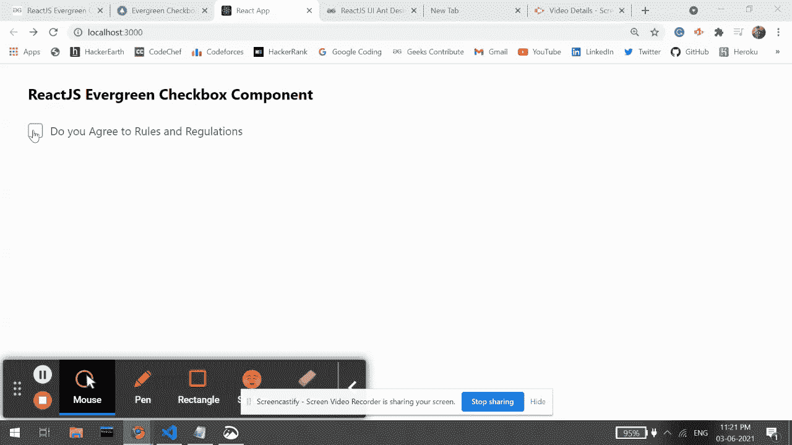

# 重新获得常青复选框组件

> 原文: [https://www.geeksforgeeks.org/reactjs-evergreen-checkbox-component/](https://www.geeksforgeeks.org/reactjs-evergreen-checkbox-component/)

React Evergreen 是一个受欢迎的前端库，它有一组 React 组件来构建漂亮的产品，因为这个库是灵活的、合理的默认值和用户友好的。`Checkbox` 组件允许用户从给定选项中进行二进制选择。我们可以在 ReactJS 中使用以下方法来使用常青树复选框组件。

## 复选框道具:

*   `id`: 用于表示复选框的通用 id 属性。
*   `name`: 用于表示复选框的名称属性。
*   `label`: 用于表示复选框的标签。
*   `value`: 用于复选框的值属性。
*   `checked`: 表示复选框是否被选中。
*   `indeterminate`: 用于表示复选框的不确定选中状态。
*   `onChange`: 是状态变化时触发的回调函数。
*   `disabled`: 用于在设置为真时禁用复选框。
*   `isInvalid`: 当该属性设置为真时，咏叹调无效属性为真。
*   `appearance`: 用于表示复选框的外观。

## 创建反应应用程序并安装模块:

*   **步骤 1:** 使用以下命令创建一个反应应用程序:

    ```jsx
    npx create-react-app foldername
    ```

*   **步骤 2:** 创建项目文件夹(即 `foldername`)后，使用以下命令移动到该文件夹中:

    ```bash
    cd foldername
    ```

*   **步骤 3:** 创建 ReactJS 应用程序后，使用以下命令安装所需的模块:

    ```bash
    npm install evergreen-ui
    ```

## 项目结构:

如下图。


项目结构

## 示例:

现在在 `App.js` 文件中写下以下代码。在这里，`App` 是我们编写代码的默认组件。

### App.js

```jsx
import React from 'react'
import { Checkbox } from 'evergreen-ui'

export default function App() {
  return (
    <div style={{
      display: 'block', width: 700, paddingLeft: 30
    }}>
      <h4>ReactJS Evergreen Checkbox Component</h4>
      <Checkbox onChange={() => {
        alert("You Checked the box!")
      }} label="Do you Agree to Rules and Regulations"
      />
    </div>
  );
}
```

## 运行应用程序的步骤:

从项目的根目录使用以下命令运行应用程序:

```bash
npm start
```

## 输出:

现在打开浏览器，转到 `http://localhost:3000/`，会看到如下输出:



## 参考:

[https://evergreen.segment.com/components/checkbox](https://evergreen.segment.com/components/checkbox)