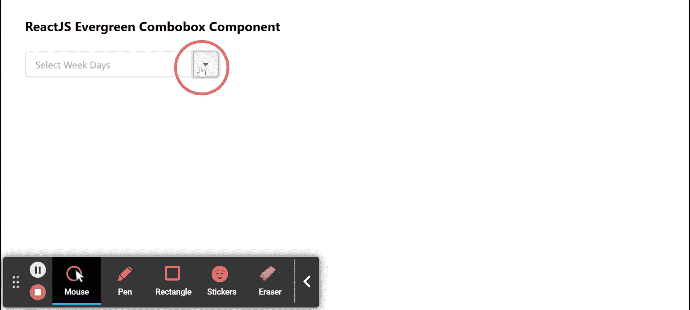

# ReactJS 常青树组合框组件

> 原文：[https://www.geeksforgeeks.org/reactjs-evergreen-combobox-component/](https://www.geeksforgeeks.org/reactjs-evergreen-combobox-component/)

React Evergreen 是一个受欢迎的前端库，它有一组 React 组件来构建漂亮的产品，因为这个库是灵活的、合理的默认值和用户友好的。组合框组件允许用户从预定义的选项列表中选择一个选项。我们可以在 ReactJS 中使用以下方法来使用组合框按钮组件。

## 组合框道具

*   `Items`：用于表示菜单中要显示的选项。
*   `selectedItem`：用于表示控制时所选项目。
*   `onChange`：是值变化时调用的函数。
*   `openOnFocus`：设置为 true 时，用于打开焦点上的自动完成。
*   `initialSelectedItem`：用于表示不受控制时默认选择的项目。
*   `placeholder`：用于表示占位符文本。
*   `itemToString`：它是一个在每个项目上使用的函数，用于在项目数组不是字符串数组的情况下返回将在过滤器上显示的字符串。
*   `inputProps`：用于表示转发到输入的属性。
*   `buttonProps`：用于表示转发给按钮的属性。
*   `autocompleteProps`：用于表示转发给自动完成组件的属性。
*   `disabled`：用于使输入元件禁用。
*   `isLoading`：当设置为真时，用于显示加载微调器。
*   `size`：用于表示构件的尺寸。

## 创建React应用程序并安装模块

*   **步骤 1：** 使用以下命令创建一个反应应用程序：
    ```jsx
    npx create-react-app foldername
    ```
*   **步骤 2：** 在创建项目文件夹（即 `foldername`）后，使用以下命令移动到该文件夹：
    ```jsx
    cd foldername
    ```
*   **步骤 3：** 创建 ReactJS 应用程序后，使用以下命令安装所需的模块：
    ```jsx
    npm install evergreen-ui
    ```

## 项目结构

如下图所示。


## 示例

现在在 `App.js` 文件中写下以下代码。在这里，`App` 是我们编写代码的默认组件。

## App.js

```jsx
import React from 'react'
import { Combobox } from 'evergreen-ui'

export default function App() {
  return (
    <div style={{
      display: 'block', width: 700, paddingLeft: 30
    }}>
      <h4>ReactJS Evergreen Combobox Component</h4>
      <Combobox
        placeholder="Select Week Days"
        items={['Monday', 'Tuesday', 'Wednesday', 'Thursday',
         'Friday', 'Saturday', 'Sunday']}
        autocompleteProps={{
          title: 'Weekdays'
        }}
      />
    </div>
  );
}
```

## 运行应用程序的步骤

从项目的根目录使用以下命令运行应用程序：
```jsx
npm start
```

## 输出

现在打开浏览器，转到 `http://localhost:3000/`，会看到如下输出：



## 参考

[https://evergreen.segment.com/components/combobox](https://evergreen.segment.com/components/combobox)