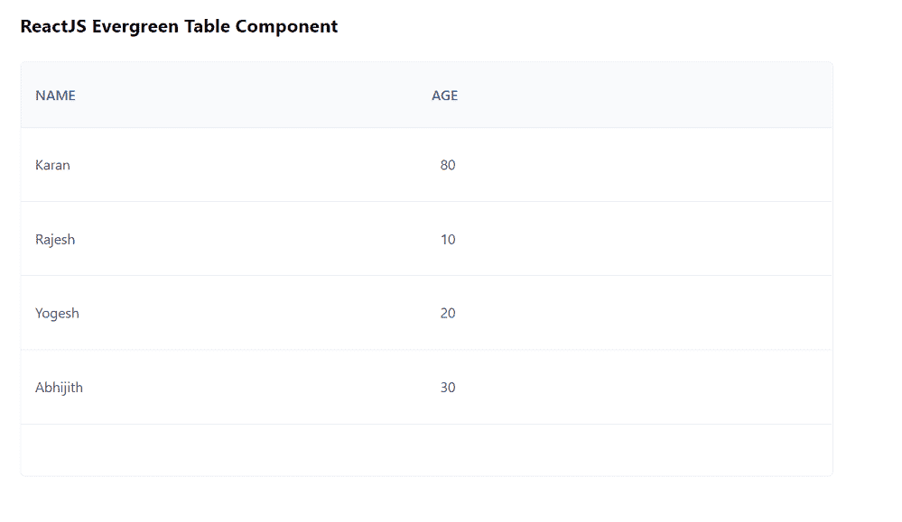

# React Evergreen 表格组件

> 原文: [https://www.geeksforgeeks.org/reactjs-evergreen-table-component/](https://www.geeksforgeeks.org/reactjs-evergreen-table-component/)

React Evergreen 是一个受欢迎的前端库，它有一组 React 组件来构建漂亮的产品，因为这个库是灵活的、合理的默认值和用户友好的。表格组件允许用户显示表格格式的所有信息。我们可以在 ReactJS 中使用以下方法来使用长青表组件。

## 可编辑单元格 Props

*   `isSelectable`: 用于表示该元素是否可选择。
*   `disabled`: 当设置为真时，无法编辑单元格。
*   `placeholder`: 用于表示表格的占位符值。
*   `size`: 用于表示文本表格单元格和文本区域的大小。
*   `children`: 它用来表示单元格值的 children。
*   `onChange`: 是值变化时调用的函数。
*   `autoFocus`: 当设置为真时，单元格将在编辑状态下初始化。

## 可编辑的 CellField Props

*   `value`: 用于表示文本区域的默认值。
*   `zIndex`: 用于表示放置在元素上的 z 索引。
*   `getTargetRef`: 是获取父级的目标 Ref 的函数。
*   `minWidth`: 用于表示文本区域的最小宽度。
*   `minHeight`: 用于表示文本区域的最小高度。
*   `onChangeComplete`: 是文本区域模糊时调用的函数。
*   `onCancel`: 这是一个在命中 Escape 或 `componentWillUnmount` 时调用的函数。
*   `size`: 用于表示文本区域的文本大小。

## Scrollbar Props

*   `handleScrollbarSize`: 是一个通过创建隐藏的固定 div 返回滚动条大小的函数。

## SearchTableHeaderCell Props

*   `value`: 用于表示输入的值。
*   `onChange`: 是输入变化时调用的函数。
*   `autoFocus`: 用于设置组件是否应自动对焦在组件渲染上。
*   `spellCheck`: 用于设置是否对内容进行拼写检查。
*   `placeholder`: 用于表示输入为空时在输入中显示的文本。
*   `icon`: 用于表示标签前的常青树或自定义图标。

## SelectMenuCell Props

*   `isSelectable`: 用于表示该元素是否可选择。
*   `disabled`: 当设置为真时，无法编辑单元格。
*   `placeholder`: 用于表示表格的占位值。
*   `size`: 用于表示文本表格单元格和文本区域的大小。
*   `selectMenuProps`: 用于表示选择菜单道具。

## Table Props

不带任何道具。

## TableBody Props

不带任何道具。

## TableCell Props

*   `isSelectable`: 用于表示该元素是否可选择。
*   `appearance`: 用于表格行的外观。
*   `rightView`: 用于制作一个可选节点，放置在表格单元格的右侧。
*   `arrowKeysOverride`: 用于允许前进箭头键覆盖可选单元格。
*   `className`: 用于将类名传递给表格单元格。

## TableHead Props

*   `height`: 用于表示台面高度。
*   `accountForScrollbar`: 如果同时使用 `TableHead` 和 `TableBody`，这些道具应该设置为 true always。

## TableHeaderCell Props

不需要任何道具。

## TableRow Props

*   `height`: 用来表示行的高度。
*   `onSelect`: 这是一个在点击和回车/空格键时触发的功能。
*   `onDeselect`: 这是一个在点击和回车/空格键时触发的功能。
*   `isSelectable`: 用于使 `TableRow` 可选择。
*   `isSelected`: 用于选择表格行。
*   `isHighlighted`: 用于手动设置要高亮显示的 `TableRow`。
*   `intent`: 用于表示警报的意图。
*   `appearance`: 用于表格行的外观。
*   `className`: 用于表示传递给表行的类名。

## TableVirtualBody Props

*   `children`: 用于表示子元素，是单个节点的数组。
*   `defaultHeight`: 用于表示每行的默认高度。
*   `allowAutoHeight`: 如果该道具设置为真，则允许自动高度。
*   `overscanCount`: 用于表示传递给 `react-tiny-virtual-list` 的 `overscanCount` 属性。
*   `estimateItemSize`: 当 `allowAutoHeight` 和 `useAverageAutoHeightEstimate` 道具设置为 false 时，此道具用作 `react-tiny-virtual-list` 中的 `estimateItemSize`。
*   `useAverageAutoHeightEstimate`: 当 `allowAutoHeight` 和此道具设置为真时，估计高度将根据自动高度行的平均高度计算。
*   `scrollToIndex`: 用于表示传递给 `react-tiny-virtual-list` 的 `scrollToIndex` 属性。
*   `scrollOffset`: 用于表示传递给 `react-tiny-virtual-list` 的 `scrollOffset` 属性。
*   `scrollToAlignment`: 用于表示传递给 `react-tiny-virtual-list` 的 `scrollToAlignment` 属性。
*   `onScroll`: 它是 `onScroll` 的回调，被传递到 `react-tiny-virtual-list`。

## TextTableBodyCell Props

*   `isNumber`: 用于添加 *mono* 值的 `fontFamily`。
*   `textProps`: 用于将附加道具传递给文本组件。

## TextTableHeaderCell Props

*   `textProps`: 用于将附加道具传递给文本组件。

## 创建 React 应用并安装模块

*   **步骤 1:** 使用以下命令创建一个反应应用程序:

```jsx
npx create-react-app foldername
```

*   **步骤 2:** 创建项目文件夹(即 `foldername`)后，使用以下命令移动到该文件夹中:

```jsx
cd foldername
```

*   **步骤 3:** 创建 ReactJS 应用程序后，使用以下命令安装所需的模块:

```jsx
npm install evergreen-ui
```

## 项目结构

如下图。


## 示例

现在在 `App.js` 文件中写下以下代码。在这里，`App` 是我们编写代码的默认组件。

### App.js

```jsx
import React from 'react'
import { Table } from 'evergreen-ui'

export default function App() {

const sampleData = [
    { id: 1, name: 'Karan', age: 80 },
    { id: 3, name: 'Rajesh', age: 10 },
    { id: 4, name: 'Yogesh', age: 20 },
    { id: 5, name: 'Abhijith', age: 30 }
  ]

return (
    <div style={{
      display: 'block', width: 700, paddingLeft: 30
    }}>
      <h4>ReactJS Evergreen Table Component</h4>
      <Table>
        <Table.Head>
          <Table.TextHeaderCell>Name</Table.TextHeaderCell>
          <Table.TextHeaderCell>Age</Table.TextHeaderCell>
        </Table.Head>
        <Table.Body height={300}>
          {sampleData.map((data) => (
            <Table.Row key={data.id}>
              <Table.TextCell>{data.name}</Table.TextCell>
              <Table.TextCell>{data.age}</Table.TextCell>
            </Table.Row>
          ))}
        </Table.Body>
      </Table>
    </div>
  );
}
```

## 运行应用程序的步骤

从项目的根目录使用以下命令运行应用程序:

```jsx
npm start
```

## 输出

现在打开浏览器，转到 `http://localhost:3000/`，会看到如下输出:



## 参考

[https://evergreen.segment.com/components/table](https://evergreen.segment.com/components/table)