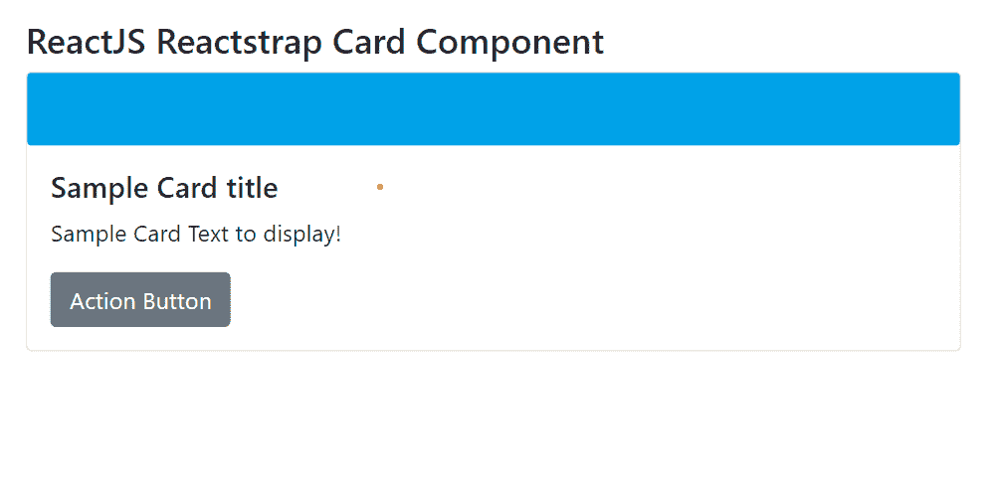

# Reactstrap Card 组件

> 原文: [https://www.geeksforgeeks.org/reactjs-reactstrap-card-component/](https://www.geeksforgeeks.org/reactjs-reactstrap-card-component/)

`Reactstrap` 是一个流行的前端库，可以轻松地在 `React` 中使用 `Bootstrap 4` 组件。该库包含 `Bootstrap 4` 的无状态 `React` 组件。`Card` 组件允许用户显示内容。我们可以在 `ReactJS` 中使用以下方法来使用 `Reactstrap Card` 组件。

## Reactstrap Card 组件的属性 (Props)

### Card Props
*   `tag`: `Card` 组件的标签，可以是一个函数或一个字符串。
*   `inverse`: 用于指示是否反转文字颜色。
*   `color`: 用于改变卡片的颜色。应该是 `RGB` 格式或颜色名称。
*   `body`: 用于指示是否在组件中应用 `card-body` 类。
*   `className`: 用于表示类名，以设置组件的样式。

### CardBody Props
*   `tag`: `CardBody` 组件的标签，可以是一个函数或一个字符串。
*   `className`: 用于表示该组件的类名。

### CardColumns Props
*   `tag`: `CardColumns` 组件的标签，可以是一个函数或一个字符串。
*   `className`: 用于表示该组件的类名，以设置 `CSS` 样式。

### CardDeck Props
*   `tag`: `CardDeck` 组件的标签，可以是一个函数或一个字符串。
*   `className`: 用于表示该组件的类名。

### CardFooter Props
*   `tag`: `CardFooter` 组件的标签，可以是一个函数或一个字符串。
*   `className`: 用于表示该组件的类名。

### CardGroup Props
*   `tag`: `CardGroup` 组件的标签，可以是一个函数或一个字符串。
*   `className`: 用于表示该组件的类名。

### CardHeader Props
*   `tag`: `CardHeader` 组件的标签，可以是一个函数或一个字符串。
*   `className`: 用于表示该组件的类名。

### CardImg Props
*   `tag`: `CardImg` 组件的标签，可以是一个函数或一个字符串。
*   `className`: 用于表示该组件的类名。
*   `top`: 通过 `card-img-top` 类定位图像。
*   `bottom`: 通过 `card-img-bottom` 类定位图像。

### CardImgOverlay Props
*   `tag`: `CardImgOverlay` 组件的标签，可以是一个函数或一个字符串。
*   `className`: 用于表示该组件的类名。

### CardLink Props
*   `tag`: `CardLink` 组件的标签，可以是一个函数或一个字符串。
*   `className`: 用于表示该组件的类名。
*   `innerRef`: 用于表示内部引用元素。

### CardSubtitle Props
*   `tag`: `CardSubtitle` 组件的标签，可以是一个函数或一个字符串。
*   `className`: 用于表示该组件的类名。

### CardText Props
*   `tag`: `CardText` 组件的标签，可以是一个函数或一个字符串。
*   `className`: 用于表示该组件的类名。

### CardTitle Props
*   `tag`: `CardTitle` 组件的标签，可以是一个函数或一个字符串。
*   `className`: 用于表示该组件的类名。

## 创建 React 应用程序和安装模块的语法

*   **步骤 1:** 使用以下命令创建一个 `React` 应用程序。

```jsx
npx create-react-app foldername
```

*   **步骤 2:** 创建项目文件夹（即 `foldername`）后，使用以下命令移动到该文件夹。

```jsx
cd foldername
```

*   **步骤 3:** 在给定的目录中安装 `Reactstrap`。

```jsx
npm install --save reactstrap react react-dom
```

## 项目结构

如下图所示：


## 示例 1

现在在 `App.js` 文件中写下以下代码。在这里，`App` 是我们编写代码的默认组件。

### App.js

```jsx
import React from 'react'
import 'bootstrap/dist/css/bootstrap.min.css';
import {
    Card, CardImg, CardBody,
    CardTitle, CardText, Button
} from "reactstrap"

function App() {
    return (
        <div style={{
            display: 'block', width: 700, padding: 30
        }}>
            <h4>ReactJS Reactstrap Card Component</h4>
            <Card>
                <CardImg
                    width="50px"
                    height="50px"
                    src="https://media.geeksforgeeks.org/wp-content/
                          uploads/20210425000233/test-300x297.png"
                    alt="GFG Logo" />
                <CardBody>
                    <CardTitle tag="h5">Sample Card title</CardTitle>
                    <CardText>Sample Card Text to display!</CardText>
                    <Button>Action Button</Button>
                </CardBody>
            </Card>
        </div>
    );
}

export default App;
```

### 运行应用程序的步骤

从项目的根目录使用以下命令运行应用程序：

```jsx
npm start
```

### 输出

现在打开浏览器，进入 `http://localhost:3000/`，会看到如下输出：



## 示例 2

这是 `ReactStrap Card` 组件的另一个示例。

### App.js

```jsx
import React from "react";
import {
  Card,CardBody,CardLink,CardTitle,
} from "reactstrap";

const Example = (props) => {
  return (
    <div>
      <Card>
        <CardBody>
          <CardTitle tag="h5">GFG Practice Portal </CardTitle>
          
          <p>
            The Best Data Structures Course Available Online From Skilled 
            And Experienced Faculty. Learn Data Structures In A Live 
            Classroom With The Best Of Faculty In The Industry. 
            Classroom Experience.
          </p>
        </CardBody>
        <CardBody>
          <CardLink href="https://www.geeksforgeeks.org/html-images/">
             To know more about us... 
          </CardLink>
        </CardBody>
      </Card>
    </div>
  );
};

export default Example;
```


## 参考

[https://reactstrap.github.io/components/card/](https://reactstrap.github.io/components/card/)