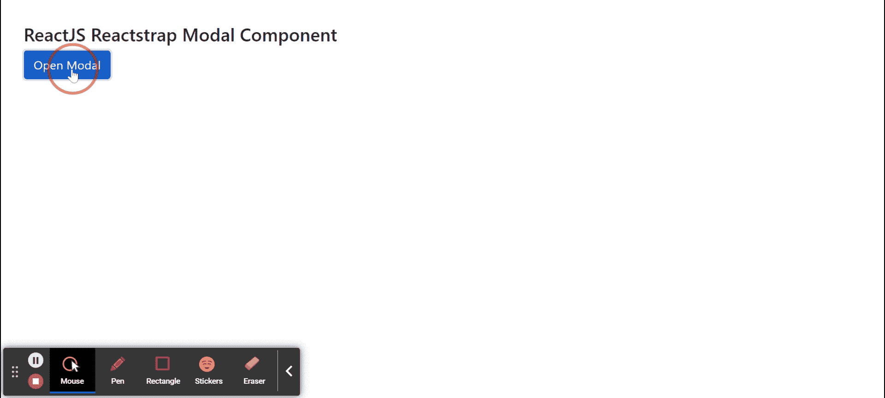
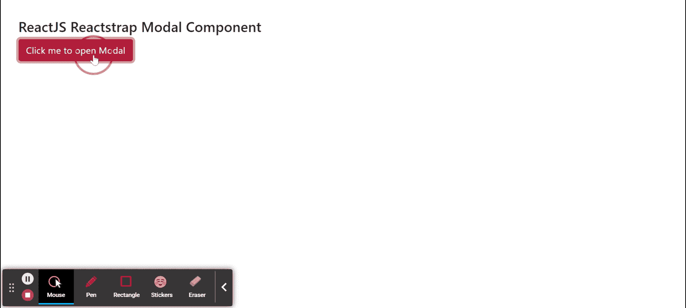

# Reactstrap Modal 组件

> 原文: [https://www.geeksforgeeks.org/reactjs-reactstrap-modal-component/](https://www.geeksforgeeks.org/reactjs-reactstrap-modal-component/)

Reactstrap 是一个流行的前端库，易于使用 React Bootstrap 4 组件。该库包含引导 4 的无状态 React 组件。Modal 组件为创建对话框、灯箱、弹出窗口等提供了坚实的基础。我们可以在 ReactJS 中使用以下方法来使用 ReactJS Reactstrap Modal 组件。

## Modal Props

*   `isOpen`: 当设置为真时，模态会显示出来。
*   `autoFocus`: 当设置为真时，模式会打开并自动对焦。
*   `centered`: 用于制作居中情态。
*   `size`: 用于设置模态尺寸。
*   `toggle`: 是组件切换时触发的回调函数。
*   `role`: 用于表示角色属性，默认值为“dialog”。
*   `labelledBy`: 用于引用模态中标题元素的 ID。
*   `keyboard`: 用于指示是否支持按 ESC 键关闭。
*   `backdrop`: 当设置为真时，模式将显示处于打开状态的背景。
*   `scrollable`: 用于内容较长时允许模态可滚动。
*   `external`: 用于允许模态旁边存在节点或构件。
*   `onEnter`: 是一个回调函数，在 `componentDidMount` 事件上调用。
*   `onExit`: 是一个回调函数，在 `componentWillUnmount` 事件上调用。
*   `onOpened`: 这是一个回调函数，在转换完成时调用。
*   `onClosed`: 这是一个回调函数，在转换完成时调用。
*   `className`: 用于表示造型的类名。
*   `wrapClassName`: 用于传递模态对话框容器的类名。
*   `modalClassName`: 用于为 modal 类添加可选的额外类名。
*   `backdropClassName`: 用于为模态背景增加一个可选的额外类名。
*   `contentClassName`: 用于给模态内容增加一个可选的额外类名。
*   `fade`: 用于指示渐变过渡是否发生。
*   `cssModule`: 用来表示造型用的 CSS 模块。
*   `zIndex`: 用于表示情态动词的 z-index。
*   `backdropTransition`: 用于背景渐变，因为它控制背景渐变。
*   `modalTransition`: 用于模态转换，因为它控制模态转换。
*   `innerRef`: 用于表示该组件的内部 Ref 元素。
*   `unmountOnClose`: 用于关闭模态后从 DOM 中卸载。
*   `returnFocusAfterClose`: 用于在模态关闭后，将焦点返回到打开模态的元素。
*   `container`: 是容器属性，类型为任意。
*   `trapFocus`: 用于管理其子代的焦点。

## 创建 React 应用程序并安装模块

**步骤 1:** 使用以下命令创建一个 React 应用程序:

```jsx
npx create-react-app foldername
```

**步骤 2:** 在创建项目文件夹(即 `foldername`)后，使用以下命令移动到该文件夹:

```jsx
cd foldername
```

**步骤 3:** 创建 ReactJS 应用程序后，使用以下命令安装所需的 `reactstrap` 和 `bootstrap` 模块:

```jsx
npm install reactstrap bootstrap
```

**项目结构:** 如下图。


## 示例 1

现在在 `App.js` 文件中写下以下代码。这里我们展示了延迟为 2 秒的 Modal，我们展示了没有 `ModalHeader` 和 `ModalFooter` 的 Modal。

```jsx
import React from 'react'
import 'bootstrap/dist/css/bootstrap.min.css';
import {
    Button, Modal, ModalFooter,
    ModalHeader, ModalBody
} from "reactstrap"

function App() {

// Modal open state
    const [modal, setModal] = React.useState(false);

// Toggle for Modal
    const toggle = () => setModal(!modal);

return (
        <div style={{
            display: 'block', width: 700, padding: 30
        }}>
            <h4>ReactJS Reactstrap Modal Component</h4>
            <Button color="primary"
                onClick={toggle}>Open Modal</Button>
            <Modal isOpen={modal}
                toggle={toggle}
                modalTransition={{ timeout: 2000 }}>
                <ModalBody>
                    Simple Modal with just ModalBody...
                </ModalBody>
            </Modal>
        </div >
    );
}

export default App;
```

**运行应用程序的步骤:** 从项目的根目录使用以下命令运行应用程序:

```jsx
npm start
```

**输出:** 现在打开浏览器，转到 `http://localhost:3000/`，会看到如下输出:



## 示例 2

现在在 `App.js` 文件中写下以下代码。在这里，我们没有任何延迟地展示了 Modal，并且展示了带有 `ModalHeader` 和 `ModalFooter` 的 Modal。

```jsx
import React from 'react'
import 'bootstrap/dist/css/bootstrap.min.css';
import {
    Button, Modal, ModalFooter,
    ModalHeader, ModalBody
} from "reactstrap"

function App() {

// Modal open state
    const [modal, setModal] = React.useState(false);

// Toggle for Modal
    const toggle = () => setModal(!modal);

return (
        <div style={{
            display: 'block', width: 700, padding: 30
        }}>
            <h4>ReactJS Reactstrap Modal Component</h4>
            <Button color="danger"
                onClick={toggle}>Click me to open Modal</Button>
            <Modal isOpen={modal} toggle={toggle}>
                <ModalHeader
                    toggle={toggle}>Sample Modal Title</ModalHeader>
                <ModalBody>
                    Sample Modal Body Text to display...
                </ModalBody>
                <ModalFooter>
                    <Button color="primary" onClick={toggle}>Okay</Button>
                </ModalFooter>
            </Modal>
        </div >
    );
}

export default App;
```

**运行应用程序的步骤:** 从项目的根目录使用以下命令运行应用程序:

```jsx
npm start
```

**输出:** 现在打开浏览器，转到 `http://localhost:3000/`，会看到如下输出:



**参考:** [https://reactstrap.github.io/components/modals/](https://reactstrap.github.io/components/modals/)