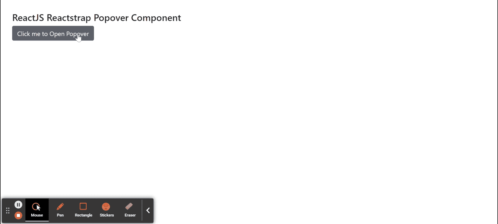
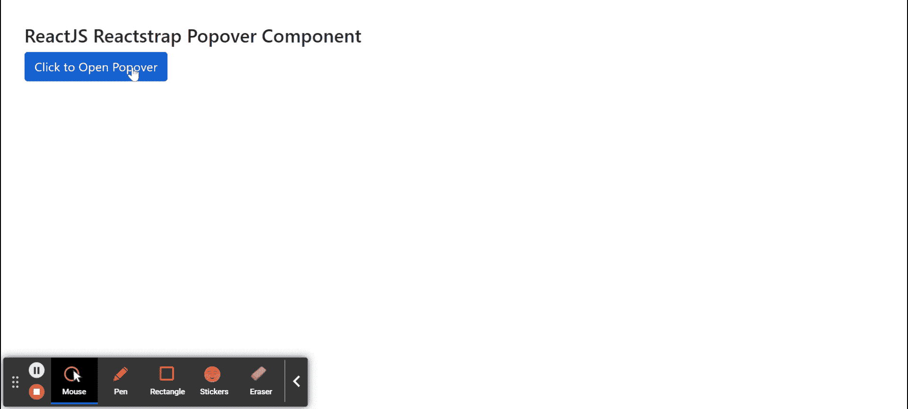

# Reactstrap Popover 组件

> 原文: [https://www.geeksforgeeks.org/reactjs-reactstrap-popover-component/](https://www.geeksforgeeks.org/reactjs-reactstrap-popover-component/)

Reactstrap 是一个流行的前端库，易于使用 React Bootstrap 4 组件。该库包含引导 4 的无状态反应组件。弹出组件是悬停在父窗口上的容器类型元素。我们可以在 ReactJS 中使用以下方法来使用 ReactJS Reactstrap Popover 组件。

**Popover 道具:**

*   `children`: 用于将 children 元素传递给这个组件。
*   `trigger`: 用于表示用空格分隔的触发器列表。
*   `isOpen`: 表示是否打开 popover。
*   `toggle`: 是控制组件中切换 `isOpen` 的回调函数。
*   `boundary`: 用于表示弹出器的边界。
*   `container`: 用于指示弹出器 DOM 节点的注入位置。
*   `className`: 用于表示造型的类名。
*   `popperClassName`: 用于对 popper 组件应用一个类。
*   `innerClassName`: 用于将类应用于内部 popover。
*   `disabled`: 表示组件是否禁用。
*   `hideArrow`: 表示是否隐藏箭头。
*   `placementPrefix`: 用于表示放置前缀类，如 `bs-popover` 等。
*   `delay`: 用于表示延迟值。
*   `placement`: 用于放置 popover。
*   `modifiers`: 用于表示传递给 Popper.js 的自定义修改器。
*   `positionFixed`: 用于指示波波头指向元素是否有 `position: fixed` 造型。
*   `offset`: 用于表示偏移元素。
*   `fade`: 表示是否显示/隐藏带有淡入淡出效果的 popover。
*   `flip`: 用于指示如果太靠近容器边缘是否翻转弹弓的方向。

**创建反应应用程序并安装模块:**

**步骤 1:** 使用以下命令创建一个反应应用程序:

```jsx
npx create-react-app foldername
```

**步骤 2:** 创建项目文件夹（即 `foldername`）后，使用以下命令移动到该文件夹中:

```jsx
cd foldername
```

**步骤 3:** 创建 ReactJS 应用程序后，使用以下命令安装所需的模块:

```jsx
npm install reactstrap bootstrap
```

**项目结构:** 如下图。


**示例 1:** 现在在 `App.js` 文件中写下以下代码。这里我们展示了带有头部组件的 popover，Popover 的位置在底部。

```jsx
import React from 'react'
import 'bootstrap/dist/css/bootstrap.min.css';
import { Button, Popover, PopoverHeader, PopoverBody } from "reactstrap"

function App() {
    // Popover open state
    const [popoverOpen, setPopoverOpen] = React.useState(false);

    return (
        <div style={{
            display: 'block', width: 700, padding: 30
        }}>
            <h4>ReactJS Reactstrap Popover Component</h4>
            <Button id="Popover1" type="button">
                Click me to Open Popover
            </Button> <br></br>
            <Popover
                placement="bottom" isOpen={popoverOpen}
                target="Popover1" toggle=
                    {() => { setPopoverOpen(!popoverOpen) }}>
                <PopoverHeader>Sample Popover Title</PopoverHeader>
                <PopoverBody>Sample Body Text to display...</PopoverBody>
            </Popover>
        </div >
    );
}

export default App;
```

**运行应用程序的步骤:** 从项目的根目录使用以下命令运行应用程序:

```jsx
npm start
```

**输出:** 现在打开浏览器，转到 `http://localhost:3000/`，会看到如下输出:



**示例 2:** 现在在 `App.js` 文件中写下以下代码。这里我们展示了没有头部组件的 popover，Popover 的位置是正确的。

```jsx
import React from 'react'
import 'bootstrap/dist/css/bootstrap.min.css';
import { Button, Popover, PopoverBody } from "reactstrap"

function App() {
    // Popover open state
    const [popoverOpen, setPopoverOpen] = React.useState(false);

    return (
        <div style={{
            display: 'block', width: 700, padding: 30
        }}>
            <h4>ReactJS Reactstrap Popover Component</h4>
            <Button id="Popover" color="primary">
                Click to Open Popover
            </Button> <br></br>
            <Popover
                placement="right" isOpen={popoverOpen}
                target="Popover" toggle=
                    {() => { setPopoverOpen(!popoverOpen) }}>
                <PopoverBody>Sample Body Text to display...</PopoverBody>
            </Popover>
        </div >
    );
}

export default App;
```

**运行应用程序的步骤:** 从项目的根目录使用以下命令运行应用程序:

```jsx
npm start
```

**输出:** 现在打开浏览器，转到 `http://localhost:3000/`，会看到如下输出:



**参考:** [https://reactstrap.github.io/components/popovers/](https://reactstrap.github.io/components/popovers/)