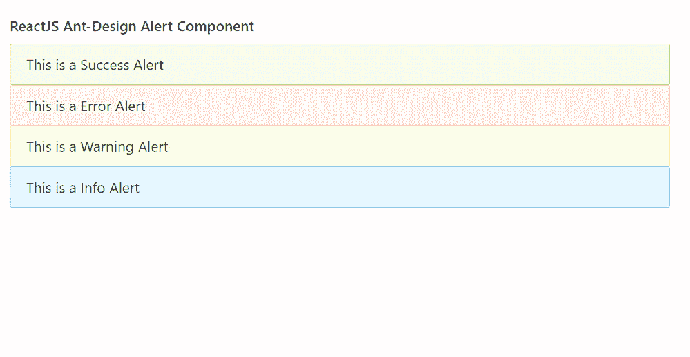

# React Ant Design 预警组件

> 原文: [https://www.geeksforgeeks.org/reactjs-ui-ant-design-alert-component/](https://www.geeksforgeeks.org/reactjs-ui-ant-design-alert-component/)

Ant Design 库预建了这个组件，也很容易集成。Alert 组件用于紧急中断，要求确认，通知用户情况。我们可以在 ReactJS 中使用以下方法来使用 Ant Design Alert 组件。

### Alert 属性

*   `action`: 用于定义 Alert 的动作。
*   `afterClose`: 是关闭动画完成时触发的回调函数。
*   `banner`: 用于表示是否显示为横幅。
*   `closable`: 用于指示 Alert 是否可以关闭。
*   `closeText`: 用于定义要显示的关闭文本。
*   `description`: 用于定义 Alert 的附加内容。
*   `icon`: 用于定义自定义图标。
*   `message`: 用于定义 Alert 的内容。
*   `showIcon`: 表示是否显示图标。
*   `type`: 用于表示成功、警告等预警样式的类型。
*   `onClose`: 是 Alert 关闭时触发的回调函数。

### Alert.ErrorBoundary 属性

*   `description`: 用于定义自定义错误描述。
*   `message`: 用于定义自定义错误消息。

### 创建 React 应用程序并安装模块

*   **步骤 1:** 使用以下命令创建一个 React 应用程序:
    ```
    npx create-react-app foldername
    ```

*   **步骤 2:** 在创建项目文件夹（即 `foldername`）后，使用以下命令移动到该文件夹:
    ```
    cd foldername
    ```

*   **步骤 3:** 创建 ReactJS 应用程序后，使用以下命令安装所需的模块:
    ```
    npm install antd
    ```

### 项目结构

如下图。


### 示例

现在在 `App.js` 文件中写下以下代码。在这里，`App` 是我们编写代码的默认组件。

## App.js

```jsx
import React from 'react'
import "antd/dist/antd.css";
import { Alert } from 'antd';

export default function App() {
  return (
    <div style={{
      display: 'block', width: 700, padding: 30
    }}>
      <h4>ReactJS Ant-Design Alert Component</h4>
      <Alert message="This is a Success Alert" type="success" />
      <Alert message="This is a Error Alert" type="error" />
      <Alert message="This is a Warning Alert" type="warning" />
      <Alert message="This is a Info Alert" type="info" />
    </div>
  );
}
```

### 运行应用程序的步骤

从项目的根目录使用以下命令运行应用程序:
```
npm start
```

### 输出

现在打开浏览器，转到 `http://localhost:3000/`，会看到如下输出:



### 参考

[https://ant.design/components/alert/](https://ant.design/components/alert/)