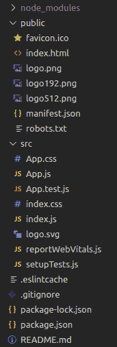
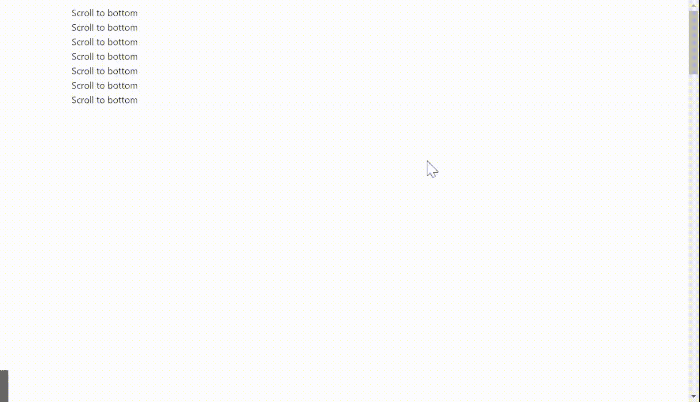

# 重新获取用户界面蚂蚁设计后台组件

> 原文：[https://www.geeksforgeeks.org/reactjs-ui-ant-design-backtop-component/](https://www.geeksforgeeks.org/reactjs-ui-ant-design-backtop-component/)

BackTop 是 Ant Design 中的一个组件，当用户已经滚动页面返回页面顶部时，它提供了一个按钮，而不需要滚动回顶部。它会将用户带到页面顶部，并显示平滑的滚动动画。

蚂蚁设计库已经预建了这个组件，它也很容易集成。我们可以使用下面的方法轻松地使用这个 `BackTop` 组件。

### 语法：

```jsx
<BackTop>
      Scroll to Top
</BackTop>
```

### BackTop 属性：

*   `duration`：该属性指定返回顶部的时间（毫秒）
*   `target`：该属性指定可滚动区 dom 节点
*   `visibilityHeight`：该属性指定在滚动高度达到该值之前，后退按钮不会显示
*   `onClick`：该属性指定一个回调函数，点击按钮即可执行

### 创建 React 应用程序和安装模块：

*   **步骤 1：** 使用以下命令创建一个 React 应用程序。

    ```jsx
    npx create-react-app demo
    ```

*   **步骤 2：** 创建项目文件夹即 `demo` 后，使用以下命令移动到它。

    ```jsx
    cd demo
    ```

*   **步骤 3：** 创建 ReactJS 应用程序后，使用以下命令安装 `antd` 库。

    ```jsx
    npm install antd
    ```

**项目结构：**



**示例：** 现在在文件名 `App.js` 中编写以下代码

### App.js

```jsx
import { BackTop } from "antd";
import "./App.css";
import "antd/dist/antd.css";

const style = {
  height: 40,
  width: 40,
  lineHeight: "40px",
  borderRadius: 4,
  backgroundColor: "#1088e9",
  color: "#fff",
  textAlign: "center",
  fontSize: 14,
};

function App() {
  return (
    <div className="App">
      <div style={{ height: "600vh", 
                    padding: 8, 
                    margin: "auto 20rem" }}>
        <div>Scroll to bottom</div>
        <div>Scroll to bottom</div>
        <div>Scroll to bottom</div>
        <div>Scroll to bottom</div>
        <div>Scroll to bottom</div>
        <div>Scroll to bottom</div>
        <div>Scroll to bottom</div>
        <BackTop>
          <div style={style}>UP</div>
        </BackTop>
      </div>
    </div>
  );
}

export default App;
```

**运行应用程序：** 使用以下命令运行应用程序。

```jsx
npm start
```

**输出：** 现在打开浏览器，转到 `http://localhost:3000/`，会看到如下输出。



**参考：** [https://ant.design/components/back-top/](https://ant.design/components/back-top/)