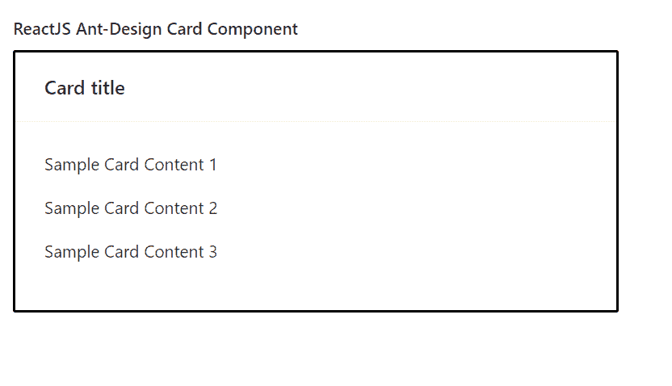

# ReactJS UI Ant Design Card 组件

> 原文：[https://www.geeksforgeeks.org/reactjs-ui-ant-design-card-component/](https://www.geeksforgeeks.org/reactjs-ui-ant-design-card-component/)

Ant Design 库预建了这个组件，也很容易集成。Card 组件用作一个简单的矩形容器，当用户想要显示与单个主题相关的内容时使用。我们可以在 ReactJS 中使用以下方法来使用 Ant Design Card 组件。

**Card 属性：**

*   `actions`：用于表示动作列表。
*   `activeTabKey`：用于表示当前标签面板的键。
*   `bodyStyle`：用于表示应用于卡片内容的内联样式。
*   `bordered`：用于切换卡片周围边框的渲染。
*   `cover`：用于表示卡片封面。
*   `defaultActiveTabKey`：用于表示初始活动选项卡面板的键。
*   `extra`：用于内容在卡片右上角渲染。
*   `headStyle`：用于表示应用于卡片头部的内联样式。
*   `hoverable`：用于在卡片悬停时抬升。
*   `loading`：用于在加载卡片时显示加载指示。
*   `size`：用来表示卡片的大小。
*   `tabBarExtraContent`：用于表示标签栏中的额外内容。
*   `tabList`：用来表示 TabPane 头部的列表。
*   `tabProps`：用来表示 Tab 属性。
*   `title`：用于表示卡片标题。
*   `type`：用于表示卡片样式类型。
*   `onTabChange`：是切换标签时触发的回调函数。

**Card.Grid 属性：**

*   `className`：用于表示容器的类名。
*   `hoverable`：用于在卡片网格悬停时抬升。
*   `style`：用于传递容器的样式对象。

**Card.Meta 属性：**

*   `avatar`：用来表示头像或图标。
*   `className`：用于表示容器的类名。
*   `description`：用于表示描述内容。
*   `style`：用于传递容器的样式对象。
*   `title`：用于表示标题内容。

## 创建 React 应用程序并安装模块

*   **步骤 1：** 使用以下命令创建一个 React 应用程序：

```jsx
npx create-react-app foldername
```

*   **步骤 2：** 在创建项目文件夹（即 `foldername`）后，使用以下命令移动到该文件夹：

```jsx
cd foldername
```

*   **步骤 3：** 创建 ReactJS 应用程序后，使用以下命令安装所需的 `antd` 模块：

```jsx
npm install antd
```

## 项目结构

如下图所示。


## 示例

现在在 `App.js` 文件中写下以下代码。在这里，`App` 是我们编写代码的默认组件。

### App.js

```jsx
import React from 'react'
import "antd/dist/antd.css";
import { Card } from 'antd';

export default function App() {
  return (
    <div style={{
      display: 'block', width: 700, padding: 30
    }}>
      <h4>ReactJS Ant-Design Card Component</h4>
      <>
        <Card title="Card title" bordered
          style={{
            width: 500,
            border: '2px solid black'
          }}>
          <p>Sample Card Content 1</p>
          <p>Sample Card Content 2</p>
          <p>Sample Card Content 3</p>
        </Card>
      </>
    </div>
  );
}
```

## 运行应用程序的步骤

从项目的根目录使用以下命令运行应用程序：

```jsx
npm start
```

## 输出

现在打开浏览器，转到 `http://localhost:3000/`，会看到如下输出：



## 参考

[https://ant.design/components/card/](https://ant.design/components/card/)