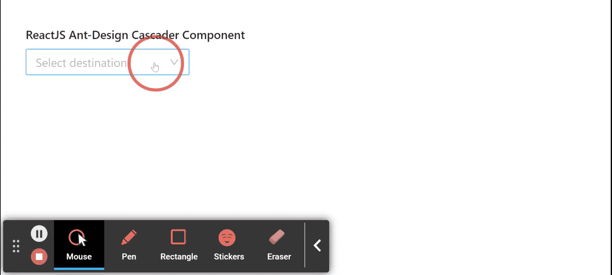

# Ant Design Cascader 组件

> 原文: [https://www.geeksforgeeks.org/reactjs-ui-ant-design-cascader-component/](https://www.geeksforgeeks.org/reactjs-ui-ant-design-cascader-component/)

Ant Design 库预建了这个组件，并且很容易集成。`Cascader` 组件用作级联选择框。当用户需要从一组关联的数据中进行选择时，使用该组件。我们可以在 ReactJS 中使用以下方法来使用 Ant Design `Cascader` 组件。

## Cascader Props

*   `allowClear`: 表示是否允许清除。
*   `autoFocus`: 如果设置为真，用于在组件安装时对焦。
*   `bordered`: 表示是否有边框样式。
*   `changeOnSelect`: 如果设置为真，则用于更改每个选择的值。
*   `className`: 用于附加 CSS 类。
*   `defaultValue`: 用于表示最初选择的值。
*   `disabled`: 表示是否禁用选择。
*   `displayRender`: 是显示选中选项的渲染功能。
*   `dropdownRender`: 用于自定义下拉内容。
*   `expandIcon`: 用于自定义当前项目展开图标。
*   `expandTrigger`: 用于在点击或悬停时展开当前项目，`click` 或 `hover` 其中之一。
*   `fieldNames`: 用于标签和值及子项的自定义字段名。
*   `getPopupContainer`: 它是选择器应该呈现到的父节点。
*   `loadData`: 用于惰性加载选项。
*   `notFoundContent`: 用于指定无结果匹配时显示的内容。
*   `options`: 用于级联的数据选项。
*   `placeholder`: 用于表示输入占位符。
*   `popupClassName`: 用于弹出叠加的附加类名。
*   `popupPlacement`: 用于预设弹出窗口对齐。
*   `popupVisible`: 用于设置级联弹出菜单的可见性。
*   `showSearch`: 用于指示是否以单模方式显示搜索输入。
*   `size`: 用于表示输入大小。
*   `style`: 用于附加样式。
*   `suffixIcon`: 用于自定义后缀图标。
*   `value`: 用于表示选择的值。
*   `onChange`: 是一个回调函数，在完成级联选择时触发。
*   `onPopupVisibleChange`: 是弹出窗口显示或隐藏时触发的回调函数。

## ShowSearch Props

*   `filter`: 如果此函数返回真，作为参数传递给此函数的选项将包含在过滤集中，否则将被排除。
*   `limit`: 用于设置过滤项目的计数。
*   `matchInputWidth`: 用于表示列表宽度是否与输入匹配。
*   `render`: 用于渲染过滤后的选项。
*   `sort`: 用于对过滤后的选项进行排序。

## Methods

*   `blur()`: 此功能用于去除焦点。
*   `focus()`: 此功能用于获取焦点。

## 创建 React 应用程序并安装模块

*   **步骤 1:** 使用以下命令创建一个 React 应用程序:

```jsx
npx create-react-app foldername
```

*   **步骤 2:** 在创建项目文件夹（即 `foldername`）后，使用以下命令移动到该文件夹:

```jsx
cd foldername
```

*   **步骤 3:** 创建 ReactJS 应用程序后，使用以下命令安装所需的模块:

```jsx
npm install antd
```

## 项目结构

项目结构如下图所示。


## 示例

现在在 `App.js` 文件中写下以下代码。在这里，`App` 是我们编写代码的默认组件。

### App.js

```jsx
import React from 'react'
import "antd/dist/antd.css";
import { Cascader } from 'antd';

export default function App() {

  return (
    <div style={{
      display: 'block', width: 700, padding: 30
    }}>
      <h4>ReactJS Ant-Design Cascader Component</h4>
      <>
        <Cascader
          options={[
            {
              value: 'Madhya Pradesh',
              label: 'Madhya Pradesh',
              children: [
                {
                  value: 'Indore',
                  label: 'Indore',
                  children: [
                    {
                      value: 'Vijay Nagar',
                      label: 'Vijay Nagar',
                    }, {
                      value: 'Bhawarkuwa',
                      label: 'Bhawarkuwa',
                    },
                    {
                      value: 'MR10',
                      label: 'MR10',
                    },
                  ],
                },
              ],
            },
          ]}
          onChange={(data) => { console.log(data) }}
          placeholder="Select destination" />
      </>
    </div>
  );
}
```

## 运行应用程序的步骤

从项目的根目录使用以下命令运行应用程序:

```jsx
npm start
```

## 输出

现在打开浏览器，转到 `http://localhost:3000/`，会看到如下输出:



## 参考

[https://ant.design/components/cascader/](https://ant.design/components/cascader/)