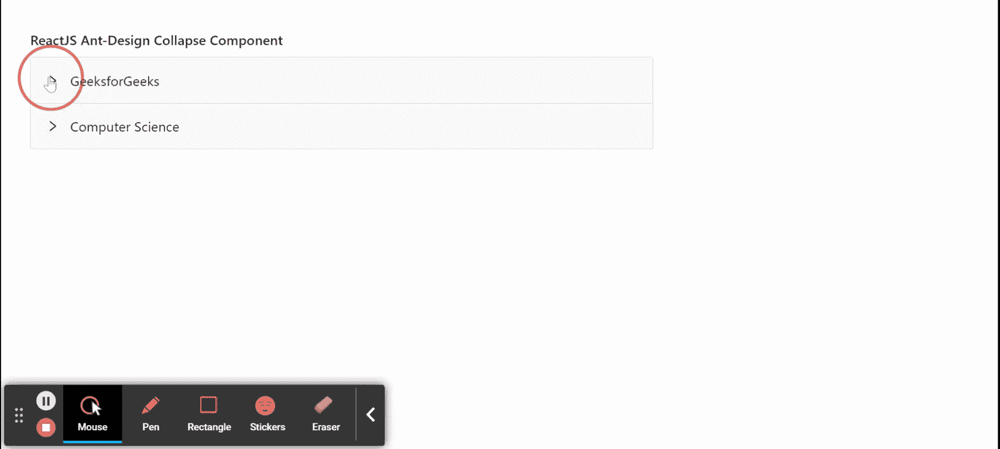

# 重新获取用户界面蚂蚁设计折叠组件

> 原文：`https://www.geeksforgeeks.org/reactjs-ui-ant-design-collapse-component/`

蚂蚁设计库预建了这个组件，也很容易集成。折叠组件用作可折叠和展开的内容区域。我们可以在 ReactJS 中使用以下方法来使用 Ant 设计折叠组件。

## `Collapse` 属性

*   `accordion`：如果该值设置为真，则用于折叠渲染为手风琴。
*   `activeKey`：用于表示活动面板的键。
*   `bordered`：用于切换折叠块周围边框的渲染。
*   `collapsible`：用于指定子面板或触发区域是否可折叠。
*   `defaultActiveKey`：用于表示初始活动面板的按键。
*   `destroyInactivePanel`：用来摧毁无效面板。
*   `expandIcon`：用于自定义折叠图标。
*   `expandIconPosition`：用于设置展开图标位置。
*   `ghost`：用于使塌陷背景透明无边界。
*   `onChange`：是活动面板改变时触发的回调函数。

## `Collapse.Panel` 属性

*   `collapsible`：用于指定面板或触发区域是否可折叠。
*   `extra`：用来表示角落的额外元素。
*   `forceRender`：点击表头时，用于强制渲染面板上的内容，而不是懒渲染。
*   `header`：用于定义面板的标题。
*   `key`：是识别面板的唯一键。
*   `showArrow`：如果为真，则显示箭头图标。

## 创建反应应用程序并安装模块

*   **步骤 1：** 使用以下命令创建一个反应应用程序：

    ```jsx
    npx create-react-app foldername
    ```

*   **步骤 2：** 创建项目文件夹（即 `foldername`）后，使用以下命令移动到该文件夹中：

    ```jsx
    cd foldername
    ```

*   **步骤 3：** 创建 ReactJS 应用程序后，使用以下命令安装所需的模块：

    ```jsx
    npm install antd
    ```

## 项目结构

如下图。


## 示例

现在在 `App.js` 文件中写下以下代码。在这里，`App` 是我们编写代码的默认组件。

### `App.js`

```jsx
import React from 'react'
import "antd/dist/antd.css";
import { Collapse } from 'antd';

const { Panel } = Collapse;

export default function App() {
  return (
    <div style={{
      display: 'block', width: 700, padding: 30
    }}>
      <h4>ReactJS Ant-Design Collapse Component</h4>
      <Collapse>
        <Panel header="GeeksforGeeks" key="1">
          <p>Greetings from GeeksforGeeks</p>
        </Panel>
        <Panel header="Computer Science" key="2">
          <p>This is Best computer Science Portal</p>
        </Panel>
      </Collapse>
    </div>
  );
}
```

## 运行应用程序的步骤

从项目的根目录使用以下命令运行应用程序：

```jsx
npm start
```

## 输出

现在打开浏览器，转到 `http://localhost:3000/`，会看到如下输出：



## 参考

`https://ant.design/components/collapse/`