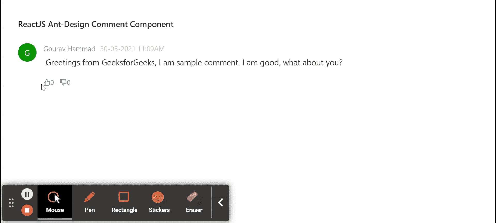

# ReactJS UI Ant Design Comment 组件

> 原文：[https://www.geeksforgeeks.org/reactjs-ui-ant-design-comment-component/](https://www.geeksforgeeks.org/reactjs-ui-ant-design-comment-component/)

Ant Design 库预建了这个组件，也很容易集成。评论组件用于添加用户评论，常用于显示用户反馈和围绕该评论的讨论。我们可以在 ReactJS 中使用以下方法来使用 Ant Design Comment 组件。

## Comment Props

*   `actions`: 用于表示在评论内容下方呈现的动作项列表。
*   `author`: 用于表示显示为评论作者的元素。
*   `avatar`: 用于表示显示为评论头像的元素。
*   `children`: 用于表示嵌套注释应作为注释的子级提供。
*   `content`: 用于表示评论的主要内容。
*   `datetime`: 用于表示包含要显示的时间的 `Tooltip` 元素。

## 创建 React 应用程序并安装模块

*   **步骤 1:** 使用以下命令创建一个 React 应用程序：
    ```bash
    npx create-react-app foldername
    ```
*   **步骤 2:** 创建项目文件夹（即 `foldername`）后，使用以下命令移动到该文件夹中：
    ```bash
    cd foldername
    ```
*   **步骤 3:** 创建 ReactJS 应用程序后，使用以下命令安装所需的模块：
    ```bash
    npm install antd
    npm install --save @ant-design/icons
    ```

## 项目结构

如下图所示。


## 示例

现在在 `App.js` 文件中写下以下代码。在这里，`App` 是我们编写代码的默认组件。

### App.js

```jsx
import React, { createElement, useState } from 'react';
import { Comment, Avatar, Tooltip } from 'antd';
import "antd/dist/antd.css";
import {
  LikeOutlined, DislikeFilled,
  DislikeOutlined, LikeFilled
} from '@ant-design/icons';

export default function App() {
  // To maintain Like state
  const [likesCount, setLikesCount] = useState(0);
  // To maintain Dislike state
  const [dislikesCount, setDislikesCount] = useState(0);
  // To maintain action state
  const [action, setAction] = useState(null);

  return (
    <div style={{
      display: 'block', width: 700, padding: 30
    }}>
      <h4>ReactJS Ant-Design Comment Component</h4>
      <Comment
        author={<a>Gourav Hammad</a>}
        avatar={<Avatar style={{ backgroundColor: 'green' }}>G</Avatar>}
        content={
          <p>
            Greetings from GeeksforGeeks, I am sample comment.
            I am good, what about you?
          </p>
        }
        actions={[
          <Tooltip title="Like">
            <span onClick={() => {
              setLikesCount(1);
              setDislikesCount(0);
              setAction('liked');
            }}>
              {createElement(action === 'liked' ?
                LikeFilled : LikeOutlined)}
              {likesCount}
            </span>
          </Tooltip>,
          <Tooltip title="Dislike">
            <span onClick={() => {
              setLikesCount(0);
              setDislikesCount(1);
              setAction('disliked');
            }}>
              {React.createElement(action === 'disliked' ?
                DislikeFilled : DislikeOutlined)}
              {dislikesCount}
            </span>
          </Tooltip>
        ]}
        datetime={'30-05-2021 11:09AM'}
      />
    </div>
  );
}
```

## 运行应用程序的步骤

从项目的根目录使用以下命令运行应用程序：
```bash
npm start
```

## 输出

现在打开浏览器，转到 `http://localhost:3000/`，会看到如下输出：



## 参考

[https://ant.design/components/comment/](https://ant.design/components/comment/)