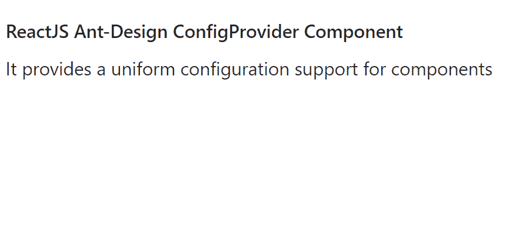

# 重新获取用户界面蚂蚁设计配置提供程序组件

> 原文: [https://www.geeksforgeeks.org/reactjs-ui-ant-design-configprovider-component/](https://www.geeksforgeeks.org/reactjs-ui-ant-design-configprovider-component/)

蚂蚁设计库预建了这个组件，也很容易集成。`ConfigProvider` 组件用于为组件提供统一的配置支持。我们可以在 ReactJS 中使用以下方法来使用 Ant 设计配置提供程序组件。

## 配置提供者道具

*   `autoInsertSpaceInButton`: 设置为 `false` 时，删除按钮上 2 个汉字之间的空格。
*   `componentSize`: 用于配置 `antd` 组件大小。
*   `csp`: 用于设置内容安全策略配置。
*   `direction`: 用于设置布局的方向。
*   `dropdownMatchSelectWidth`: 用于判断下拉菜单和选择输入的宽度是否相同。
*   `form`: 用于设置形态常用道具。
*   `getPopupContainer`: 用于设置弹出元素的容器。
*   `getTargetContainer`: 用于配置词缀、锚点滚动目标容器。
*   `iconPrefixCls`: 用于设置图标前缀类名。
*   `input`: 用于设置 `input` 常用道具。
*   `locale`: 用于表示语言包设置。
*   `pageHeader`: 用于统一 `pageHeader` 的幽灵。
*   `prefixCls`: 用于设置前缀类名。
*   `renderEmpty`: 用于设置组件的空内容。
*   `space`: 用于设置空间大小。
*   `virtual`: 设置为假时，用于禁用虚拟滚动。

## 创建反应应用程序并安装模块

*   **步骤 1:** 使用以下命令创建一个反应应用程序:

```jsx
npx create-react-app foldername
```

*   **步骤 2:** 在创建项目文件夹(即 `foldername`)后，使用以下命令移动到该文件夹:

```jsx
cd foldername
```

*   **步骤 3:** 创建 ReactJS 应用程序后，使用以下命令安装所需的 `antd` 模块:

```jsx
npm install antd
```

## 项目结构

如下图。


项目结构

## 示例

现在在 `App.js` 文件中写下以下代码。在这里，`App` 是我们编写代码的默认组件。

### App.js

```jsx
import React from 'react'
import "antd/dist/antd.css";
import { ConfigProvider } from 'antd';

export default function App() {
  return (
    <div style={{
      display: 'block', width: 700, padding: 30
    }}>
      <h4>ReactJS Ant-Design ConfigProvider Component</h4>
      <ConfigProvider componentSize={"small"}>
        <label>
          It provides a uniform configuration 
          support for components
        </label>
      </ConfigProvider>
    </div>
  );
}
```

## 运行应用程序的步骤

从项目的根目录使用以下命令运行应用程序:

```jsx
npm start
```

## 输出

现在打开浏览器，转到 `http://localhost:3000/`，会看到如下输出:



## 参考

[https://ant.design/components/config-provider/](https://ant.design/components/config-provider/)