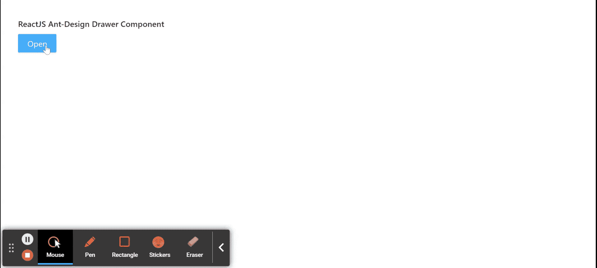

# ReactJS UI Ant Design 抽屉组件

> 原文：[https://www.geeksforgeeks.org/reactjs-ui-ant-design-drawer-component/](https://www.geeksforgeeks.org/reactjs-ui-ant-design-drawer-component/)

Ant Design 库预建了这个组件，也很容易集成。抽屉组件是一个面板，从屏幕边缘滑入。我们可以在 ReactJS 中使用以下方法来使用 Ant Design 抽屉组件。

## 抽屉属性

*   `afterVisibleChange`：是切换抽屉时动画结束后触发的回调函数。
*   `bodyStyle`：用于抽屉内容部分的样式。
*   `className`：用于传递抽屉对话框容器的类名。
*   `closable`：用于指示抽屉对话框右上角是否可见关闭按钮。
*   `closeIcon`：用于自定义关闭图标。
*   `contentWrapperStyle`：用于内容部分的抽屉包装的样式。
*   `destroyOnClose`：用于指示是否卸载正在关闭的抽屉上的子组件。
*   `drawerStyle`：用于弹出层元素的样式。
*   `footer`：用于表示抽屉的页脚。
*   `footerStyle`：用于抽屉页脚部分的样式。
*   `forceRender`：用于强制预渲染抽屉组件。
*   `getContainer`：用于返回抽屉的挂载节点。
*   `headerStyle`：用于抽屉表头部分的样式。
*   `height`：用于表示抽屉对话框的高度。
*   `keyboard`：用于指示是否支持按 `ESC` 键关闭。
*   `mask`：表示是否显示蒙版。
*   `maskClosable`：用于在点击蒙版时指示是否关闭抽屉。
*   `maskStyle`：用于抽屉的遮罩元素的样式。
*   `placement`：用于放置抽屉。
*   `push`：是嵌套抽屉的推送行为。
*   `style`：用于包装元素的样式。
*   `title`：用于表示抽屉的标题。
*   `visible`：用于指示抽屉对话框是否可见。
*   `width`：用于表示抽屉对话框的宽度。
*   `zIndex`：用于表示抽屉的 `z-index`。
*   `onClose`：它是一个回调函数，当用户点击遮罩、关闭按钮或取消按钮时会被触发。

## 创建 React 应用程序并安装模块

*   **步骤 1：** 使用以下命令创建一个 React 应用程序：

    ```bash
    npx create-react-app foldername
    ```

*   **步骤 2：** 在创建项目文件夹（即 `foldername`）后，使用以下命令移动到该文件夹：

    ```bash
    cd foldername
    ```

*   **步骤 3：** 创建 ReactJS 应用程序后，使用以下命令安装所需的 `antd` 模块：

    ```bash
    npm install antd
    ```

## 项目结构

如下图所示。


## 示例

现在在 `App.js` 文件中写下以下代码。在这里，`App` 是我们编写代码的默认组件。

### App.js

```jsx
import React, { useState } from 'react'
import "antd/dist/antd.css";
import { Drawer, Button } from 'antd';

export default function App() {
  const [visible, setVisible] = useState(false);

  return (
    <div style={{
      display: 'block', width: 700, padding: 30
    }}>
      <h4>ReactJS Ant-Design Drawer Component</h4>
      <>
        <Button type="primary"
          onClick={() => {
            setVisible(true);
          }}>Open</Button>
        <Drawer
          title="Drawer Demo"
          placement="left"
          closable={false}
          visible={visible}
          onClose={() => {
            setVisible(false)
          }}
        >
          <p>Item One</p>
          <p>Item Two</p>
          <p>Item Three</p>
          <p>Item Four</p>
          <p>Item Five</p>
        </Drawer>
      </>
    </div>
  );
}
```

## 运行应用程序的步骤

从项目的根目录使用以下命令运行应用程序：

```bash
npm start
```

## 输出

现在打开浏览器，转到 `http://localhost:3000/`，会看到如下输出：



## 参考

[https://ant.design/components/drawer/](https://ant.design/components/drawer/)