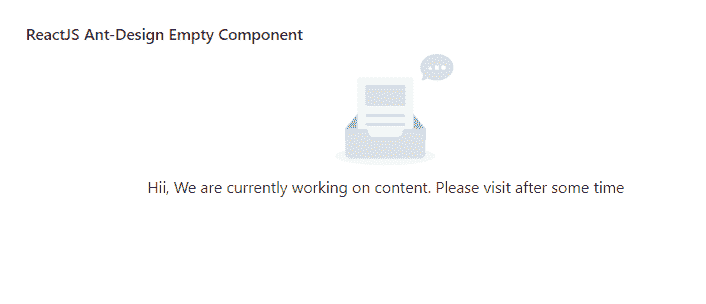

# ReactJS UI Ant Design Empty 组件

> 原文：[https://www.geeksforgeeks.org/reactjs-ui-ant-design-empty-component/](https://www.geeksforgeeks.org/reactjs-ui-ant-design-empty-component/)

Ant Design 库预建了这个组件，并且很容易集成。`Empty` 组件是一个空状态占位符，当没有数据显示给最终用户时使用。我们可以在 ReactJS 中使用以下方法来使用 Ant Design `Empty` 组件。

`Empty` 组件的属性：

*   `description`：用于定义自定义描述。
*   `image`：用于定义自定义图像。
*   `imageStyle`：用于传递图像的样式。

## 创建 React 应用程序并安装模块

*   **步骤 1：** 使用以下命令创建一个 React 应用程序：

    ```jsx
    npx create-react-app foldername
    ```

*   **步骤 2：** 创建项目文件夹（即 `foldername`）后，使用以下命令移动到该文件夹中：

    ```jsx
    cd foldername
    ```

*   **步骤 3：** 创建 ReactJS 应用程序后，使用以下命令安装所需的模块：

    ```jsx
    npm install antd
    ```

## 项目结构

项目结构如下图所示。


## 示例

现在在 `App.js` 文件中写下以下代码。在这里，`App` 是我们编写代码的默认组件。

### App.js

```jsx
import React from 'react'
import "antd/dist/antd.css";
import { Empty } from 'antd';

export default function App() {
  return (
    <div style={{
      display: 'block', width: 700, padding: 30
    }}>
      <h4>ReactJS Ant-Design Empty Component</h4>
      <Empty 
        description="Hii, We are currently working on content. 
        Please visit after some time"
      />
    </div>
  );
}
```

## 运行应用程序的步骤

从项目的根目录使用以下命令运行应用程序：

```jsx
npm start
```

## 输出

现在打开浏览器，转到 `http://localhost:3000/`，会看到如下输出：



## 参考

[https://ant.design/components/empty/](https://ant.design/components/empty/)