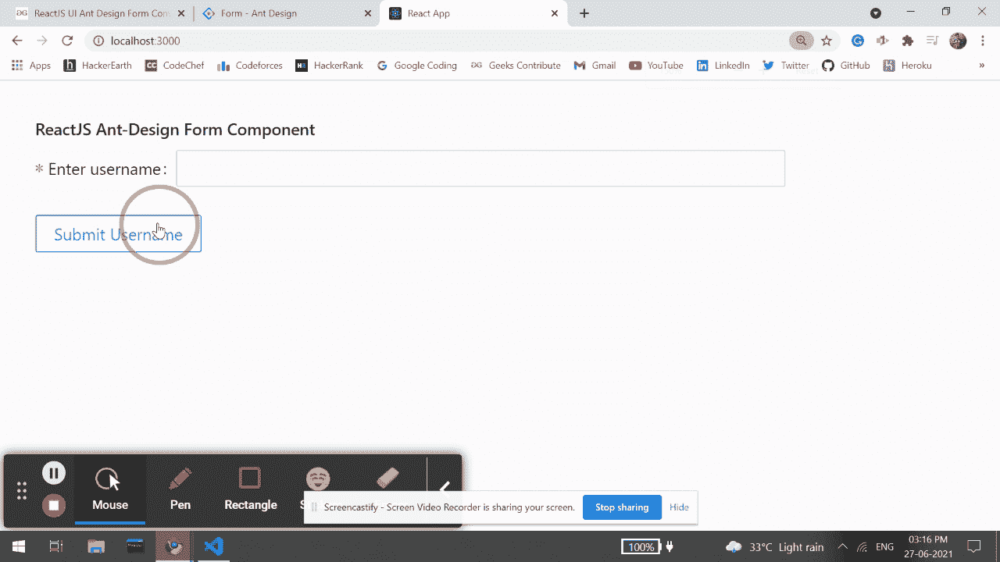

# 重新获取用户界面蚂蚁设计表单组件

> 原文: [https://www.geeksforgeeks.org/reactjs-ui-ant-design-form-component/](https://www.geeksforgeeks.org/reactjs-ui-ant-design-form-component/)

蚂蚁设计库预建了这个组件，也很容易集成。当用户需要创建实例或收集信息时，使用表单组件。我们可以在 ReactJS 中使用以下方法来使用 Ant 设计表单组件。

## 形态道具

*   `colon`: 用于配置表单项的冒号默认值。
*   `component`: 用于设置表单渲染元素。
*   `fields`: 用于表示通过状态管理对表单字段的控制。
*   `form`: 用于表示 `Form.useForm()` 创建的表单控件实例。
*   `initialValues`: 用于通过表单初始化或重置来设置值。
*   `labelAlign`: 用于表示所有项目标签的文本对齐。
*   `labelCol`: 用于表示标签布局，类似于 `<Col>` 组件。
*   `layout`: 用于表示表单布局。
*   `name`: 用于表示表单名称。
*   `preserve`: 用于保存字段值，即使字段被移除。
*   `requiredMark`: 用于要求标记样式。
*   `scrollToFirstError`: 用于提交时自动滚动至第一个失败的字段。
*   `size`: 用于设置字段组件尺寸。
*   `validateMessages`: 用于验证提示模板。
*   `validateTrigger`: 用于表示配置字段验证触发器。
*   `wrapperCol`: 用于表示输入控件的布局。
*   `onFieldsChange`: 是字段更新时触发的回调函数。
*   `onFinish`: 是提交表单验证数据成功后触发的回调函数。
*   `onFinishFailed`: 是提交表单验证数据失败后触发的回调函数。
*   `onValuesChange`: 是值更新时触发的回调函数。

## 形态。物品道具

*   `colon`: 与 label 连用，标注文字后是否显示颜色(:)。
*   `dependencies`: 用于设置依赖项字段。
*   `extra`: 用于表示额外的提示信息。
*   `getValueFromEvent`: 用于指定如何从事件或其他 `onChange` 参数中获取值。
*   `getValueProps`: 用于获取带有子组件的附加道具。
*   `hasFeedback`: 用于验证状态，该选项指定验证状态图标。
*   `help`: 用于表示提示信息。
*   `hidden`: 表示是否隐藏 `Form.Item` 与否。
*   `htmlFor`: 用于设置子标签 `htmlFor`。
*   `initialValue`: 用于配置子默认值。
*   `label`: 用于表示标签文本。
*   `labelAlign`: 用于表示标签的文本对齐。
*   `labelCol`: 用于表示标签的布局。
*   `messageVariables`: 用于表示默认的验证字段信息。
*   `name`: 用于表示名称。
*   `normalize`: 用于在传递到表单实例之前，对组件值进行规格化。
*   `noStyle`: 用作纯场控制。
*   `preserve`: 用于保存字段值，即使字段被移除。
*   `required`: 用于显示所需样式。它是由验证规则生成的。
*   `rules`: 用于表示字段验证的规则。
*   `shouldUpdate`: 用于自定义字段更新逻辑。
*   `tooltip`: 用于配置工具提示信息。
*   `trigger`: 用于指示何时采集子节点的值。
*   `validateFirst`: 用于指示是否根据该字段的第一个错误规则停止验证。
*   `validateStatus`: 用于表示验证状态。
*   `validateTrigger`: 用于指示何时验证子节点的值。
*   `valuePropName`: 用于表示子节点的道具。
*   `wrapperCol`: 用于表示输入控件的布局。

## 形态。道具列表

*   `children`: 是一个渲染函数。
*   `initialValue`: 用于表示配置子默认值。
*   `name`: 用于表示字段名称。
*   `rules`: 用于验证规则。

## 形式。ErrorList Props

*   `errors`: 用于表示错误列表。

## 形态。提供商道具

*   `onFormChange`: 是子窗体字段更新函数时触发的回调函数。
*   `onFormFinish`: 是子窗体提交时触发的回调函数。

## 创建反应应用程序并安装模块

### 步骤 1
使用以下命令创建一个反应应用程序:
```jsx
npx create-react-app foldername
```

### 步骤 2
在创建项目文件夹(即 `foldername`)后，使用以下命令将移动到该文件夹:
```jsx
cd foldername
```

### 步骤 3
创建 ReactJS 应用程序后，使用以下命令安装所需的模块:
```jsx
npm install antd
```

## 项目结构
如下图。


项目结构

## 示例
现在在 `App.js` 文件中写下以下代码。在这里，`App` 是我们编写代码的默认组件。

### App.js
```jsx
import React from 'react'
import "antd/dist/antd.css";
import { Form, Button, Input } from 'antd';

export default function App() {

return (
        <div style={{
            display: 'block', width: 700, padding: 30
        }}>
            <h4>ReactJS Ant-Design Form Component</h4>
            <Form
                name="basicform"
                onFinishFailed={() => alert('Failed to submit')}
                onFinish={() => alert('Form Submitted')}
                initialValues={{ remember: true }}
            >
             <Form.Item
              label="Enter username"
              name="Username"
              rules={[{ required: true, message: 'Please enter username' }]}
             >
              <Input />
             </Form.Item>
             <Form.Item>
              <Button type="success" htmlType="submit">
               Submit Username
              </Button>
             </Form.Item>
            </Form>
        </div>
    );
}
```

## 运行应用程序的步骤
从项目的根目录使用以下命令运行应用程序:
```jsx
npm start
```

## 输出
现在打开浏览器，转到 `http://localhost:3000/`，会看到如下输出:



## 参考
[https://ant.design/components/form/](https://ant.design/components/form/)