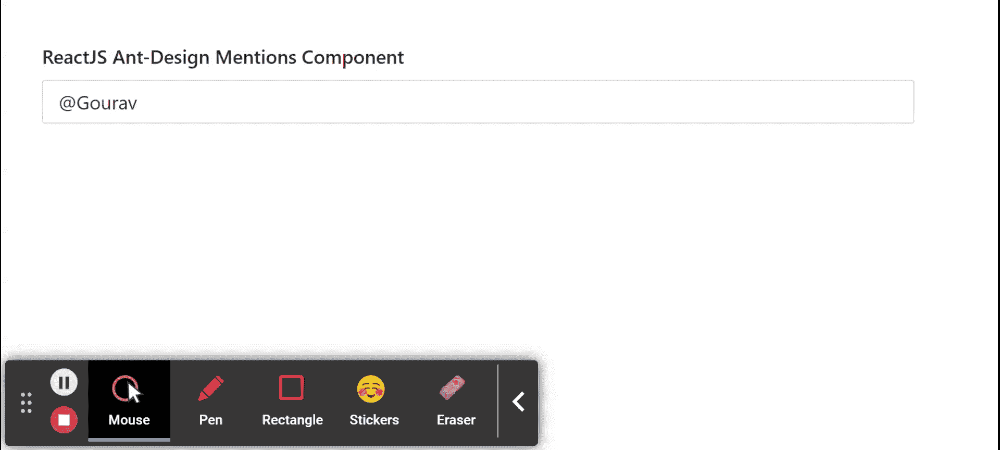

# 反应蚂蚁界面设计提及组件

> 原文：[https://www.geeksforgeeks.org/reactjs-ui-ant-design-attents-component/](https://www.geeksforgeeks.org/reactjs-ui-ant-design-attents-component/)

蚂蚁设计库预建了这个组件，也很容易集成。提及组件用于提及目的，当用户需要提及某人或某事时使用。我们可以在 ReactJS 中使用以下方法来使用 Ant 设计提及组件。

## 提到道具

*   `autoFocus`：用于设置组件挂载时的自动对焦。
*   `autoSize`：用于文本区域高度自动调整功能。
*   `defaultValue`：用于表示默认值。
*   `filterOption`：用于通过自定义的过滤选项逻辑。
*   `getPopupContainer`：用于设置建议的挂载 HTML 节点。
*   `notFoundContent`：用于设置不匹配时的提及内容。
*   `placement`：用于设置弹出放置。
*   `prefix`：用于设置触发前缀关键字。
*   `split`：用于设置选中提及前后的拆分字符串。
*   `validateSearch`：用于自定义触发搜索逻辑。
*   `value`：用于设置提及值。
*   `onBlur`：是一个回调函数，在提及失去焦点时触发。
*   `onChange`：是值发生变化时触发的回调函数。
*   `onFocus`：是一个回调函数，在提到获得焦点时触发。
*   `onResize`：是 Textarea 调整大小时触发的回调函数。
*   `onSearch`：是前缀命中时触发的回调函数。
*   `onSelect`：是用户选择选项时触发的回调函数。

## 选项道具

*   `children`：用于建议内容
*   `value`：用于表示建议的值，选择后该值将插入输入栏。

## 方法

*   `blur()`：此功能用于去除焦点。
*   `focus()`：此功能用于获取焦点。

## 创建反应应用程序并安装模块

*   **步骤 1：** 使用以下命令创建一个反应应用程序：

```jsx
npx create-react-app foldername
```

*   **步骤 2：** 创建项目文件夹（即文件夹名）后，使用以下命令移动到该文件夹中：

```jsx
cd foldername
```

*   **步骤 3：** 创建 ReactJS 应用程序后，使用以下命令安装所需的模块：

```jsx
npm install antd
```

## 项目结构

如下图。


项目结构

## 示例

现在在 `App.js` 文件中写下以下代码。在这里，`App` 是我们编写代码的默认组件。

### App.js

```jsx
import React from 'react'
import "antd/dist/antd.css";
import { Mentions } from 'antd';

const { Option } = Mentions;

export default function App() {

return (
    <div style={{
      display: 'block', width: 700, padding: 30
    }}>
      <h4>ReactJS Ant-Design Mentions Component</h4>
      <>
        <Mentions
          defaultValue="@Gourav"
          onChange={(data) => {console.log(data)}}
          onSelect={(option)=> {console.log(option)}}
        >
          <Option value="Gourav">Gourav</Option>
          <Option value="Ashutosh">Ashutosh</Option>
          <Option value="Kartik">Kartik</Option>
          <Option value="Nikhil">Nikhil</Option>
        </Mentions>
      </>
    </div>
  );
}
```

## 运行应用程序的步骤

从项目的根目录使用以下命令运行应用程序：

```jsx
npm start
```

## 输出

现在打开浏览器，转到 `http://localhost:3000/`，会看到如下输出：



## 参考

[https://ant.design/components/mentions/](https://ant.design/components/mentions/)