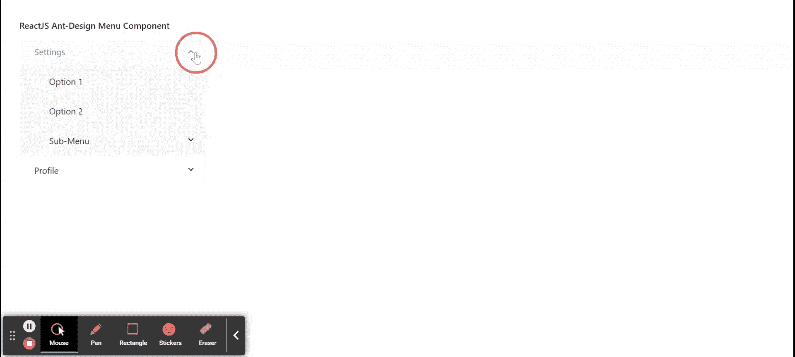

# ReactJS Ant Design 菜单组件详解

> 原文：[https://www.geeksforgeeks.org/reactjs-ui-ant-design-menu-component/](https://www.geeksforgeeks.org/reactjs-ui-ant-design-menu-component/)

Ant Design 库预建了这个组件，也很容易集成。菜单组件用于显示用于导航目的的多功能菜单。我们可以在 ReactJS 中使用以下方法来使用 Ant Design 菜单组件。

## `Menu` 属性

*   `defaultOpenKeys`: 用默认打开的子菜单的按键表示数组。
*   `defaultSelectedKeys`: 用于表示带有缺省选择菜单项的键的数组。
*   `expandIcon`: 用于传递子菜单的自定义扩展图标。
*   `forceSubMenuRender`: 用于在渲染子菜单变得可见之前，强制渲染子菜单进入 DOM。
*   `inlineCollapsed`: 用于指定菜单处于内嵌模式时的折叠状态。
*   `inlineIndent`: 用于表示每一级内嵌菜单项的缩进量，单位为像素。
*   `mode`: 用于表示菜单的类型。
*   `multiple`: 用于允许选择多个项目。
*   `openKeys`: 用于表示带有当前打开的子菜单的键的数组。
*   `overflowedIndicator`: 用于菜单折叠时传递自定义图标。
*   `selectable`: 用于选择菜单项。
*   `selectedKeys`: 用于表示带有当前选中菜单项按键的数组。
*   `style`: 用于定义根节点的样式。
*   `subMenuCloseDelay`: 表示鼠标离开时隐藏子菜单的延迟时间，单位为秒。
*   `subMenuOpenDelay`: 表示鼠标进入时显示子菜单的延迟时间，单位为秒。
*   `theme`: 用于定义菜单的颜色主题。
*   `triggerSubMenuAction`: 是一个可以触发子菜单打开/关闭的回调函数。
*   `onClick`: 是一个回调函数，在点击菜单项时调用。
*   `onDeselect`: 是取消选择菜单项时调用的回调函数。
*   `onOpenChange`: 是打开或关闭子菜单时调用的回调函数。
*   `onSelect`: 是选择菜单项时调用的回调函数。

## `Menu.Item` 属性

*   `danger`: 用于显示危险样式。
*   `disabled`: 用于指示菜单项是否禁用。
*   `icon`: 用于传递菜单项的图标。
*   `key`: 用于表示菜单项的唯一标识。
*   `title`: 用于设置折叠项的显示标题。

## `Menu.SubMenu` 属性

*   `children`: 用于表示子菜单或子菜单项。
*   `disabled`: 表示子菜单是否禁用。
*   `icon`: 用于传递子菜单的图标。
*   `key`: 用于表示子菜单的唯一标识。
*   `popupClassName`: 用于表示子菜单类名。
*   `popupOffset`: 用于表示子菜单偏移。
*   `title`: 用于表示子菜单的标题。
*   `onTitleClick`: 是点击子菜单标题时触发的回调函数。

## `Menu.ItemGroup` 属性

*   `children`: 用于表示子菜单项。
*   `title`: 用来表示团体的名称。

## `Menu.Divider`

用作菜单项之间的分隔线。该组件仅用于垂直弹出菜单或下拉菜单。

## 创建 React 应用并安装模块

*   **步骤 1:** 使用以下命令创建一个 React 应用程序：
    ```jsx
    npx create-react-app foldername
    ```
*   **步骤 2:** 创建项目文件夹（即 `foldername`）后，使用以下命令移动到该文件夹中：
    ```jsx
    cd foldername
    ```
*   **步骤 3:** 创建 ReactJS 应用程序后，使用以下命令安装所需的模块：
    ```jsx
    npm install antd
    ```

## 项目结构

如下图。


## 示例

现在在 `App.js` 文件中写下以下代码。在这里，`App` 是我们编写代码的默认组件。

### `App.js`

```jsx
import React from 'react';
import "antd/dist/antd.css";
import { Menu } from 'antd';

const { SubMenu } = Menu;

export default function App() {
  return (
    <div style={{
      display: 'block', width: 700, padding: 30
    }}>
      <h4>ReactJS Ant-Design Menu Component</h4>
      <Menu
        defaultOpenKeys={['1']}
        defaultSelectedKeys={['1']}
        style={{ width: 300 }}
        mode="inline"
      >
        <SubMenu key="1" title="Settings">
          <Menu.Item key="2">Option 1</Menu.Item>
          <Menu.Item key="3">Option 2</Menu.Item>
          <SubMenu key="4" title="Sub-Menu">
            <Menu.Item key="5">Option 3</Menu.Item>
            <Menu.Item key="6">Option 4</Menu.Item>
          </SubMenu>
        </SubMenu>
        <SubMenu key="7" title="Profile">
          <Menu.Item key="8">Option 5</Menu.Item>
          <Menu.Item key="9">Option 6</Menu.Item>
          <Menu.Item key="10">Option 7</Menu.Item>
          <Menu.Item key="11">Option 8</Menu.Item>
        </SubMenu>
      </Menu>
    </div>
  );
}
```

## 运行应用程序的步骤

从项目的根目录使用以下命令运行应用程序：
```jsx
npm start
```

## 输出

现在打开浏览器，转到 `http://localhost:3000/`，会看到如下输出：



## 参考

[https://ant.design/components/menu/](https://ant.design/components/menu/)