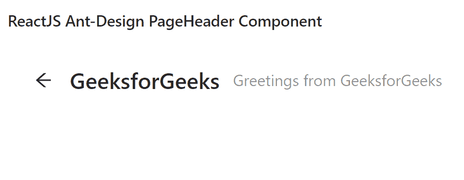

# ReactJS Ant Design PageHeader 组件使用指南

> 原文：[https://www.geeksforgeeks.org/reactjs-ui-ant-design-pageheader-component/](https://www.geeksforgeeks.org/reactjs-ui-ant-design-pageheader-component/)

Ant Design 库预建了这个组件，也很容易集成。PageHeader 组件是一个标题，具有内置的常用动作和设计元素。我们可以在 ReactJS 中使用以下方法来使用 Ant Design PageHeader 组件。

## 语法

```jsx
<PageHeader
  onBack={() => {
    // Action on click
  }}
  title=""
  subTitle=" "
  className=" "
/>
```

## PageHeader 属性

*   `avatar`： 就是标题栏旁边的头像。
*   `backIcon`： 是自定义后退图标。
*   `breadcrumb`： 用于传递面包屑配置。
*   `breadcrumbRender`： 用于自定义面包屑区域的内容。
*   `extra`： 位于标题行末尾的操作区。
*   `footer`： 是页眉页脚，一般用于渲染 TabBar。
*   `ghost`： 是 `PageHeader` 类型，用于改变背景颜色。
*   `subTitle`： 用于表示字幕的自定义文本。
*   `tags`： 用于表示标题旁边的标签列表。
*   `title`： 用于表示标题的自定义文本。
*   `onBack`： 是点击后退图标触发的回调。

## 创建 React 应用程序并安装模块

### 步骤 1
使用以下命令创建一个 React 应用程序：
```bash
npx create-react-app foldername
```

### 步骤 2
创建项目文件夹后，即文件夹名称 `foldername`，使用以下命令移动到项目文件夹：
```bash
cd foldername
```

### 步骤 3
创建 ReactJS 应用程序后，使用以下命令安装所需的模块：
```bash
npm install antd
```

## 项目结构
如下图所示。


## 示例
现在在 `App.js` 文件中写下以下代码。在这里，`App` 是我们编写代码的默认组件。

### App.js
```jsx
import React from 'react'
import "antd/dist/antd.css";
import { PageHeader } from 'antd';

export default function App() {
  return (
    <div style={{ display: 'block', width: 700, padding: 30 }}>
      <h4>ReactJS Ant-Design PageHeader Component</h4>
      <PageHeader
        onBack={() => {
          console.log("Action you can perform on Click on Back button")
        }}
        title="GeeksforGeeks"
        subTitle="Greetings from GeeksforGeeks"
        className="site-page-header"
      />
    </div>
  );
}
```

## 运行应用程序的步骤
从项目的根目录使用以下命令运行应用程序：
```bash
npm start
```

## 输出
现在打开浏览器，转到 `http://localhost:3000/`，会看到如下输出：



## 参考
[https://ant.design/components/page-header/](https://ant.design/components/page-header/)