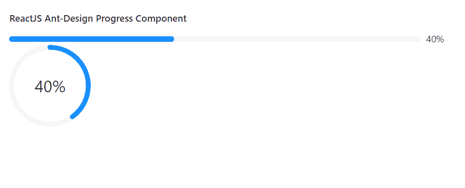

# ReactJS UI Ant Design 进度组件

> 原文: [https://www.geeksforgeeks.org/reactjs-ui-ant-design-progress-component/](https://www.geeksforgeeks.org/reactjs-ui-ant-design-progress-component/)

Ant Design 库预建了这个组件，也很容易集成。进度组件用于显示操作流程的当前进度。我们可以在 ReactJS 中使用以下方法来使用 Ant Design 进度组件。

## 进度道具

*   `format`: 作为内容的模板函数。
*   `percent`: 用于设置完成百分比。
*   `showInfo`: 表示是否显示进度值和状态图标。
*   `status`: 用于设置进度的状态。
*   `strokeColor`: 用于表示进度条颜色。
*   `strokeLinecap`: 用于设置进度线帽样式。
*   `success`: 用于成功进度条的配置。
*   `trailColor`: 用于设置未填充部分的颜色。
*   `type`: 用于设置类型。

## type="line" 道具

*   `steps`: 用于表示总集数。
*   `strokeColor`: 用于表示进度条颜色。
*   `strokeWidth`: 用于设置进度条宽度。

## type="circle" 道具

*   `strokeColor`: 用于表示循环进度颜色。
*   `strokeWidth`: 用于设置循环进度宽度。
*   `width`: 用于设置循环进度的画布宽度。

## type="dashboard" 道具

*   `gapDegree`: 用于表示半圆的间隙度。
*   `gapPosition`: 用于表示间隙位置。
*   `strokeWidth`: 用于设置仪表盘进度宽度。
*   `width`: 用于设置仪表盘进度的画布宽度。

## 创建 React 应用程序并安装模块

*   **步骤 1:** 使用以下命令创建一个 React 应用程序:
    ```
    npx create-react-app foldername
    ```

*   **步骤 2:** 创建项目文件夹（即 `foldername`）后，使用以下命令移动到该文件夹中:
    ```
    cd foldername
    ```

*   **步骤 3:** 创建 ReactJS 应用程序后，使用以下命令安装所需的模块:
    ```
    npm install antd
    ```

## 项目结构

如下图。


## 示例

现在在 `App.js` 文件中写下以下代码。在这里，`App` 是我们编写代码的默认组件。

### App.js

```jsx
import React from 'react'
import "antd/dist/antd.css";
import { Progress } from 'antd';

export default function App() {
  return (
    <div style={{
      display: 'block', width: 700, padding: 30
    }}>
      <h4>ReactJS Ant-Design Progress Component</h4>
      <Progress percent={40} />
      <Progress type="circle" percent={40} />
    </div>
  );
}
```

## 运行应用程序的步骤

从项目的根目录使用以下命令运行应用程序:
```
npm start
```

## 输出

现在打开浏览器，转到 `http://localhost:3000/`，会看到如下输出:



## 参考

[https://ant.design/components/progress/](https://ant.design/components/progress/)