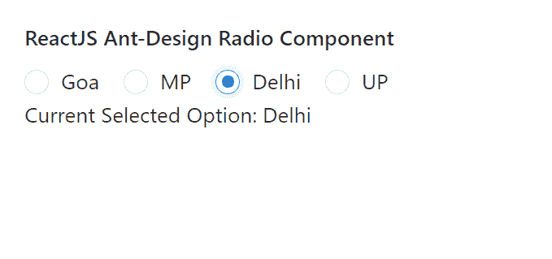

# ReactJS UI Ant 设计无线电组件

> 原文: [https://www.geeksforgeeks.org/reactjs-ui-ant-design-radio-component/](https://www.geeksforgeeks.org/reactjs-ui-ant-design-radio-component/)

蚂蚁设计库预建了这个组件，也很容易集成。无线电组件允许用户从一组中选择一个选项。我们可以在 ReactJS 中使用以下方法来使用 Ant 设计无线电组件。

**无线电方法:**

*   `blur()`: 此方法用于去除元素的焦点。
*   `focus()`: 此方法用于获取元素的焦点。

**无线电道具:**

*   `autoFocus`: 用于安装组件时对焦。
*   `checked`: 表示收音机是否被选择。
*   `defaultChecked`: 用于指定收音机是否被选中的初始状态。
*   `disabled`: 用于禁用收音机。
*   `value`: 用于表示所选单选按钮的值。

**RadioGroup 道具:**

*   `buttonStyle`: 用于表示单选按钮的样式类型。
*   `defaultValue`: 用于定义单选按钮的默认选定值。
*   `disabled`: 用于禁用所有单选按钮。
*   `name`: 用于定义所有输入子对象的名称属性，这些子对象的类型为单选。
*   `options`: 用于设置孩子可选。
*   `optionType`: 用于指定收音机的选项类型。
*   `size`: 用来表示收音机的大小。
*   `value`: 用于设置当前选择的值。
*   `onChange`: 是状态变化时触发的回调函数。

### 创建反应应用程序并安装模块

*   **步骤 1:** 使用以下命令创建一个反应应用程序:

```jsx
npx create-react-app foldername
```

*   **步骤 2:** 创建项目文件夹(即文件夹名)后，使用以下命令移动到该文件夹中:

```jsx
cd foldername
```

*   **步骤 3:** 创建 ReactJS 应用程序后，使用以下命令安装所需的模块:

```jsx
npm install antd
```

**项目结构:** 如下图。


项目结构

### 示例

现在在 `App.js` 文件中写下以下代码。在这里，`App` 是我们编写代码的默认组件。

## App.js

```jsx
import React, { useState } from 'react'
import "antd/dist/antd.css";
import { Radio } from 'antd';

export default function App() {

const [currentValue, setCurrentValue] = useState("Goa")

return (
    <div style={{ display: 'block', width: 700, padding: 30 }}>
      <h4>ReactJS Ant-Design Radio Component</h4>   
      <Radio.Group onChange={(e) => {
        setCurrentValue(e.target.value)
      }} value={currentValue}>
        <Radio value={"Goa"}>Goa</Radio>
        <Radio value={"MP"}>MP</Radio>
        <Radio value={"Delhi"}>Delhi</Radio>
        <Radio value={"UP"}>UP</Radio>
      </Radio.Group> <br />
      Current Selected Option: {currentValue}
    </div>
  );
}
```

### 运行应用程序的步骤

从项目的根目录使用以下命令运行应用程序:

```jsx
npm start
```

**输出:** 现在打开浏览器，转到 `http://localhost:3000/`，会看到如下输出:



**参考:** [https://ant.design/components/radio/](https://ant.design/components/radio/)