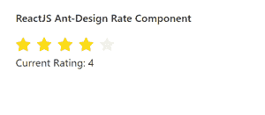

# React Ant Design Rate 组件

> 原文: [https://www.geeksforgeeks.org/reactjs-ui-ant-design-rate-component/](https://www.geeksforgeeks.org/reactjs-ui-ant-design-rate-component/)

Ant Design 库预建了这个组件，并且很容易集成。Rate 组件以评分的形式帮助捕捉用户反馈。我们可以在 ReactJS 中使用以下方法来使用 Ant Design Rate 组件。

## 方法

*   `blur()`: 此方法用于去除元素的焦点。
*   `focus()`: 此方法用于获取元素的焦点。

## 属性

*   `allowClear`: 用于指定用户再次点击时是否允许清除评级。
*   `allowHalf`: 表示是否允许评级半选。
*   `autoFocus`: 用于在安装组件时获得焦点。
*   `character`: 用于表示评分的自定义字符。
*   `className`: 用于指定评分的类名。
*   `count`: 用于表示开始计数。
*   `defaultValue`: 用于定义评分的默认值。
*   `disabled`: 用于禁用组件。
*   `style`: 用于指定评分的自定义样式对象。
*   `tooltips`: 用于为每个角色自定义工具提示。
*   `value`: 用于表示当前值。
*   `onBlur`: 是组件失去焦点时触发的回调函数。
*   `onChange`: 是选择值时触发的回调函数。
*   `onFocus`: 是组件获得焦点时触发的回调函数。
*   `onHoverChange`: 是一个回调函数，在项目悬停时触发。
*   `onKeyDown`: 是一个回调函数，在组件上按键时触发。

## 创建 React 应用程序并安装模块

*   **步骤 1:** 使用以下命令创建一个 React 应用程序:
    ```bash
    npx create-react-app foldername
    ```
*   **步骤 2:** 创建项目文件夹（即 `foldername`）后，使用以下命令移动到该文件夹中:
    ```bash
    cd foldername
    ```
*   **步骤 3:** 创建 ReactJS 应用程序后，使用以下命令安装所需的模块:
    ```bash
    npm install antd
    ```

## 项目结构

如下图所示。


## 示例

现在在 `App.js` 文件中写下以下代码。在这里，`App` 是我们编写代码的默认组件。

### App.js

```jsx
import React, { useState } from 'react'
import "antd/dist/antd.css";
import { Rate } from 'antd';

export default function App() {
  const [currentValue, setCurrentValue] = useState(2)

  return (
    <div style={{ display: 'block', width: 700, padding: 30 }}>
      <h4>ReactJS Ant-Design Rate Component</h4>
      <Rate onChange={(value) => {
        setCurrentValue(value)
      }} value={currentValue} /> <br />
      Current Rating: {currentValue}
    </div>
  );
}
```

## 运行应用程序的步骤

从项目的根目录使用以下命令运行应用程序:
```bash
npm start
```

## 输出

现在打开浏览器，转到 `http://localhost:3000/`，会看到如下输出:



## 参考

[https://ant.design/components/rate/](https://ant.design/components/rate/)