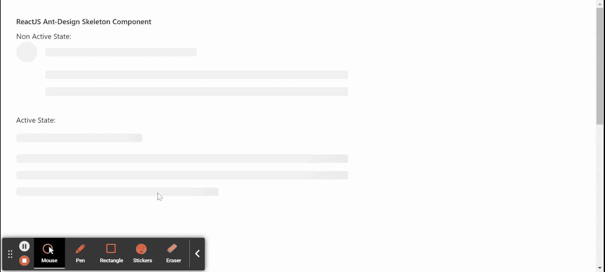

# ReactJS UI Ant Design Skeleton Component

> 原文: [https://www.geeksforgeeks.org/reactjs-ui-ant-design-skeleton-component/](https://www.geeksforgeeks.org/reactjs-ui-ant-design-skeleton-component/)

Ant Design 库预建了这个组件，并且很容易集成。只要数据没有加载，就使用骨架组件。它用于在加载内容时提供占位符。我们可以在 ReactJS 中使用以下方法来使用 Ant Design 骨架组件。

## Skeleton Props

*   `active`: 用于显示动画效果。
*   `avatar`: 用于显示头像占位符。
*   `loading`: 设置为 `true` 时显示骨架。
*   `paragraph`: 用于显示段落占位符。
*   `round`: 设置为 `true` 时显示段落和标题半径。
*   `title`: 用于显示标题占位符。

## Skeleton.Avatar Props

*   `active`: 用于显示动画效果。
*   `shape`: 用于设置头像的形状。
*   `size`: 用于设置头像的大小。

## Skeleton.Title Props

*   `width`: 用于设置标题的宽度。

## Skeleton.Paragraph Props

*   `rows`: 用于设置段落的行数。
*   `width`: 用于设置段落宽度。

## Skeleton.Button Props

*   `active`: 用于显示动画效果。
*   `shape`: 用于设置按钮的形状。
*   `size`: 用于设置按钮的大小。

## Skeleton.Input Props

*   `active`: 用于显示动画效果。
*   `size`: 用于设置输入的大小。

## 创建 React 应用程序并安装模块

*   **步骤 1:** 使用以下命令创建一个 React 应用程序:
    ```jsx
    npx create-react-app foldername
    ```

*   **步骤 2:** 在创建项目文件夹（即 `foldername`）后，使用以下命令移动到该文件夹:
    ```jsx
    cd foldername
    ```

*   **步骤 3:** 创建 ReactJS 应用程序后，使用以下命令安装所需的 `antd` 模块:
    ```jsx
    npm install antd
    ```

## 项目结构

如下图所示。


## 示例

现在在 `App.js` 文件中写下以下代码。在这里，`App` 是我们编写代码的默认组件。

### App.js

```jsx
import React from 'react'
import "antd/dist/antd.css";
import { Skeleton } from 'antd';

export default function App() {
  return (
    <div style={{
      display: 'block', width: 700, padding: 30, height: 1000,
    }}>
      <h4>ReactJS Ant-Design Skeleton Component</h4>
      Non Active State: <Skeleton avatar paragraph={{ rows: 2 }} /> <br />
      Active State: <Skeleton active />  <br />
    </div>
  );
}
```

## 运行应用程序的步骤

从项目的根目录使用以下命令运行应用程序:
```jsx
npm start
```

## 输出

现在打开浏览器，转到 `http://localhost:3000/`，会看到如下输出:



## 参考

[https://ant.design/components/skeleton/](https://ant.design/components/skeleton/)