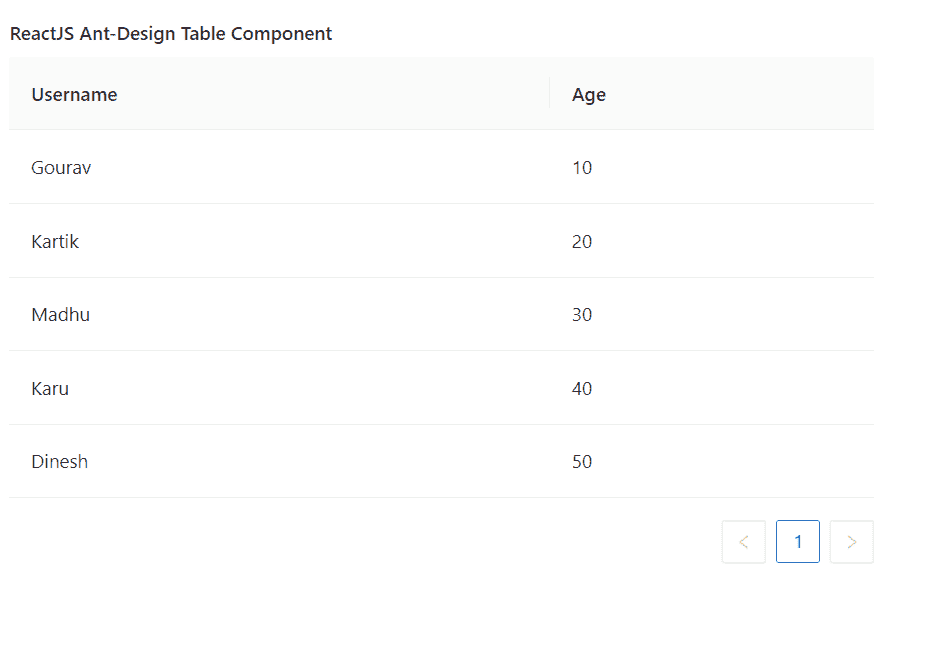

# ReactJS UI Ant 设计表组件

> 原文: [https://www.geeksforgeeks.org/reactjs-ui-ant-design-table-component/](https://www.geeksforgeeks.org/reactjs-ui-ant-design-table-component/)

蚂蚁设计库预建了这个组件，也很容易集成。ReactJS UI Ant 设计表组件用于显示数据行。它用于以表格格式显示数据。我们可以在 ReactJS 中使用以下方法来使用 Ant 设计表组件。

## 桌面道具

*   `bordered`: 表示是否显示所有表格边框。
*   `columns`: 用于表示表格的列。
*   `components`: 用于覆盖默认表格元素。
*   `dataSource`: 用于表示要显示的数据记录数组。
*   `expandable`: 用于配置可扩展内容。
*   `footer`: 用于表示表格页脚渲染器。
*   `getPopupContainer`: 是表中下拉的渲染容器。
*   `loading`: 用于表示表格的加载状态。
*   `locale`: 是包含过滤、排序、空文本等的 i18n 文本。
*   `pagination`: 用于分页的配置。
*   `rowClassName`: 用于表示行的类名。
*   `rowKey`: 用于表示行的唯一键。
*   `rowSelection`: 用于表示行选择配置。
*   `scroll`: 表示表格是否可以滚动。
*   `showHeader`: 表示是否显示表头。
*   `showSorterTooltip`: 用于表头显示下一个分拣方向的工具提示。
*   `size`: 用于表示表格的大小。
*   `sortDirections`: 用于表示排序方向。
*   `sticky`: 用于设置粘性表头和滚动条。
*   `summary`: 用于表示摘要内容。
*   `tableLayout`: 表示表元素的表布局属性。
*   `title`: 用于表示表格标题渲染器。
*   `onChange`: 是分页、过滤器或排序器改变时执行的回调函数。
*   `onHeaderRow`: 用于设置每个标题行的道具。
*   `onRow`: 用于设置每行道具。

## 柱道具

*   `align`: 用于指定该列的对齐方式。
*   `className`: 用于表示本列的类名。
*   `colSpan`: 用于表示本栏标题的跨度。
*   `dataIndex`: 用于显示数据记录的字段。
*   `defaultFilteredValue`: 用于表示默认过滤值。
*   `defaultSortOrder`: 用于表示排序值的默认顺序。
*   `editable`: 表示一列是否可以编辑。
*   `ellipsis`: 用于表示省略号单元格内容。
*   `filterDropdown`: 用于自定义滤镜叠加。
*   `filterDropdownVisible`: 用于表示 `filterDropdown` 是否可见。
*   `filtered`: 表示数据源是否过滤。
*   `filteredValue`: 用于表示受控过滤值，过滤图标会高亮显示。
*   `filterIcon`: 用于自定义滤镜图标。
*   `filterMultiple`: 表示是否可以选择多个过滤器。
*   `filters`: 用于表示过滤器菜单配置。
*   `fixed`: 用于设置待固定的列。
*   `key`: 用于表示该列的唯一键。
*   `render`: 是表格单元格的渲染器。
*   `responsive`: 用于表示显示该列的断点列表。
*   `shouldCellUpdate`: 用于表示控制单元渲染逻辑。
*   `showSorterTooltip`: 用于在表头显示下一个分拣器方向工具提示时，覆盖表格中的 `showSorterTooltip`。
*   `sortDirections`: 用于对表格中的方向进行排序，值可以是 `ascend` 或 `descend`。
*   `sorter`: 是局部分类的分类功能。
*   `sortOrder`: 用于表示排序值的顺序。
*   `title`: 用于表示本栏标题。
*   `width`: 用于表示该列的宽度。
*   `onCell`: 用于每个单元设置道具。
*   `onFilter`: 是一个回调函数，决定过滤时是否显示该行。
*   `onFilterDropdownVisibleChange`: 当 `filterDropdownVisible` 更改时触发的回调函数。
*   `onHeaderCell`: 用于设置每个表头单元格上的道具。

## 柱组道具

*   `title`: 用于表示列组的标题。

## 创建反应应用程序并安装模块

*   **步骤 1:** 使用以下命令创建一个反应应用程序:
    ```jsx
    npx create-react-app foldername
    ```
*   **步骤 2:** 在创建项目文件夹(即 `foldername`)后，使用以下命令将移动到该文件夹:
    ```jsx
    cd foldername
    ```
*   **步骤 3:** 创建 ReactJS 应用程序后，使用以下命令安装所需的 `antd` 模块:
    ```jsx
    npm install antd
    ```

## 项目结构

如下图。


项目结构

## 示例

现在在 `App.js` 文件中写下以下代码。在这里，`App` 是我们编写代码的默认组件。

### App.js

```jsx
import React from 'react'
import "antd/dist/antd.css";
import { Table } from 'antd';

export default function App() {

// Sample Data for the table
    const dataSource = [
        { key: '1', username: 'Gourav', age: 10 },
        { key: '2', username: 'Kartik', age: 20 },
        { key: '3', username: 'Madhu', age: 30 },
        { key: '4', username: 'Karu', age: 40 },
        { key: '5', username: 'Dinesh', age: 50 },
    ];

// Sample Columns data
    const columns = [
        {
            title: 'Username',
            dataIndex: 'username',
            key: 'username',
        },
        {
            title: 'Age',
            dataIndex: 'age',
            key: 'age',
        },
    ];

return (
        <div style={{
            display: 'block', width: 700, padding: 30
        }}>
            <h4>ReactJS Ant-Design Table Component</h4>
            <Table dataSource={dataSource} columns={columns} />
        </div>
    );
}
```

## 运行应用程序的步骤

从项目的根目录使用以下命令运行应用程序:
```jsx
npm start
```

## 输出

现在打开浏览器，转到 `http://localhost:3000/`，会看到如下输出:



## 参考

[https://ant.design/components/table/](https://ant.design/components/table/)