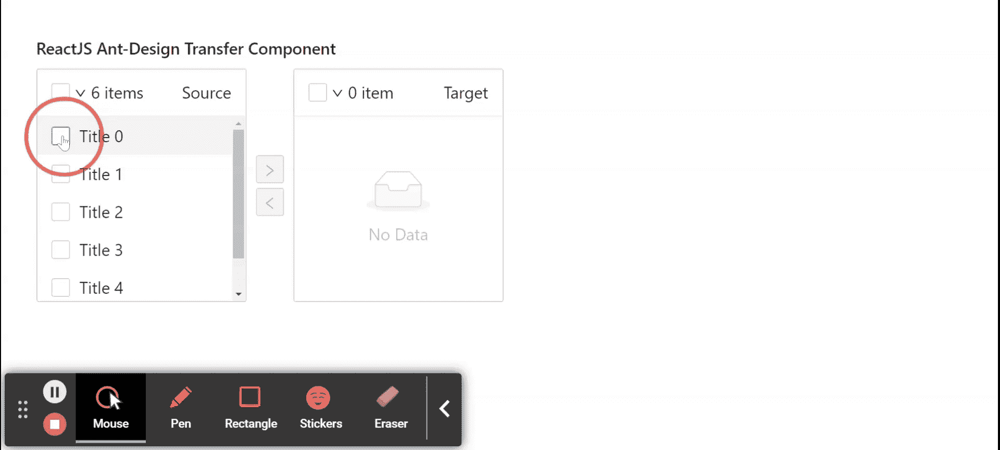

# React Ant Design Transfer 组件

> 原文: [https://www.geeksforgeeks.org/reactjs-ui-ant-design-transfer-component/](https://www.geeksforgeeks.org/reactjs-ui-ant-design-transfer-component/)

Ant Design 库预建了这个组件，也很容易集成。传送组件用于双栏传送选择框。用于有效传递两列之间的项目。我们可以在 ReactJS 中使用以下方法来使用 Ant Design Transfer 组件。

## Transfer 属性

*   `dataSource`: 用于设置源数据。
*   `disabled`: 表示是否禁用转账。
*   `filterOption`: 是检查一个项目是否应该显示在搜索结果列表中的函数。
*   `footer`: 是用于渲染页脚的函数。
*   `listStyle`: 用于传递一个自定义的 CSS 样式，用于渲染传输列。
*   `locale`: 用于表示 *i18n* 文本，包括过滤器、空文本、项目单元等。
*   `oneWay`: 用于显示为单向样式。
*   `operations`: 用于表示从上到下排序的一组操作。
*   `operationStyle`: 用于传递一个自定义的 CSS 样式，用于渲染操作的列。
*   `pagination`: 用于分页。
*   `render`: 生成列上显示的项目的函数。
*   `selectable`: 用于表示是否可以选择项目。
*   `selectedKeys`: 用于表示所选项目的一组按键。
*   `showSearch`: 用于表示是否在每一列显示搜索框。
*   `showSelectAll`: 用于显示表头的选择所有复选框。
*   `targetKeys`: 用于表示右列所列元素的一组键。
*   `titles`: 用来表示从左到右排序的一组标题。
*   `onChange`: 是列间传递完成时触发的回调函数。
*   `onScroll`: 是滚动选项列表时触发的回调函数。
*   `onSearch`: 是搜索字段发生变化时触发的回调函数。
*   `onSelectChange`: 是一个回调函数，在选择的项目发生变化时触发。

## Render 属性

*   `direction`: 用于表示列表渲染方向。
*   `disabled`: 表示是否禁用列表。
*   `filteredItems`: 用于表示过滤后的项目。
*   `selectedKeys`: 用于表示选择的项目。
*   `onItemSelect`: 用于表示所选项目。
*   `onItemSelectAll`: 用于选择一组项目。

## 创建 React 应用程序并安装模块

*   **步骤 1:** 使用以下命令创建一个 React 应用程序:
```jsx
npx create-react-app foldername
```

*   **步骤 2:** 创建项目文件夹（即 `foldername`）后，使用以下命令移动到该文件夹中:
```jsx
cd foldername
```

*   **步骤 3:** 创建 ReactJS 应用程序后，使用以下命令安装所需的模块:
```jsx
npm install antd
```

## 项目结构

如下图。


## 示例

现在在 `App.js` 文件中写下以下代码。在这里，`App` 是我们编写代码的默认组件。

### App.js

```jsx
import React, { useState } from 'react';
import "antd/dist/antd.css";
import { Transfer } from 'antd';

// Our sample Mock Data
const mockData = [
  {key: "0", title: "Title 0", description: "Sample Description 0"}, 
  {key: "1", title: "Title 1", description: "Sample Description 1"},
  {key: "2", title: "Title 2", description: "Sample Description 2"},
  {key: "3", title: "Title 3", description: "Sample Description 3"},
  {key: "4", title: "Title 4", description: "Sample Description 4"},
  {key: "5", title: "Title 5", description: "Sample Description 5"},
];

export default function App() {
  // To set target keys
  const [targetKeys, setTargetKeys] = useState(mockData);
  // Contains the selected keys
  const [selectedKeys, setSelectedKeys] = useState([]);

  return (
    <div style={{
      display: 'block', width: 700, padding: 30
    }}>
      <h4>ReactJS Ant-Design Transfer Component</h4>
      <Transfer
        dataSource={mockData}
        titles={['Source', 'Target']}
        render={item => item.title}
        selectedKeys={selectedKeys}
        targetKeys={targetKeys}
        onChange={(nextTargetKeys) => {
          setTargetKeys(nextTargetKeys);
        }}
        onSelectChange={(sourceSelectedKeys, targetSelectedKeys) => {
          setSelectedKeys([...sourceSelectedKeys, ...targetSelectedKeys]);
        }}
      />
    </div>
  );
}
```

## 运行应用程序的步骤

从项目的根目录使用以下命令运行应用程序:
```jsx
npm start
```

## 输出

现在打开浏览器，转到 `http://localhost:3000/`，会看到如下输出:



## 参考

[https://ant.design/components/transfer/](https://ant.design/components/transfer/)