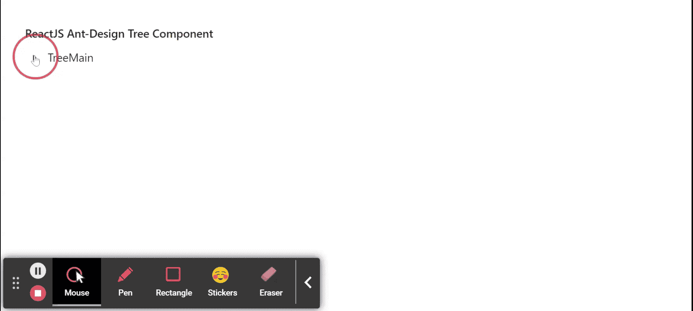

# 在ReactJS中使用Ant Design的Tree组件

> 原文：[https://www.geeksforgeeks.org/reactjs-ui-ant-design-tree-component/](https://www.geeksforgeeks.org/reactjs-ui-ant-design-tree-component/)

Ant Design库预建了这个组件，并且很容易集成。Tree组件用于展示层次化的列表结构。我们可以在ReactJS中使用以下方法来使用Ant Design的Tree组件。

## Tree Props

*   `allowDrop`：用于指示是否允许在节点上放置。
*   `autoExpandParent`：用于指示是否自动展开父树节点。
*   `blockNode`：用于表示`treeNode`是否填充剩余的水平空间。
*   `checkable`：用于在树节点前添加复选框。
*   `checkedKeys`：用于指定被勾选树节点的键。
*   `checkStrictly`：用于精确勾选树节点。
*   `defaultCheckedKeys`：用于指定默认勾选的树节点的键。
*   `defaultExpandAll`：用于表示是否默认展开所有树节点。
*   `defaultExpandedKeys`：用于指定默认展开树节点的键。
*   `defaultExpandParent`：表示是否自动展开父树节点。
*   `defaultSelectedKeys`：用于指定默认选择的树节点的键。
*   `disabled`：表示是否禁用树。
*   `draggable`：用于指定该树或节点是否可拖动。
*   `expandedKeys`：用于指定展开树节点的键。
*   `filterTreeNode`：用于定义一个过滤树节点的函数。
*   `height`：用于定义虚拟滚动的高度。
*   `icon`：用于自定义`treeNode`图标。
*   `loadData`：用于异步加载数据。
*   `loadedKeys`：用于设置已加载的树节点。
*   `multiple`：用于启用选择多个树节点。
*   `selectable`：表示是否可以选择。
*   `selectedKeys`：用于指定所选树节点的键。
*   `showIcon`：用于显示树节点标题前的图标。
*   `showLine`：用于显示连接线。
*   `switcherIcon`：用于自定义树节点的折叠/展开图标。
*   `titleRender`：用于自定义树节点标题渲染。
*   `treeData`：用于表示树节点数据数组。
*   `virtual`：设置为`false`时，用于禁用虚拟滚动。
*   `onCheck`：是`checkable`事件发生时触发的回调函数。
*   `onDragEnd`：是`dragend`事件发生时触发的回调函数。
*   `onDragEnter`：是`dragenter`事件发生时触发的回调函数。
*   `onDragLeave`：是`dragleave`事件发生时触发的回调函数。
*   `onDragOver`：是`dragover`事件发生时触发的回调函数。
*   `onDragStart`：是`dragstart`事件发生时触发的回调函数。
*   `onDrop`：是`drop`事件发生时触发的回调函数。
*   `onExpand`：是一个回调函数，在`treeNode`展开或折叠时触发。
*   `onLoad`：是加载`treeNode`时触发的回调函数。
*   `onRightClick`：是一个回调函数，当用户右键单击一个`treeNode`时触发。
*   `onSelect`：是用户点击`treeNode`时触发的回调函数。

## TreeNode Props

*   `checkable`：用于表示树是否可勾选。
*   `disableCheckbox`：用于禁用树节点的复选框。
*   `disabled`：用于禁用树节点。
*   `icon`：用于自定义图标。
*   `isLeaf`：用来判断这是不是叶节点。
*   `key`：用于树节点的唯一标识符。
*   `selectable`：用于设置是否可以选择树节点。
*   `title`：用于表示树节点的标题。

## FieldProps建议

*   `expandable`：用于表示目录打开逻辑。

## Tree方法

*   `scrollTo()`：此方法用于滚动到虚拟滚动中的关键项目。

## 创建React应用程序并安装模块

*   **步骤 1：** 使用以下命令创建一个React应用程序：
    ```bash
    npx create-react-app foldername
    ```
*   **步骤 2：** 在创建项目文件夹（即`foldername`）后，使用以下命令移动到该文件夹：
    ```bash
    cd foldername
    ```
*   **步骤 3：** 创建ReactJS应用程序后，使用以下命令安装所需的`antd`模块：
    ```bash
    npm install antd
    ```

## 项目结构

项目结构如下图所示。


## 示例

现在在`App.js`文件中写下以下代码。在这里，`App`是我们编写代码的默认组件。

### App.js

```jsx
import React from 'react'
import "antd/dist/antd.css";
import { Tree } from 'antd';

const treeData = [
  {
    title: 'TreeMain',
    key: 'TreeMain',
    children: [
      {
        title: 'ParentLeaf',
        key: 'ParentLeaf',
        children: [
          {
            title: 'ChildLeaf1',
            key: 'ChildLeaf1',
          },
          {
            title: 'ChildLeaf2',
            key: 'ChildLeaf2',
          },
        ],
      },
    ],
  },
];

export default function App() {
  return (
    <div style={{
      display: 'block', width: 700, padding: 30
    }}>
      <h4>ReactJS Ant-Design Tree Component</h4>
      <Tree
        treeData={treeData}
      />
    </div>
  );
}
```

## 运行应用程序的步骤

从项目的根目录使用以下命令运行应用程序：
```bash
npm start
```

## 输出

现在打开浏览器，转到`http://localhost:3000/`，会看到如下输出：



## 参考

[https://ant.design/components/tree/](https://ant.design/components/tree/)