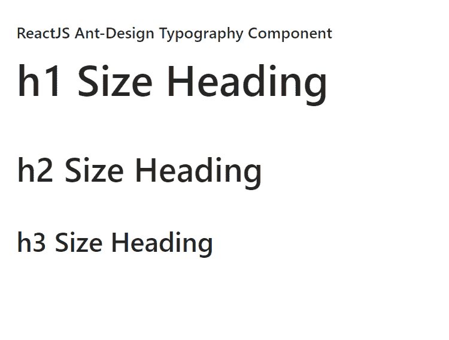

# 重新获取用户界面蚂蚁设计排版组件

> 原文：[https://www.geeksforgeeks.org/reactjs-ui-ant-design-typography-component/](https://www.geeksforgeeks.org/reactjs-ui-ant-design-typography-component/)

蚂蚁设计库预建了这个组件，也很容易集成。排版组件对于基本文本写作、正文文本（包括标题、列表等）非常有用。我们可以在 ReactJS 中使用以下方法来使用 Ant Design 排版组件。

## `Typography.Text` 属性

*   `code`：用于代码样式。
*   `copyable`：表示是否可复制。
*   `delete`：用于删除的线型。
*   `disabled`：用于禁用内容。
*   `editable`：如果设置为可编辑，用于编辑对象时的状态。
*   `ellipsis`：用于显示文本溢出时的省略号。
*   `keyboard`：用于键盘风格。
*   `mark`：用于标记的样式。
*   `onClick`：用于设置处理点击事件的处理程序。
*   `strong`：用于黑体风格。
*   `italic`：用于斜体样式。
*   `type`：用于表示内容类型。
*   `underline`：用于下划线样式。

## `Typography.Title` 属性

*   `code`：用于代码样式。
*   `copyable`：表示是否可复制。
*   `delete`：用于删除的线型。
*   `disabled`：用于禁用内容。
*   `editable`：如果设置为可编辑，用于编辑对象时的状态。
*   `ellipsis`：用于显示文本溢出时的省略号。
*   `level`：用于设置内容重要性。
*   `mark`：用于标记的样式。
*   `onClick`：用于设置处理点击事件的处理程序。
*   `italic`：用于斜体样式。
*   `type`：用于表示内容类型。
*   `underline`：用于下划线样式。

## `Typography.Paragraph` 属性

*   `code`：用于代码样式。
*   `copyable`：表示是否可复制。
*   `delete`：用于删除的线型。
*   `disabled`：用于禁用内容。
*   `editable`：如果设置为可编辑，用于编辑对象时的状态。
*   `ellipsis`：用于显示文本溢出时的省略号。
*   `mark`：用于标记的样式。
*   `onClick`：用于设置处理点击事件的处理程序。
*   `strong`：用于黑体风格。
*   `italic`：用于斜体样式。
*   `type`：用于表示内容类型。
*   `underline`：用于下划线样式。

## `copyable` 属性

*   `icon`：用于自定义复制图标。
*   `text`：用于表示要复制的文本。
*   `tooltips`：用于自定义工具提示文本。
*   `onCopy`：是复制文本时调用的函数。

## `editable` 属性

*   `autoSize`：用于表示 `textarea` 的 `autoSize` 属性。
*   `editing`：表示是否可编辑。
*   `icon`：用于自定义可编辑图标。
*   `maxLength`：用于表示 `textarea` 编号的 `maxLength` 属性。
*   `tooltips`：用于自定义工具提示文本。
*   `onCancel`：是在键入 `ESC` 退出可编辑状态时调用的回调函数。
*   `onChange`：是在 `textarea` 输入时调用的回调函数。
*   `onEnd`：是一个回调函数，在输入 `ENTER` 退出可编辑状态时调用。
*   `onStart`：是进入可编辑状态时调用的回调函数。
*   `onCancel`：是在键入 `ESC` 退出可编辑状态时调用的回调函数。
*   `onEnd`：是一个回调函数，在键入 `ENTER` 退出可编辑状态时调用。

## `ellipsis` 属性

*   `expandable`：表示是否可扩展。
*   `rows`：用于表示内容的最大行数。
*   `suffix`：用于表示省略号内容的后缀。
*   `symbol`：用于省略号的自定义描述。
*   `tooltip`：用于省略号时显示工具提示。
*   `onEllipsis`：是进入或离开省略号状态时调用的回调函数。
*   `onExpand`：是扩展内容时调用的回调函数。

## 创建 React 应用程序并安装模块

*   **步骤 1：** 使用以下命令创建一个 React 应用程序：
    ```jsx
    npx create-react-app foldername
    ```
*   **步骤 2：** 在创建项目文件夹（即 `foldername`）后，使用以下命令移动到该文件夹：
    ```jsx
    cd foldername
    ```
*   **步骤 3：** 创建 ReactJS 应用程序后，使用以下命令安装所需的 `antd` 模块：
    ```jsx
    npm install antd
    ```

## 项目结构

如下图所示。


## 示例

现在在 `App.js` 文件中写下以下代码。在这里，`App` 是我们编写代码的默认组件。

### `App.js`

```jsx
import React from 'react'
import "antd/dist/antd.css";
import { Typography } from 'antd';

const { Title } = Typography;

export default function App() {

return (
    <div style={{
      display: 'block', width: 700, padding: 30
    }}>
      <h4>ReactJS Ant-Design Typography Component</h4>
      <>
        <Title>h1 Size Heading</Title>
        <Title level={2}>h2 Size Heading</Title>
        <Title level={3}>h3 Size Heading</Title>
      </>
    </div>
  );
}
```

## 运行应用程序的步骤

从项目的根目录使用以下命令运行应用程序：
```jsx
npm start
```

## 输出

现在打开浏览器，转到 `http://localhost:3000/`，会看到如下输出：



## 参考

[https://ant.design/components/typography/](https://ant.design/components/typography/)